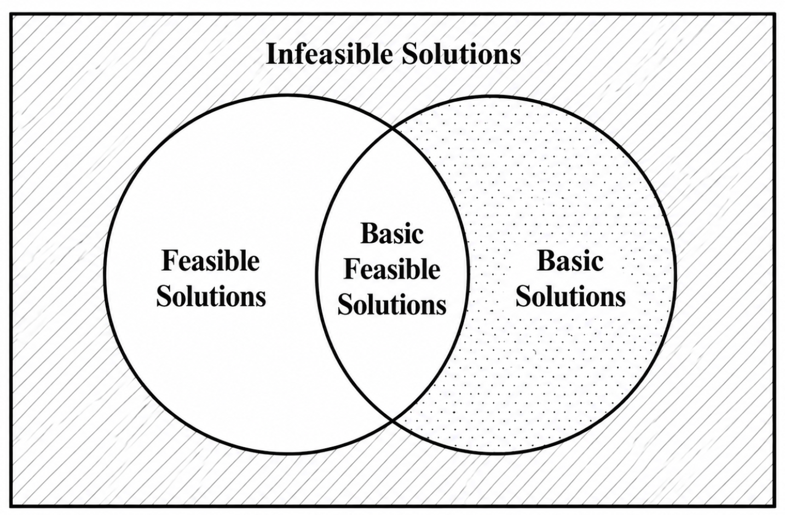

# Integer Linear Programming Notes 01: Simplex Method and Linear Programming Duality

> Author: Hang Li (@flgkd)
> Note: Titles marked with `*` highlight key concepts and important summaries.

## 1. Preface

Integer Linear Programming (ILP) is closely related to Linear Programming (LP). In many ILP algorithms, the first step is to relax the integrality restrictions and solve the corresponding LP relaxation. Therefore, a solid understanding of LP, especially the simplex method and LP duality, is essential.

The simplex method is a general-purpose algorithm for solving linear programs. It is **not a polynomial-time algorithm in the worst case**. Polynomial-time algorithms for LP include the **ellipsoid method** and **interior-point methods**. Nevertheless, the simplex method is still widely used because of its clear geometric interpretation and strong practical performance.

**Column generation**, which appears later in this note series, is also deeply connected to the simplex method: the pricing subproblem can be understood as the search for a nonbasic variable with a favorable reduced cost.

## 2. The Simplex Method

The simplex method contains many details. **This note does not aim to provide a complete step-by-step tutorial**. Instead, it summarizes several key concepts that are important for understanding LP, simplex, LP duality, and later ILP algorithms.

## 3. Key Concepts in Linear Programming

### 3.1 Possible Outcomes of a Linear Program

For a linear programming problem, the result may fall into one of the following cases:

1. a unique optimal solution;
2. multiple optimal solutions;
3. infinitely many optimal solutions;
4. an unbounded objective value;
5. no feasible solution.

In continuous linear programming, if there are two distinct optimal solutions, then every convex combination of them is also optimal. Therefore, multiple optimal solutions usually imply infinitely many optimal solutions.

### 3.2 Standard Form

A common maximization form of an LP is

$$
\max \quad z = c^T x
$$

$$
Ax \le b, \quad x \ge 0.
$$

By adding slack variables $s \ge 0$, it can be transformed into the standard equality form:

$$
\max \quad z = c^T x + 0^T s
$$

$$
Ax + Is = b, \quad x \ge 0, \quad s \ge 0.
$$

Here, $I$ is an identity matrix. Slack variables are often used to obtain an initial basis.

### 3.3 Solution Concepts

For an LP in equality form,

$$
Ax = b,\quad x \ge 0,
$$

where $A \in \mathbf{R}^{m \times n}$ and $rank(A)=m$, the following concepts are important.

| Concept | Meaning |
|---|---|
| Feasible solution | A vector $x$ satisfying all equality and non-negativity constraints. |
| Basis | A set of $m$ linearly independent columns of $A$. |
| Basic solution | A solution obtained by setting the $n-m$ nonbasic variables to zero and solving for the $m$ basic variables. |
| Basic feasible solution | A basic solution that also satisfies $x \ge 0$. |
| Feasible basis | A basis whose corresponding basic solution is feasible. |

The relationship among these concepts can be illustrated as follows.

  

  Relationship among infeasible solutions, feasible solutions, basic solutions, and basic feasible solutions.

### 3.4 Geometric Interpretation

The feasible region of a linear program is a convex set. For a standard LP, each basic feasible solution corresponds to a vertex, or extreme point, of the feasible region.

The simplex method moves from one vertex to an adjacent vertex, trying to improve the objective value at each step.

## 4. Key Concepts in the Simplex Method

### 4.1 Meaning of a Simplex

A simplex is the simplest possible polytope in a given dimension:

| Dimension   | Simplex                               |
| ----------- | ------------------------------------- |
| 0D          | Point                                 |
| 1D          | Line segment                          |
| 2D          | Triangle                              |
| 3D          | Tetrahedron                           |
| <em>n</em>D | Polytope with <em>n</em> + 1 vertices |

The standard <em>n</em>-simplex can be written as

$$
\Delta^n = \{ x \in \mathbf{R}^{n+1} : \sum_{i=1}^{n+1} x_i = 1, \ x_i \ge 0, \ i=1,\ldots,n+1 \}.
$$

For example, in three-dimensional space, a tetrahedron with unit intercepts has vertices

$$
(0,0,0),\quad (1,0,0),\quad (0,1,0),\quad (0,0,1).
$$

### 4.2 Initial Basic Feasible Solution

If an LP is written in the form $Ax \le b$, $x \ge 0$, and $b \ge 0$, then slack variables can often provide an initial basic feasible solution.

However, if the constraints contain equality constraints, $\ge$ constraints, or negative right-hand-side terms, an initial basic feasible solution may not be obvious. In such cases, artificial variables are introduced. The two common methods are:

1. the Big-M method;
2. the two-phase method.

### 4.3 Matrix Description of Simplex*

Consider the LP in standard equality form:

$$
\max \quad z = c^T x
$$

$$
Ax = b, \quad x \ge 0.
$$

Let $B$ be a basis matrix and $N$ be the matrix of nonbasic columns. Partition the variables and objective coefficients as

$$
x = (x_B, x_N), \quad c = (c_B, c_N).
$$

Then the constraints can be written as

$$
Bx_B + Nx_N = b.
$$

Solving for the basic variables gives

$$
x_B = B^{-1}b - B^{-1}Nx_N.
$$

Substituting this expression into the objective function gives

$$
z = c_B^T x_B + c_N^T x_N
$$

$$
z = c_B^T B^{-1}b + (c_N^T - c_B^T B^{-1}N)x_N .
$$

When $x_N = 0$, the corresponding basic solution is

$$
x_B = B^{-1}b, \qquad z_0 = c_B^T B^{-1}b .
$$

### 4.4 Reduced Cost

The coefficient of a nonbasic variable in the rewritten objective function is called its reduced cost, or simplex optimality indicator.

For all nonbasic variables, the reduced-cost row vector is

$$
\overline{c}_N^T = c_N^T - c_B^T B^{-1}N .
$$

Equivalently, if the reduced costs are written as a column vector, then

$$
\overline{c}_N = c_N - N^T (B^{-1})^T c_B .
$$

For a single nonbasic variable $x_j$ with column $a_j$, its reduced cost is

$$
\overline{c}_j = c_j - c_B^T B^{-1}a_j .
$$

In many Chinese textbooks, the reduced cost is written as

$$
\sigma_j = c_j - z_j, \quad z_j = c_B^T B^{-1}a_j.
$$

Thus,

$$
\sigma_j = \overline{c}_j.
$$

The reduced cost measures whether increasing a nonbasic variable can improve the objective value.

For a maximization problem:

- if $\overline{c}_j > 0$, increasing $x_j$ may improve the objective value;
- if $\overline{c}_j < 0$, increasing $x_j$ decreases the objective value;
- if $\overline{c}_j = 0$, increasing $x_j$ does not change the objective value locally.

This is why reduced costs are central to simplex, column generation, and branch-and-price.

### 4.5 Optimality Test and Solution Classification*

Assume that the current basis is primal feasible, i.e.,

$$
B^{-1}b \ge 0.
$$

For a maximization problem, the following criteria are used.

#### Unique Optimal Solution

If the current basic feasible solution is nondegenerate and

$$
\overline{c}_j < 0, \quad \forall j \in \mathcal{N},
$$

then the current solution is the unique optimal solution.

#### Alternative Optimal Solutions

If

$$
\overline{c}_j \le 0, \quad \forall j \in \mathcal{N},
$$

and at least one nonbasic variable satisfies

$$
\overline{c}_j = 0,
$$

then another optimal basis may exist. If pivoting on such a variable leads to a distinct feasible solution, then the LP has multiple optimal solutions. Since the feasible region is convex, two distinct optimal solutions imply infinitely many optimal solutions.

#### Unbounded Objective Value

If there exists a nonbasic variable $x_j$ such that

$$
\overline{c}_j > 0,
$$

but

$$
B^{-1}a_j \le 0,
$$

then increasing $x_j$ can improve the objective value without violating feasibility. Therefore, the maximization problem is unbounded.

More generally, let

$$
d = B^{-1}a_j .
$$

If $d$ has at least one positive component, the leaving variable is determined by the minimum ratio test. The ratio is computed only for indices satisfying $d_i>0$:

$$
\theta^\ast = \min \frac{(B^{-1}b)_i}{d_i}, \quad d_i>0.
$$

The basic variable corresponding to the index attaining this minimum ratio leaves the basis.

### 4.6 Artificial Variables and Infeasibility

Artificial variables are introduced only to construct an initial basis. They are not part of the original problem and should eventually be removed from the basis.

In the Big-M method, artificial variables are penalized by a sufficiently large constant $M$ in the objective function.

In the two-phase method:

1. Phase I minimizes the sum of artificial variables.
2. Phase II solves the original LP after artificial variables have been removed.

If, at the end of Phase I, the optimal value of the artificial-variable objective is positive, then the original LP is infeasible.

Equivalently, if an artificial variable remains positive in the final basis, the original problem has no feasible solution.

### 4.7 Degeneracy

A basic feasible solution is degenerate if at least one basic variable is equal to zero:

$$
x_{B_i}=0.
$$

Degeneracy may cause the objective value to remain unchanged after a pivot. In extreme cases, it may lead to cycling. Anti-cycling rules, such as Bland's rule, can be used to avoid cycling.

### 4.8 Matrix Form of the Simplex Tableau*

The simplex tableau after choosing a basis $B$ can be expressed entirely using $B^{-1}$.

| Tableau component | Matrix expression |
|---|---|
| Right-hand side | $B^{-1}b$ |
| Coefficients of nonbasic variables | $B^{-1}N$ |
| Objective value | $c_B^T B^{-1}b$ |
| Reduced costs of nonbasic variables | $c_N^T - c_B^T B^{-1}N$ |
| Reduced costs of slack variables | $-c_B^T B^{-1}$, when slack-variable costs are zero |

This representation explains why the inverse basis matrix $B^{-1}$ is so important in simplex computations.

For slack variable columns $e_i$, the reduced costs are

$$
\overline{c}_{s_i} = 0 - c_B^T B^{-1}e_i.
$$

Thus, the reduced costs of slack variables can be written compactly as

$$
\overline{c}_s^T = -c_B^T B^{-1}.
$$

This relationship becomes especially important when studying LP duality and sensitivity analysis.

## 5. Dual Simplex Method

### 5.1 Principle

In the simplex tableau, the right-hand-side column corresponds to a primal basic solution, while the reduced-cost row corresponds to a dual basic solution.

The primal simplex method maintains primal feasibility and tries to reach dual feasibility.

The dual simplex method does the opposite: it maintains dual feasibility and iteratively repairs primal infeasibility. For a maximization problem in the convention used above, dual feasibility corresponds to

$$
\overline{c}_j \le 0, \quad \forall j \in \mathcal{N}.
$$

If the reduced-cost condition is already satisfied but some components of $B^{-1}b$ are negative, the current basis is dual feasible but primal infeasible. The dual simplex method can pivot until primal feasibility is restored.

Once both primal feasibility and dual feasibility hold, the current solution is optimal.

### 5.2 Advantages

The dual simplex method has several advantages:

1. The initial primal solution does not have to be feasible, as long as the reduced-cost condition satisfies dual feasibility.
2. It can avoid artificial variables in some cases.
3. It is useful in sensitivity analysis.
4. It is frequently used in cutting-plane methods and branch-and-cut algorithms for integer programming.
5. It is efficient for re-optimization after adding new constraints.

Its limitation is that finding an initial dual feasible basis is not always easy for a general LP.

## 6. Linear Programming Duality

### 6.1 Essence of LP Duality*

LP duality can be viewed as a special and highly structured form of Lagrangian duality for linear programs.

The dual problem provides bounds on the primal objective value. At optimality, under standard feasibility and boundedness assumptions, the primal and dual objective values are equal.

### 6.2 Primal-Dual Pair*

Consider the primal maximization problem

$$
(P) \quad \max \quad c^T x
$$

$$
Ax \le b, \quad x \ge 0.
$$

The corresponding dual problem is

$$
(D) \quad \min \quad b^T y
$$

$$
A^T y \ge c, \quad y \ge 0.
$$

The correspondence between a primal problem and its dual can be summarized as follows.

| Primal element | Dual element |
|---|---|
| Maximization objective | Minimization objective |
| $m$ constraints | $m$ dual variables |
| $n$ variables | $n$ dual constraints |
| Primal right-hand side $b_i$ | Objective coefficient of dual variable $y_i$ |
| Primal objective coefficient $c_j$ | Right-hand side of the $j$-th dual constraint |
| Constraint $a_i^T x \le b_i$ in a max primal | Dual variable $y_i \ge 0$ |
| Constraint $a_i^T x \ge b_i$ in a max primal | Dual variable $y_i \le 0$ |
| Equality constraint $a_i^T x = b_i$ | Dual variable $y_i$ is unrestricted |
| Variable $x_j \ge 0$ in a max primal | Dual constraint $(A^T y)_j \ge c_j$ |
| Variable $x_j \le 0$ in a max primal | Dual constraint $(A^T y)_j \le c_j$ |
| Variable $x_j$ unrestricted | Dual constraint $(A^T y)_j = c_j$ |

### 6.3 Basic Properties of LP Duality*

The following properties are stated for the primal-dual pair above.

#### Symmetry

The dual of the dual problem is the primal problem.

#### Weak Duality

If $x$ is feasible for the primal problem and $y$ is feasible for the dual problem, then

$$
c^T x \le b^T y.
$$

Thus, any dual feasible solution gives an upper bound on the primal maximization problem.

#### Unboundedness

If the primal problem is unbounded, then the dual problem is infeasible.

Similarly, if the dual problem is unbounded, then the primal problem is infeasible.

The converse is not always true: infeasibility of one problem does not necessarily imply unboundedness of the other.

#### Optimality Criterion

If $x$ is primal feasible, $y$ is dual feasible, and

$$
c^T x = b^T y,
$$

then both $x$ and $y$ are optimal solutions.

#### Strong Duality

If the primal problem has a finite optimal solution, then the dual problem also has a finite optimal solution, and their optimal objective values are equal:

$$
c^T x^{opt} = b^T y^{opt}.
$$

#### Complementary Slackness

For the primal-dual pair above, optimal solutions $x^{opt}$ and $y^{opt}$ satisfy

$$
y_i^{opt}(b_i-a_i^T x^{opt})=0, \quad i=1,\ldots,m.
$$

and

$$
x_j^{opt}((A^T y^{opt})_j-c_j)=0, \quad j=1,\ldots,n.
$$

These equations mean:

- if a primal constraint is not tight, then the corresponding dual variable must be zero;
- if a primal variable is positive, then the corresponding dual constraint must be tight.

### 6.4 Reduced Costs and the Dual Basic Solution*

One of the most important relationships between simplex and LP duality is that the reduced-cost row of the primal simplex tableau corresponds to a dual basic solution.

For a basis $B$, define the simplex multiplier, or the dual basic solution, by

$$
y^T = c_B^T B^{-1}.
$$

Then the reduced cost of variable $x_j$ can be written as

$$
\overline{c}_j = c_j - y^T a_j.
$$

The dual constraint corresponding to $x_j$ is

$$
y^T a_j \ge c_j.
$$

Therefore, the dual slack of this constraint is

$$
s_j^D = y^T a_j - c_j.
$$

Combining the reduced-cost expression and the dual-slack expression, we obtain

$$
s_j^D = -\overline{c}_j.
$$

This explains the connection between primal reduced costs and dual feasibility:

- for a maximization problem, $\overline{c}_j \le 0$ means $s_j^D \ge 0$;
- therefore, the reduced-cost optimality condition is exactly the dual feasibility condition.

This is also the theoretical reason why reduced cost is the key quantity in column generation.

### 6.5 Shadow Price

The optimal dual variable $y_i^\ast$ is often called the shadow price of resource $i$.

Within the valid sensitivity-analysis range, it measures the marginal change in the optimal objective value when the right-hand-side value $b_i$ changes:

$$
y_i^\ast = \frac{\partial z^\ast}{\partial b_i}.
$$

For example, if $b_i$ represents the capacity of a resource, then $y_i^\ast$ measures the marginal value of increasing that resource capacity by one unit.

## 7. Key Takeaways

1. ILP algorithms often rely on LP relaxation, so LP and simplex are foundational.
2. A basic feasible solution corresponds to a vertex of the LP feasible region.
3. The simplex method moves among basic feasible solutions.
4. Reduced cost determines whether a nonbasic variable should enter the basis.
5. The matrix expression of reduced cost is

$$
\overline{c}_j = c_j - c_B^T B^{-1}a_j.
$$

6. The simplex tableau naturally contains dual information.
7. The reduced-cost condition for primal optimality is equivalent to dual feasibility.
8. Dual simplex is useful for re-optimization, sensitivity analysis, and cutting-plane methods.
9. LP duality is the basis for many advanced optimization methods, including decomposition, column generation, branch-and-price, and Lagrangian relaxation.

## Suggested Follow-up Reading

- Linear programming and simplex method chapters in standard operations research textbooks.
- LP duality and sensitivity analysis.
- Reduced cost and simplex tableau interpretation.
- Column generation and Dantzig-Wolfe decomposition.
