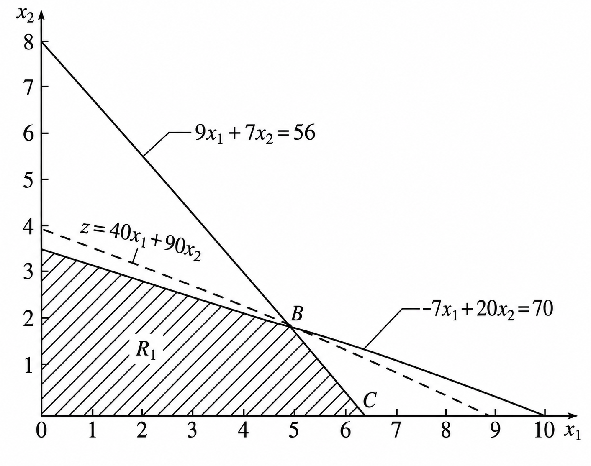
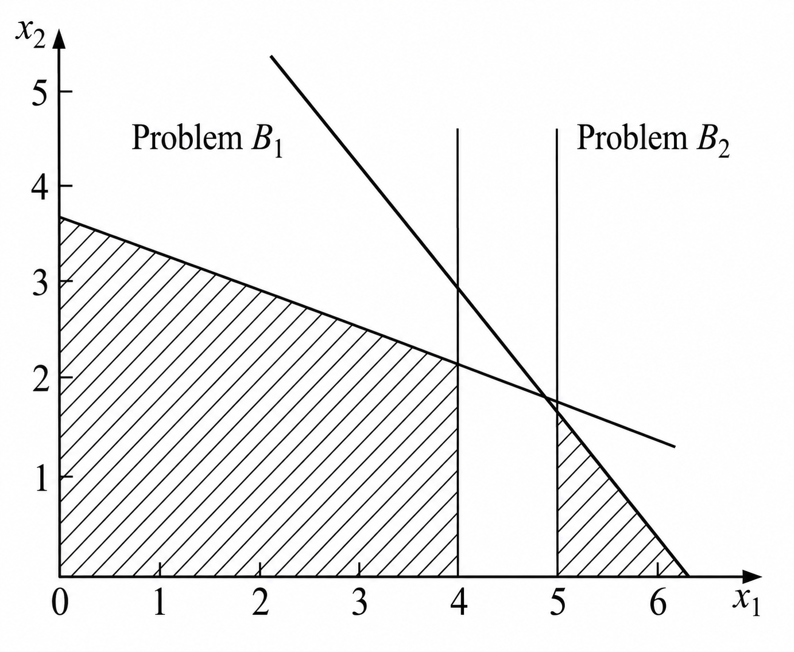
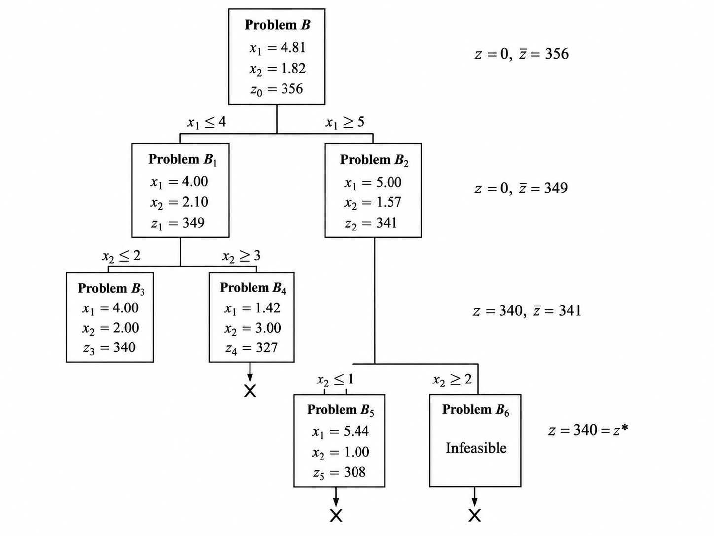

# Integer Linear Programming Notes 02: Branch and Bound

> Author: Hang Li (@flgkd)
>
> Note: Titles marked with ⭐ highlight key concepts and important summaries.

## 1. Preface

When I first learned Integer Linear Programming (ILP), I had a very natural and very naive idea:

> Why not ignore the integer constraints, solve the LP relaxation, and then round the solution?

At first glance, this sounds almost too clever. Solve a linear program, round the answer, done. I even felt like I had discovered something smart.

Unfortunately, this usually does not work.

Unless the LP relaxation happens to return an integer solution, **simple rounding can easily produce a poor solution, or even a solution that is not feasible at all**. If integer programming were really that easy, there would be no need to study it as a separate topic.

This note introduces **Branch and Bound**, one of the most fundamental methods for solving integer programming problems. The basic idea is not mysterious: it is a smarter form of enumeration.

## 2. Why Simple Rounding Is Naive⭐

A very natural first thought when learning integer linear programming is:

> Can we just ignore the integer constraints, solve the LP relaxation, and then round the solution?

At first glance, this sounds almost too clever.

Unfortunately, this idea is usually unreliable. Unless the LP relaxation happens to return an integer solution, simple rounding may either destroy feasibility or produce a feasible but non-optimal solution.

The following small example shows why.

### 2.1 A Small Shipping Example

Suppose a factory wants to ship two types of goods, denoted by Goods A and Goods B. For each box of goods, the volume, weight, and profit are given below.

| Goods          | Volume (m³/box) | Weight (100 kg/box) | Profit (100 dollars/box) |
| -------------- | --------------: | ------------------: | --------------------: |
| A              |               5 |                   2 |                    20 |
| B              |               4 |                   5 |                    10 |
| Shipping limit |              24 |                  13 |                       |

The question is:

> How many boxes of Goods A and Goods B should be shipped so that the total profit is maximized?

Let $x_1$ and $x_2$ denote the numbers of boxes of Goods A and Goods B, respectively. Since boxes cannot be divided, both variables must be nonnegative integers.

The integer programming model is

$$
\max \quad z = 20x_1 + 10x_2
$$

subject to

$$
5x_1 + 4x_2 \le 24
$$

$$
2x_1 + 5x_2 \le 13
$$

$$
x_1 \ge 0,\quad x_2 \ge 0
$$

$$
x_1, x_2 \in \mathbf{Z}.
$$

The only difference between this problem and an ordinary linear programming problem is the last condition: $x_1$ and $x_2$ must be integers.

Now ignore the integer constraints and solve the corresponding LP relaxation. The optimal solution of the LP relaxation is

$$
x_1 = 4.8,\quad x_2 = 0,\quad z = 96.
$$

However, this is not feasible for the original ILP, because $x_1=4.8$ is not an integer.

A naive idea is to round this solution.

If we round $x_1=4.8$ up to $5$, we obtain

$$
(x_1,x_2)=(5,0).
$$

But this violates the volume constraint:

$$
5x_1+4x_2=25>24.
$$

So rounding up gives an infeasible solution.

If we round $x_1=4.8$ down to $4$, we obtain

$$
(x_1,x_2)=(4,0).
$$

This solution is feasible, and its objective value is

$$
z = 20 \times 4 + 10 \times 0 = 80.
$$

But it is not optimal. For example,

$$
(x_1,x_2)=(4,1)
$$

is also feasible, because

$$
5 \times 4 + 4 \times 1 = 24 \le 24
$$

and

$$
2 \times 4 + 5 \times 1 = 13 \le 13.
$$

Its objective value is

$$
z = 20 \times 4 + 10 \times 1 = 90.
$$

So rounding down gives a feasible solution, but not the optimal integer solution.

Therefore, simply rounding the LP relaxation solution can fail in two ways:

1. rounding may destroy feasibility;
2. even if the rounded solution is feasible, it may still be non-optimal.

This is the first important lesson:

> The LP relaxation is useful, but rounding its solution is not a reliable method for solving integer linear programming problems.

### 2.2 Geometric Interpretation

The LP relaxation has a continuous feasible region. The ILP feasible region is only the set of integer lattice points inside that region.

<p align="center">
  
</p>

<p align="center">
  Geometric Interpretation of the Shipping Example.
</p>

In the example above, the LP relaxation reaches its optimum at the fractional point

$$
C=(4.8,0), \quad z=96.
$$

But the integer feasible points are discrete. The point $(5,0)$ is outside the feasible region, while the point $(4,0)$ is feasible but not optimal.

To find the integer optimum, the objective-value line has to move inward until it first touches an integer feasible point. In this example, that point is

$$
B=(4,1), \quad z=90.
$$

The loss

$$
96-90=6
$$

comes from the indivisibility of the decision variables.

This is exactly why integer programming is harder than linear programming.

## 3. Why Integer Programming Is Hard⭐

When we studied calculus, a common way to find an optimum was to take derivatives and set them equal to zero.

But this relies on continuity and differentiability.

We also learned the sentence:

> Differentiability implies continuity, but continuity does not necessarily imply differentiability.

In integer programming, variables are restricted to integer values. This makes the feasible region discrete and destroys the continuous structure that calculus relies on.

So the powerful derivative-based tools are no longer directly available. We have to find another way.

This is one of the intuitive reasons why integer programming is difficult.

In fact, many classical NP-hard problems can be formulated as integer programming problems.

## 4. Basic Idea of Branch and Bound⭐

If rounding does not work, another simple idea is enumeration.

That is, we could enumerate all feasible integer solutions, evaluate their objective values, and choose the best one.

This is correct in principle, but usually impossible in practice. Once the problem size becomes large, the number of possible integer solutions can become astronomically large.

Branch and Bound improves on this naive enumeration idea.

The LP relaxation is still useful, because its optimal value gives a bound on the original ILP:

- for a maximization problem, the LP relaxation gives an **upper bound**;
- for a minimization problem, the LP relaxation gives a **lower bound**.

At the same time, every feasible integer solution gives a candidate objective value:

- for a maximization problem, it gives a **lower bound**;
- for a minimization problem, it gives an **upper bound**.

Therefore, Branch and Bound can be understood as:

> enumeration with bounds, so that many impossible branches can be cut off before being fully explored.

This is why Branch and Bound is also called **implicit enumeration**.

It is not magic. It is just a much smarter way to enumerate.

Branch and Bound can be used for both pure integer programming and mixed-integer programming. It is also one of the core ideas behind commercial solvers such as CPLEX and Gurobi.

## 5. Two Core Ideas of Branch and Bound⭐

Assume that the original ILP is a maximization problem. Call it problem $A$.

Let problem $B$ be the LP relaxation of problem $A$.

Branch and Bound relies on two basic facts.

### 5.1 Core Idea I:: Integer Feasible Solutions Give Lower Bounds

Any feasible integer solution of problem $A$ gives a valid lower bound on the optimal value of $A$.

If the best integer feasible solution found so far has value $LB$, then the true optimal value satisfies

$$
Z^{opt} \ge LB.
$$

This best known integer solution is often called the **incumbent**.

### 5.2 Core Idea II: LP Relaxations Give Upper Bounds

The optimal value of the LP relaxation gives an upper bound for the maximization ILP.

If the LP relaxation has optimal value $UB$, then

$$
Z^{opt} \le UB.
$$

This happens because the LP relaxation has a larger feasible region than the ILP. It removes the integer restriction, so it can only make the maximization problem easier.

### 5.3 Putting the Two Ideas Together

Branch and Bound solves the ILP by repeatedly splitting the feasible region of the LP relaxation into smaller subregions.

This splitting operation is called **branching**.

For each subproblem, we solve its LP relaxation and obtain a bound. Then we decide whether the subproblem is still worth exploring.

The goal is to gradually:

- increase the lower bound;
- decrease the upper bound;
- discard subproblems that cannot contain a better integer solution.

When no remaining branch can improve the incumbent, the current incumbent is optimal.

## 6. Example: Solving an ILP by Branch and Bound

Consider the following integer programming problem:

$$
\max \quad z = 40x_1 + 90x_2
$$

$$
9x_1 + 7x_2 \le 56
$$

$$
7x_1 + 20x_2 \le 70
$$

$$
x_1 \ge 0, \quad x_2 \ge 0
$$

$$
x_1, x_2 \in \mathbf{Z}.
$$

### 6.1 Root LP Relaxation

First ignore the integer constraints and solve the LP relaxation.

<p align="center">
  
</p>

<p align="center">
  Geometric Interpretation of the Example.
</p>

The LP relaxation has the optimal solution

$$
x_1=4.81, \quad x_2=1.82, \quad z=356.
$$

This solution is not integer feasible.

However, since this is a maximization problem, the LP relaxation value gives an upper bound:

$$
Z^{opt} \le 356.
$$

A trivial integer feasible solution is

$$
x_1=0, \quad x_2=0, \quad z=0.
$$

So we can initially set

$$
LB=0, \quad UB=356.
$$

### 6.2 First Branch

The LP relaxation solution has a fractional variable. For example,

$$
x_1=4.81.
$$

So we branch on $x_1$.

Since $x_1$ must be an integer, every feasible integer solution must satisfy either

$$
x_1 \le 4
$$

or

$$
x_1 \ge 5.
$$

This creates two subproblems.

<p align="center">
  
</p>

<p align="center">
  Geometric Interpretation of Two Subproblems.
</p>

| Node | Added constraint | LP relaxation solution | LP bound |
|---|---|---|---|
| $B_1$ | $x_1 \le 4$ | $x_1=4.00, x_2=2.10$ | $z=349$ |
| $B_2$ | $x_1 \ge 5$ | $x_1=5.00, x_2=1.57$ | $z=341$ |

Neither solution is integer feasible, so we continue branching.

The best LP bound is now $349$, so the global upper bound can be updated to

$$
UB=349.
$$

The lower bound is still

$$
LB=0.
$$

### 6.3 Branching on Node B1

Node $B_1$ has the relaxation solution

$$
x_1=4.00, \quad x_2=2.10.
$$

Now $x_2$ is fractional, so we branch on $x_2$:

$$
x_2 \le 2
$$

or

$$
x_2 \ge 3.
$$

This gives two new subproblems.

| Node | Added constraint | LP relaxation solution | LP bound | Status |
|---|---|---|---|---|
| $B_3$ | $x_1 \le 4, x_2 \le 2$ | $x_1=4.00, x_2=2.00$ | $z=340$ | integer feasible |
| $B_4$ | $x_1 \le 4, x_2 \ge 3$ | $x_1=1.42, x_2=3.00$ | $z=327$ | pruned |

Node $B_3$ gives an integer feasible solution:

$$
x_1=4, \quad x_2=2, \quad z=340.
$$

So the lower bound can be updated to

$$
LB=340.
$$

Node $B_4$ has LP bound $327$, which is already smaller than the incumbent value $340$. Therefore, even the best possible solution inside $B_4$ cannot beat the incumbent. This branch can be pruned.

### 6.4 Branching on Node B2

Node $B_2$ still has LP bound $341$, which is slightly larger than the current lower bound $340$.

So it still might contain an integer solution better than the incumbent.

The relaxation solution of $B_2$ is

$$
x_1=5.00, \quad x_2=1.57.
$$

Branch on $x_2$:

$$
x_2 \le 1
$$

or

$$
x_2 \ge 2.
$$

This gives two more subproblems.

| Node | Added constraint | LP relaxation solution | LP bound | Status |
|---|---|---|---|---|
| $B_5$ | $x_1 \ge 5, x_2 \le 1$ | $x_1=5.44, x_2=1.00$ | $z=308$ | pruned |
| $B_6$ | $x_1 \ge 5, x_2 \ge 2$ | infeasible | -- | pruned |

Node $B_5$ is pruned because its LP bound $308$ is smaller than the current lower bound $340$.

Node $B_6$ is pruned because it is infeasible.

Now all branches have been either explored or pruned.

Therefore, the optimal integer solution is

$$
x_1=4, \quad x_2=2.
$$

The optimal objective value is

$$
Z^{opt}=340.
$$

### 6.5 Branch-and-Bound Tree

The whole process can be summarized as follows:

```text
Root B:
x1 = 4.81, x2 = 1.82, z = 356
LB = 0, UB = 356
Branch on x1.

|
|-- B1: x1 <= 4
|   x1 = 4.00, x2 = 2.10, z1 = 349
|   LB = 0, UB = 349
|   Branch on x2.
|
|   |-- B3: x2 <= 2
|   |   x1 = 4.00, x2 = 2.00, z3 = 340
|   |   Integer feasible.
|   |   Update incumbent: LB = 340.
|   |
|   |-- B4: x2 >= 3
|       x1 = 1.42, x2 = 3.00, z4 = 327
|       Prune by bound since z4 < LB.
|
|-- B2: x1 >= 5
    x1 = 5.00, x2 = 1.57, z2 = 341
    LB = 340, UB = 341
    Branch on x2.

    |-- B5: x2 <= 1
    |   x1 = 5.44, x2 = 1.00, z5 = 308
    |   Prune by bound since z5 < LB.
    |
    |-- B6: x2 >= 2
        Infeasible.
        Prune by infeasibility.
```

<p align="center">
  
</p>

<p align="center">
  The Whole Branch-and-Bound Tree of the Example.
</p>
The final incumbent is

$$
(x_1,x_2)=(4,2), \quad z=340.
$$

## 7. General Steps of Branch and Bound for Maximization⭐

Let the original integer programming problem be problem $A$.

Let its LP relaxation be problem $B$.

### Step 1: Solve the LP Relaxation

Solve problem $B$.

There are three possible cases.

1. If $B$ has no feasible solution, then $A$ also has no feasible solution. Stop.
2. If $B$ has an optimal solution that satisfies all integer constraints, then this solution is also optimal for $A$. Stop.
3. If $B$ has an optimal solution but some integer variables are fractional, record its objective value as an upper bound and continue.

### Step 2: Find an Initial Integer Feasible Solution

Find any integer feasible solution of $A$, if possible.

Its objective value is used as an initial lower bound $LB$.

If no integer feasible solution is known, the lower bound can be initialized as $-\infty$ for a maximization problem.

### Step 3: Branch

Choose a variable whose LP relaxation value is fractional.

Suppose

$$
x_j = \beta_j
$$

where $\beta_j$ is not an integer.

Let $\lfloor \beta_j \rfloor$ be the largest integer not greater than $\beta_j$.

Create two branches:

$$
x_j \le \lfloor \beta_j \rfloor
$$

and

$$
x_j \ge \lfloor \beta_j \rfloor + 1.
$$

These two branches do not remove any integer feasible solution, because every integer value of $x_j$ must satisfy one of the two inequalities.

### Step 4: Bound

For each branch, solve its LP relaxation.

For a maximization problem, the LP relaxation value of a branch is an upper bound for all integer solutions inside that branch.

If a branch gives an integer feasible solution, update the lower bound if its objective value is better than the current incumbent.

### Step 5: Prune

A branch can be pruned in any of the following cases:

1. **Infeasibility**: the LP relaxation of the branch is infeasible.
2. **Integrality**: the LP relaxation solution is already integer feasible.
3. **Bound dominance**: the LP relaxation bound is no better than the current incumbent.

For a maximization problem, if a branch has upper bound $UB_k$ and

$$
UB_k \le LB,
$$

then this branch cannot contain a better solution and can be pruned.

### Step 6: Termination

Repeat branching, bounding, and pruning until no active branches remain.

At that point, the incumbent solution is the optimal integer solution.

## 8. Epsilon-Optimality⭐

Branch and Bound works by continuously narrowing the gap between the upper bound and the lower bound.

For a maximization problem:

- $LB$ is the value of the best integer feasible solution found so far;
- $UB$ is the best upper bound among the remaining active branches.

If the gap is already small enough, it may not be necessary to prove exact optimality.

For example, if

$$
UB - LB \le \varepsilon,
$$

then the incumbent solution is within $\varepsilon$ of the true optimum in absolute objective value.

In this case, the algorithm can stop early and return an **epsilon-optimal** solution.

Equivalently, if a relative gap is used, one may stop when

$$
\frac{UB-LB}{|LB|} \le \varepsilon.
$$

(Here $LB \ne 0$, in practice, solvers usually use a carefully defined relative MIP gap to avoid division by zero or numerical instability.)

This idea is very practical.

When the problem is large and exact optimality is too expensive, we can set an acceptable optimality gap and allow the solver to stop once the gap is small enough.

This is why commercial solvers often provide parameters such as an absolute gap or a relative MIP gap.

## 9. Key Takeaways

1. Solving the LP relaxation and rounding the result is not a reliable way to solve ILP.
2. The LP relaxation is still very useful because it provides a bound.
3. For a maximization ILP, an integer feasible solution gives a lower bound, and an LP relaxation gives an upper bound.
4. Branch and Bound is essentially a smarter form of enumeration.
5. Branching splits the feasible region into subregions without losing any integer feasible solutions.
6. Bounding tells us whether a branch is still worth exploring.
7. Pruning removes branches that are infeasible, already solved, or unable to improve the incumbent.
8. The incumbent is optimal when no active branch can beat it.
9. Epsilon-optimality allows us to stop early when the optimality gap is already small enough.
10. Branch and Bound is a core idea behind modern MILP solvers.

## References
Textbook Editorial Group of *Operations Research*. *Operations Research*, 4th ed. Beijing: Tsinghua University Press, 2012. ISBN: 978-7-302-28879-4.（《运筹学》教材编写组：《运筹学》第4版，北京：清华大学出版社，2012年，ISBN：978-7-302-28879-4）

## Suggested Follow-up Reading

- Integer Linear Programming
- LP Relaxation
- Branching Rules
- Bounding and Pruning
- Optimality Gap
- Branch and Cut
- Branch and Price
- Commercial MIP Solvers such as CPLEX and Gurobi

These topics are useful for later notes on cutting planes, column generation, and branch-and-price.
