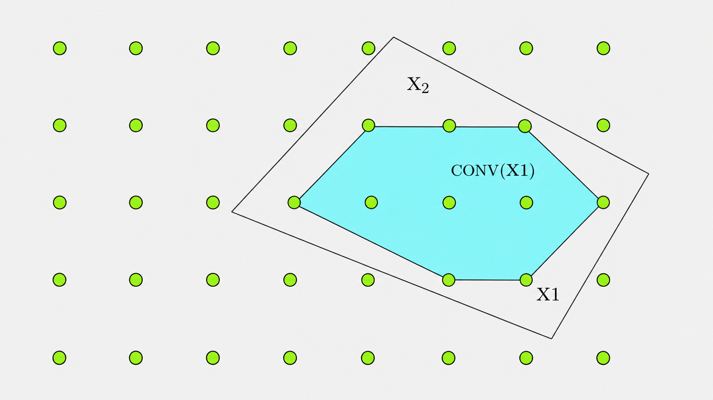

# Integer Linear Programming Notes 03: Cutting Plane

> Author: Hang Li (@flgkd)
>
> Note: Titles marked with ⭐ highlight key concepts and important summaries.

## 1. Preface

This note introduces another method for solving integer linear programming problems: the **cutting plane method**.

We first briefly introduce the basic idea behind cutting planes.

When solving the LP relaxation of an integer linear programming problem, it is natural to think:

> How nice would it be if the optimal solution of the relaxation happened to be an integer solution?

In fact, there is indeed a class of integer linear programming problems with this property. For such problems, the coefficient matrix is **totally unimodular**.

In other words, if the coefficient matrix of an integer linear programming problem is totally unimodular, then the optimal solution of its LP relaxation is also an optimal solution of the original integer programming problem.

However, total unimodularity is a rather strong condition and does not apply to general integer linear programming problems. Therefore, we will not discuss it in detail here. Interested readers may look it up separately or refer to Chapter 3 of Professor Sun Xiaoling's book *Integer Programming*.

Now consider the figure below. Suppose the feasible region of an integer linear programming problem consists of all the green points inside region $X_2$. These green points are integer points, and we denote the set of these integer feasible points by $X_1$. The region $X_2$ is the feasible region of the LP relaxation.

<p align="center">
  
</p>

<p align="center">
  Relationship among infeasible solutions, feasible solutions, basic solutions, and basic feasible solutions.
</p>

If we want the LP relaxation to directly return an optimal integer solution, then, according to the principle of the simplex method, we only need to remove the redundant parts of $X_2$ and keep the smallest convex hull containing $X_1$.

That is, we want to reduce $X_2$ to the convex hull of $X_1$, denoted by

$$
\mathrm{conv}(X_1).
$$

At this point, the feasible region of the relaxation changes from $X_2$ to $\mathrm{conv}(X_1)$. If we solve the LP relaxation over this new feasible region, the optimal solution will also be an optimal integer solution.

However, this idea is beautiful in theory but difficult in practice. Directly reducing the feasible region of the LP relaxation to the smallest convex hull of the integer feasible points is very hard. Equivalently, finding the convex hull of an integer point set is generally difficult.

The basic idea of the cutting plane method is therefore:

> Gradually remove redundant parts of the LP relaxation feasible region by adding linear inequalities, called cutting planes, until the relaxation becomes close to the convex hull of the integer feasible points.


## 2. Basic Idea of Cutting Plane⭐

Consider an integer programming problem

$$
(IP) \quad \min \quad c^T x
$$

subject to

$$
x \in X,
$$

where

$$
X = \{ x \mid Ax \le b, \ x \in \mathbf{Z}_+^n \}.
$$

The LP relaxation is obtained by replacing the integer restriction with continuous variables:

$$
(LP) \quad \min \quad c^T x
$$

subject to

$$
x \in P,
$$

where

$$
P = \{ x \mid Ax \le b, \ x \ge 0 \}.
$$

Clearly,

$$
X \subseteq P.
$$

The convex hull of $X$ is denoted by

$$
conv(X).
$$

The ideal linear programming formulation would be

$$
(CP) \quad \min \quad c^T x
$$

subject to

$$
x \in conv(X).
$$

If we can describe $conv(X)$ exactly, then problem $(CP)$ is equivalent to the original integer programming problem $(IP)$.

However, the difficulty is that an exact linear inequality description of $conv(X)$ is usually hard to obtain.

Therefore, the cutting plane method does the following:

1. solve the LP relaxation;
2. if the solution is fractional, find a valid inequality that cuts it off;
3. add this inequality to the LP relaxation;
4. repeat.

The added valid inequality is called a **cut** or a **cutting plane**.

The cut must satisfy two requirements:

1. it must cut off the current fractional LP solution;
2. it must not remove any integer feasible solution.

This is the core logic of cutting planes.

## 3. Valid Inequalities⭐

### 3.1 Definition

Let $X$ be a feasible set. An inequality

$$
\alpha^T x \le \beta
$$

is called a **valid inequality** for $X$ if every point in $X$ satisfies it.

That is, for every $x \in X$,

$$
\alpha^T x \le \beta.
$$

Geometrically, this means that the entire set $X$ lies in the half-space

$$
\{ x \mid \alpha^T x \le \beta \}.
$$

A valid inequality is useful when it removes some fractional points from the LP relaxation without removing any integer feasible point.

### 3.2 Why Valid Inequalities Matter

The LP relaxation $P$ is usually larger than $conv(X)$:

$$
conv(X) \subseteq P.
$$

If the LP optimum lies in $P$ but not in $conv(X)$, then it may be fractional and cannot be accepted as a feasible integer solution.

A valid inequality can shrink $P$:

$$
P \quad \longrightarrow \quad P \cap \{ x \mid \alpha^T x \le \beta \}.
$$

If the inequality is valid for $X$, then no integer feasible solution is lost.

If it cuts off the current LP optimum, then the next LP relaxation becomes stronger.

This is the main role of valid inequalities in cutting plane methods.

### 3.3 Simple Example

Suppose $X$ is a 0-1 feasible set.

If every feasible solution in $X$ satisfies

$$
x_1 + x_2 \le 1,
$$

then this inequality is valid for $X$.

It may remove fractional points such as

$$
x_1 = 0.8, \quad x_2 = 0.8,
$$

because this point violates

$$
x_1 + x_2 \le 1.
$$

At the same time, if all integer feasible solutions satisfy the inequality, then adding it does not change the original ILP feasible set.

### 3.4 Convex Hull View

The strongest possible valid inequalities are those that describe the convex hull $conv(X)$ exactly.

In low-dimensional examples, the convex hull of integer feasible points can sometimes be drawn and described by hand.

For high-dimensional ILP problems, this is generally impossible.

Therefore, practical cutting plane methods focus on generating useful valid inequalities automatically.

## 4. Chvátal-Gomory Cuts⭐

The **Chvátal-Gomory cut**, often abbreviated as **C-G cut**, is a classical way to generate valid inequalities for integer programming.

### 4.1 Basic Observation

The method is based on a very simple observation:

> If an integer quantity is less than or equal to a real number, then it is also less than or equal to the floor of that real number.

For example, if $a$ is an integer and

$$
a \le 5.7,
$$

then we must have

$$
a \le 5.
$$

This small observation is the foundation of the Chvátal-Gomory method.

### 4.2 Generating a C-G Cut

Consider the integer feasible set

$$
X = \{ x \mid Ax \le b, \ x \in \mathbf{Z}_+^n \}.
$$

Let

$$
P = \{ x \mid Ax \le b, \ x \ge 0 \}
$$

be its LP relaxation.

Take a nonnegative multiplier vector $u$:

$$
u \ge 0.
$$

Multiplying the constraints $Ax \le b$ by $u^T$ gives a valid inequality for $P$:

$$
u^T A x \le u^T b.
$$

Since $X \subseteq P$, this inequality is also valid for $X$.

Now suppose the coefficient vector $u^T A$ is integral. Since $x$ is integer, the left-hand side

$$
u^T A x
$$

is also integer for every $x \in X$.

Therefore, we can round down the right-hand side and obtain

$$
u^T A x \le \lfloor u^T b \rfloor.
$$

This is a valid inequality for $X$.

This inequality is called a **Chvátal-Gomory cut**.

### 4.3 C-G Cut Generation Procedure

The C-G method can be summarized as follows.

Step 1. Start from the LP relaxation

$$
P = \{ x \mid Ax \le b, \ x \ge 0 \}.
$$

Step 2. Choose a nonnegative multiplier vector $u$:

$$
u \ge 0.
$$

Step 3. Construct the aggregated inequality

$$
u^T A x \le u^T b.
$$

Step 4. If $u^T A$ is integral, strengthen the inequality by rounding down the right-hand side:

$$
u^T A x \le \lfloor u^T b \rfloor.
$$

The resulting inequality is valid for the integer feasible set $X$.

### 4.4 Geometric Interpretation

Geometrically, a C-G cut can be viewed as follows.

First, several inequalities of the LP relaxation are combined into one inequality. This produces a half-space that still contains the LP relaxation.

Then, because the variables are integer, the boundary of this half-space can sometimes be shifted inward without losing any integer feasible points.

This shifted half-space cuts away fractional points and gives a stronger relaxation.

This is why C-G cuts are useful in integer programming.

### 4.5 Important Theoretical Fact

The Chvátal-Gomory method is simple, but it is also theoretically powerful.

A classical result says that every valid inequality for a rational integer polyhedron can be obtained by repeatedly applying Chvátal-Gomory closures a finite number of times.

This does not mean that C-G cuts are always computationally efficient in practice, but it explains their theoretical importance.

## 5. General Cutting Plane Algorithm

A cutting plane algorithm repeatedly solves LP relaxations and adds cuts.

Consider the integer programming problem

$$
(IP) \quad \min \quad c^T x
$$

subject to

$$
x \in X.
$$

Let the initial LP relaxation be

$$
P_0 = P.
$$

At iteration $t$, solve

$$
\min \quad c^T x
$$

subject to

$$
x \in P_t.
$$

Let the optimal solution be $x^t$.

There are two cases.

### Case 1: The LP Solution Is Integer

If

$$
x^t \in \mathbf{Z}^n,
$$

then $x^t$ is feasible for the original integer programming problem.

Because $P_t$ is a relaxation that still contains all integer feasible points, $x^t$ is also optimal for the original ILP.

The algorithm can terminate.

### Case 2: The LP Solution Is Fractional

If $x^t$ is not integer, we try to find a valid inequality

$$
\alpha^T x \le \beta
$$

such that every integer feasible solution satisfies it, but the current LP solution violates it:

$$
\alpha^T x^t > \beta.
$$

Then we add this inequality to the relaxation:

$$
P_{t+1} = P_t \cap \{ x \mid \alpha^T x \le \beta \}.
$$

Then we solve the new LP relaxation and repeat the process.

This is the general cutting plane framework.

## 6. Gomory Fractional Cut⭐

The general cutting plane framework requires a practical way to find cuts.

The **Gomory fractional cut** is one of the most classical cuts for pure integer linear programming.

### 6.1 Basic Idea

Suppose we solve the LP relaxation of an ILP and obtain an optimal simplex tableau.

If the LP optimal solution is not integer, then at least one basic variable has a fractional value.

The Gomory fractional cut uses the row corresponding to such a fractional basic variable to construct a valid inequality that cuts off the current fractional solution.

This is why Gomory cuts are closely related to the simplex tableau.

### 6.2 Tableau Row

Suppose a row of the final simplex tableau is written as

$$
x_i + \sum_{j \in N} a_{ij}x_j = b_i,
$$

where:

- $x_i$ is a basic variable;
- $N$ is the set of nonbasic variables;
- all variables are required to be integer;
- $b_i$ is not an integer.

At the current LP basic solution, all nonbasic variables are zero:

$$
x_j = 0, \quad j \in N.
$$

Therefore,

$$
x_i = b_i.
$$

If $b_i$ is fractional, then the current LP solution is not integer feasible.

### 6.3 Fractional Part

For any real number $r$, define its fractional part as

$$
f(r) = r - \lfloor r \rfloor.
$$

For example,

$$
f(2.35) = 0.35.
$$

For a negative number,

$$
f(-0.45) = -0.45 - \lfloor -0.45 \rfloor = -0.45 - (-1) = 0.55.
$$

Let

$$
f_i = f(b_i)
$$

and

$$
f_{ij} = f(a_{ij}).
$$

Since $b_i$ is fractional,

$$
0 < f_i < 1.
$$

### 6.4 Gomory Fractional Cut

The Gomory fractional cut generated from this row is

$$
\sum_{j \in N} f_{ij}x_j \ge f_i.
$$

Equivalently, it can be written as

$$
-\sum_{j \in N} f_{ij}x_j \le -f_i.
$$

This inequality is valid for all integer feasible solutions, but it cuts off the current fractional LP solution.

Why does it cut off the current LP solution?

At the current LP basic solution,

$$
x_j = 0, \quad j \in N.
$$

So the left-hand side becomes

$$
\sum_{j \in N} f_{ij}x_j = 0.
$$

But the right-hand side is positive:

$$
f_i > 0.
$$

Therefore, the inequality

$$
\sum_{j \in N} f_{ij}x_j \ge f_i
$$

is violated by the current LP solution.

Thus, the cut removes the current fractional LP optimum.

### 6.5 Why the Cut Is Valid

The original tableau row is

$$
x_i + \sum_{j \in N} a_{ij}x_j = b_i.
$$

All variables are integer. Therefore, the difference between the left-hand side and its integer part must be consistent with the fractional part of the right-hand side.

The Gomory fractional cut captures exactly this fractional part condition.

It removes the current fractional basic solution, but it keeps all feasible integer solutions.

This is why it is a valid cutting plane.

### 6.6 Sign Convention

Different textbooks write the simplex tableau row in slightly different forms.

For example, some write

$$
x_i = b_i - \sum_{j \in N} a_{ij}x_j.
$$

Others write

$$
x_i + \sum_{j \in N} a_{ij}x_j = b_i.
$$

The formula of the Gomory cut may look slightly different depending on this convention.

The key idea is unchanged:

> take a tableau row whose basic variable has a fractional value, separate integer parts and fractional parts, and derive a valid inequality that cuts off the current LP optimum.

## 7. Gomory Cutting Plane Method

The Gomory cutting plane method applies Gomory fractional cuts repeatedly.

### 7.1 Algorithm

The algorithm can be summarized as follows.

Step 1. Solve the LP relaxation of the integer programming problem.

Step 2. If the optimal LP solution is integer feasible, stop. This solution is optimal for the ILP.

Step 3. If some basic variable has a fractional value, choose one such row from the final simplex tableau.

Step 4. Generate a Gomory fractional cut from this row.

Step 5. Add the cut to the LP relaxation.

Step 6. Reoptimize the LP relaxation.

Step 7. Repeat until an integer optimal solution is found.

### 7.2 Relation to Dual Simplex Method

After adding a Gomory cut, the current basis may become infeasible for the new LP relaxation.

However, the reduced cost structure is often still suitable for reoptimization.

Therefore, the **dual simplex method** is commonly used after adding a cut.

This is one reason why cutting plane methods are closely connected with simplex tableau operations.

### 7.3 Summary

The Gomory cutting plane method can be viewed as:

```text
Solve LP relaxation
→ find a fractional basic variable
→ generate a Gomory cut
→ add the cut
→ reoptimize
→ repeat
```

The method transforms an ILP into a sequence of LP problems.

This is similar in spirit to Branch and Bound, which also solves many LP relaxations. The difference is that:

- Branch and Bound splits the feasible region into subproblems;
- Cutting Plane keeps one relaxation but continuously adds inequalities.

## 8. Gomory Cuts and Chvátal-Gomory Cuts⭐

Gomory fractional cuts are not separate from Chvátal-Gomory cuts.

In fact, a Gomory fractional cut can be interpreted as a special Chvátal-Gomory cut derived from the simplex tableau.

The simplex tableau row is obtained from linear combinations of the original constraints. Therefore, when we take fractional parts and round the right-hand side, we are essentially applying the Chvátal-Gomory principle.

This gives an important conceptual connection:

> Gomory fractional cuts are tableau-based Chvátal-Gomory cuts.

This also explains why Gomory cuts are valid for the integer feasible set.

## 9. Mixed-Integer Cuts

So far, the discussion mainly focused on pure integer programming, where all variables are integer.

In mixed-integer linear programming, some variables are integer and some variables are continuous.

A general mixed-integer feasible set can be written as

$$
X = \{ (x,y) \mid Ax + Gy \le b, \ x \in \mathbf{Z}_+^n, \ y \in \mathbf{R}_+^p \}.
$$

Here:

- $x$ represents integer variables;
- $y$ represents continuous variables.

For mixed-integer sets, pure integer cuts such as the basic C-G cut are not always sufficient or directly applicable.

We need cuts that take into account both integer and continuous variables.

These are called **mixed-integer cuts**.

## 10. Simple Mixed-Integer Cut⭐

A simple mixed-integer set can be written as

$$
X = \{ (x,y) \mid x + y \ge b, \ x \in \mathbf{Z}, \ y \ge 0 \}.
$$

Assume $b$ is not an integer.

Let

$$
f = b - \lfloor b \rfloor.
$$

Then

$$
0 < f < 1.
$$

The mixed-integer structure allows us to derive a stronger valid inequality than the original relaxation.

The reason is that the integer variable $x$ cannot take fractional values. If $x$ is below the next integer level, then the continuous variable $y$ must compensate enough to satisfy the original constraint.

This kind of reasoning is the basis of mixed-integer cuts.

The important point is:

> mixed-integer cuts exploit the discreteness of integer variables while still allowing continuous variables to move.

## 11. Gomory Mixed-Integer Cut⭐

The **Gomory mixed-integer cut**, often abbreviated as **GMI cut**, extends Gomory fractional cuts to mixed-integer programming.

### 11.1 Tableau Row

Suppose a tableau row is written in the form

$$
x_B = b - \sum_{j \in I} a_j x_j - \sum_{j \in C} g_j y_j.
$$

Here:

- $x_B$ is a basic integer variable;
- $x_j$ are nonbasic integer variables;
- $y_j$ are nonbasic continuous variables;
- $I$ is the index set of integer nonbasic variables;
- $C$ is the index set of continuous nonbasic variables;
- $b$ is fractional.

Let

$$
f_0 = b - \lfloor b \rfloor.
$$

For each integer nonbasic coefficient $a_j$, define

$$
f_j = a_j - \lfloor a_j \rfloor.
$$

### 11.2 A Common GMI Cut Form

A common form of the GMI cut is

$$
\sum_{j \in I, f_j \le f_0} \frac{f_j}{f_0}x_j
+
\sum_{j \in I, f_j > f_0} \frac{1-f_j}{1-f_0}x_j
+
\sum_{j \in C, g_j \ge 0} \frac{g_j}{f_0}y_j
+
\sum_{j \in C, g_j < 0} \frac{-g_j}{1-f_0}y_j
\ge 1.
$$

This cut is valid for the mixed-integer feasible set and cuts off the current fractional LP solution.

As with Gomory fractional cuts, different sign conventions for the tableau row may lead to slightly different-looking formulas.

The important idea is the same:

> use a fractional basic integer variable to derive a valid inequality that respects both integer and continuous variables.

### 11.3 Why GMI Cuts Are Important

GMI cuts are important because most practical optimization models are mixed-integer linear programs rather than pure integer programs.

Modern MILP solvers often use many types of cuts, including Gomory mixed-integer cuts, together with Branch and Bound.

This combination leads to **Branch and Cut**.

## 12. Cutting Plane vs Branch and Bound

Both cutting planes and Branch and Bound solve ILP problems through LP relaxations, but they improve the relaxation in different ways.

| Method | Main idea | What changes? |
|---|---|---|
| Branch and Bound | Split the problem into subproblems | The feasible region is branched into smaller regions |
| Cutting Plane | Add valid inequalities | The LP relaxation is tightened by cuts |
| Branch and Cut | Combine both | Branching and cutting are used together |

Branch and Bound is often easier to understand geometrically as search-tree enumeration.

Cutting Plane is more polyhedral: it tries to describe the convex hull more accurately by adding inequalities.

Modern solvers usually combine both ideas.

## 13. Key Takeaways

1. The LP relaxation of an ILP is usually too large because it contains fractional points.
2. The ideal relaxation is the convex hull of integer feasible solutions, denoted by $conv(X)$.
3. Describing $conv(X)$ exactly is usually difficult.
4. A valid inequality is an inequality satisfied by all integer feasible solutions.
5. A useful cut removes fractional LP solutions without removing integer feasible solutions.
6. Chvátal-Gomory cuts are generated by aggregating inequalities and rounding the right-hand side.
7. Gomory fractional cuts are derived from fractional rows of the final simplex tableau.
8. A Gomory cut is valid for all integer feasible solutions but cuts off the current fractional LP optimum.
9. Gomory cuts can be viewed as tableau-based Chvátal-Gomory cuts.
10. Mixed-integer cuts extend the cutting plane idea to problems with both integer and continuous variables.
11. Modern MILP solvers often combine cutting planes with Branch and Bound, leading to Branch and Cut.

## References

1. Sun, Xiaoling. *Integer Programming*, Chapter 8.  
   （孙小玲：《整数规划》第八章。）

2. Textbook Editorial Group of *Operations Research*. *Operations Research*, 4th ed. Beijing: Tsinghua University Press, 2012. ISBN: 978-7-302-28879-4.  
   （《运筹学》教材编写组：《运筹学》第4版，北京：清华大学出版社，2012年。ISBN：978-7-302-28879-4。）

## Suggested Follow-up Reading

- Chvátal-Gomory Cuts
- Gomory Fractional Cuts
- Gomory Mixed-Integer Cuts
- Facets and Convex Hulls
- Branch and Cut
- Modern MILP Solvers such as CPLEX and Gurobi

These topics are useful for later notes on Branch and Cut and Branch and Price.
