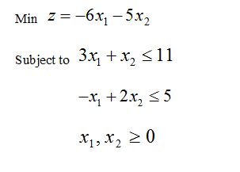

# Integer Linear Programming Notes 04: Branch and Cut

> Author: Hang Li (@flgkd)
>
> Note: Titles marked with ⭐ highlight key concepts and important summaries.

## 1. Preface

This note introduces **Branch and Cut**, a method for solving integer linear programming problems. 

In essence, Branch and Cut is based on **Branch and Bound**, but it also uses **cutting planes** to remove unnecessary parts of the LP relaxation feasible region. By tightening LP relaxations, Branch and Cut can often make Branch and Bound converge faster.

Therefore, before studying Branch and Cut, it is helpful to understand the following two topics:

- [Branch and Bound](02-branch-and-bound.md)
- [Cutting Plane](03-cutting-plane.md)

A more detailed reference on this topic is the classic survey-style document *Branch-and-Cut Algorithms for Combinatorial Optimization Problems*.

## 2. Overall Description⭐

As mentioned above, Branch and Cut is closely related to Branch and Bound. In fact, it can be viewed as an enhanced version of Branch and Bound.

Recall the basic logic of Branch and Bound. For a maximization integer programming problem:

- the optimal value of an LP relaxation gives an **upper bound**;
- the best integer feasible solution found so far gives a **lower bound**, also called the incumbent value;
- if the upper bound of a node is no better than the current lower bound, then this node can be pruned;
- if the LP relaxation solution is fractional and the bound is still promising, we branch further.

In other words, Branch and Bound repeatedly solves LP relaxations and uses bounds to decide whether a node should be explored.

Branch and Cut adds one more operation to this process:

> When solving the LP relaxation of a node, use cutting planes to tighten the LP relaxation before deciding whether to branch.

This means that if cutting planes are used to tighten LP relaxations inside Branch and Bound, the method becomes **Branch and Cut**.

### 2.1 What Does a Cutting Plane Do?

A cutting plane is a valid inequality added to the LP relaxation.

It should satisfy two requirements:

1. it removes the current fractional LP solution or other unnecessary fractional points;
2. it does not remove any feasible integer solution.

Geometrically, we can think of it as follows:

- the integer feasible region is the true feasible region of the ILP;
- the LP relaxation feasible region is usually larger;
- a cut shrinks the LP relaxation feasible region while keeping the integer feasible region unchanged.

Therefore, cuts can make the LP relaxation tighter and the bounds stronger.

This is the main advantage of Branch and Cut over plain Branch and Bound.

<p align="center">
  
</p>

<p align="center">
  Cutting planes tighten LP relaxations without removing integer feasible solutions.
</p>

### 2.2 Why Branch and Cut Can Be Faster

In Branch and Bound, if a node has a promising LP bound but the relaxation solution is fractional, the algorithm usually branches immediately.

In Branch and Cut, we may first try to add cuts at that node.

If the cuts make the LP bound worse enough, the node may be pruned without branching. In this case, Branch and Cut avoids unnecessary child nodes.

That is the key idea:

> Before branching, try to tighten the relaxation with cuts.

This is why Branch and Cut may explore a smaller search tree than ordinary Branch and Bound.

## 3. A Simple Example

To understand the essence of Branch and Cut, let us compare it with Branch and Bound on the same integer programming problem.

The original note uses a small example in which the only important difference occurs at subproblem $P_2$.

<p align="center">
  
</p>

<p align="center">
  Example problem for comparing Branch and Cut with Branch and Bound.
</p>

The solving processes of Branch and Cut and Branch and Bound are shown conceptually below.

<p align="center">
  
</p>

<p align="center">
  Branch and Cut versus Branch and Bound.
</p>

The difference between the two methods lies in how they handle subproblem $P_2$.

### 3.1 Branch and Bound Treatment

In the Branch and Bound process, solving the LP relaxation of subproblem $P_2$ gives

$$
Z=-29.5.
$$

Suppose the current incumbent value is

$$
Z=-28.
$$

In this example, the problem is treated as a minimization problem, so a smaller objective value is better.

Since

$$
-29.5 < -28,
$$

subproblem $P_2$ may still contain a better integer solution. Therefore, Branch and Bound continues branching from $P_2$.

However, after branching into two child nodes, neither branch produces a better integer solution.

So this branching effort turns out to be unnecessary.

### 3.2 Branch and Cut Treatment

Branch and Cut handles $P_2$ more carefully.

After solving the LP relaxation and obtaining

$$
Z=-29.5,
$$

it does not branch immediately.

Instead, it tries to find a cutting plane that removes part of the LP relaxation feasible region without removing any integer feasible solution.

In this example, a valid cut is found:

$$
2x_1+x_2 \le 7.
$$

After adding this cut, a tightened subproblem $P_3$ is obtained.

Solving the LP relaxation of $P_3$ gives

$$
Z=-27.8.
$$

Since this is a minimization problem and

$$
-27.8 > -28,
$$

this node cannot improve the current incumbent. Therefore, it can be pruned.

### 3.3 Main Lesson of the Example⭐

For this example:

- Branch and Bound needs to branch from $P_2$ and explore additional nodes;
- Branch and Cut adds a cut at $P_2$, tightens the relaxation, and prunes the node directly.

The key lesson is:

> A good cut can prevent unnecessary branching.

This is the main reason why Branch and Cut can be more efficient than plain Branch and Bound.

## 4. Branch and Cut Algorithm⭐

Compared with Branch and Bound, Branch and Cut adds a **cut generation** step.

The overall procedure can be summarized as follows:

```text
Start with the original ILP
→ solve the LP relaxation of the current node
→ if infeasible, prune the node
→ if the bound is not promising, prune the node
→ if the LP solution is integer feasible, update the incumbent
→ if the LP solution is fractional, try to generate violated cuts
→ if cuts are found, add them and re-solve the LP relaxation
→ if no useful cut is found, branch
→ repeat until no active nodes remain
```

<p align="center">
  
</p>

<p align="center">
  General process of Branch and Cut.
</p>

### 4.1 Algorithm Logic for Maximization

For a maximization problem, the LP relaxation value of a node gives an upper bound.

Let

$$
LB
$$

be the value of the current incumbent, that is, the best integer feasible solution found so far.

At a node, solve its LP relaxation and obtain value

$$
UB_k.
$$

There are several cases.

**Case 1: The LP relaxation is infeasible.**

Then this node contains no feasible solution and can be pruned.

**Case 2: The LP bound is no better than the incumbent.**

If

$$
UB_k \le LB,
$$

then this node cannot contain a better integer solution and can be pruned.

**Case 3: The LP solution is integer feasible.**

Then this solution is a feasible integer solution. If its objective value is better than the current incumbent, update the incumbent.

**Case 4: The LP solution is fractional.**

Try to find violated cutting planes.

If violated cuts are found, add them to the current node relaxation and solve the strengthened LP relaxation again.

If no useful cuts are found, branch on a fractional variable and create child nodes.

## 5. Pseudocode

The following pseudocode describes the main logic of Branch and Cut for a maximization problem.

```text
BranchAndCut(initial_problem):

    active_nodes = {initial_problem}
    incumbent_solution = None
    LB = -infinity

    while active_nodes is not empty:

        node = select_and_remove_one_node(active_nodes)

        while true:

            relaxation = LP_relaxation(node)
            lp_solution = solve(relaxation)

            if lp_solution is infeasible:
                prune node
                break

            UB = objective_value(lp_solution)

            if UB <= LB:
                prune node by bound
                break

            if lp_solution is integer feasible:
                incumbent_solution = lp_solution
                LB = UB
                prune node by integrality
                break

            cuts = find_violated_cuts(lp_solution, node)

            if cuts are not empty:
                add cuts to node
                continue

            child_nodes = branch(node, lp_solution)
            add child_nodes to active_nodes
            break

    return incumbent_solution
```

This pseudocode emphasizes the key difference from Branch and Bound:

> before branching, Branch and Cut first tries to find violated cuts and tighten the LP relaxation.

## 6. Branch and Bound vs Branch and Cut

The relationship between Branch and Bound and Branch and Cut can be summarized as follows.

| Method | Main idea | What happens at a fractional LP solution? |
|---|---|---|
| Branch and Bound | Use branching and bounds | Branch directly if the node is promising |
| Cutting Plane | Add valid inequalities | Tighten the relaxation by cuts |
| Branch and Cut | Combine both | Try cuts first; if cuts are not enough, branch |

Branch and Cut is not a completely separate idea from Branch and Bound.

Rather, it is Branch and Bound strengthened by cutting planes.

In modern MILP solvers, Branch and Cut is often the standard framework. Solvers do not simply branch blindly. Instead, they also use cuts, presolve, heuristics, node selection strategies, branching rules, and many other techniques.

## 7. Key Takeaways

1. Branch and Cut is an enhancement of Branch and Bound.
2. The main extra step in Branch and Cut is the use of cutting planes.
3. A cutting plane tightens the LP relaxation without removing feasible integer solutions.
4. Stronger LP relaxations lead to stronger bounds.
5. Stronger bounds can prune more nodes.
6. A good cut can prevent unnecessary branching.
7. If useful cuts cannot be found, the algorithm branches just like Branch and Bound.
8. Branch and Cut is a core framework used in modern MILP solvers.

## References

1. Deng, Faheng. “Branch and Cut.” *Cnblogs*, 2019.  
   （邓发恒：《Branch and Cut》，博客园，2019年。）

2. Padberg, M., and Rinaldi, G. “A Branch-and-Cut Algorithm for the Resolution of Large-Scale Symmetric Traveling Salesman Problems.” *SIAM Review*, 33(1), 1991, pp. 60–100.

## Suggested Follow-up Reading

- Branch and Bound
- Cutting Plane
- Branching Rules
- Cut Separation
- Node Selection Strategy
- Branch and Cut
- Modern MILP Solvers such as CPLEX and Gurobi

These topics are useful for later notes on Branch and Price and large-scale integer programming methods.
