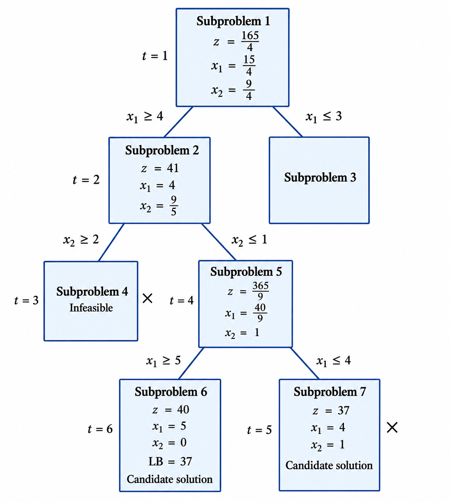
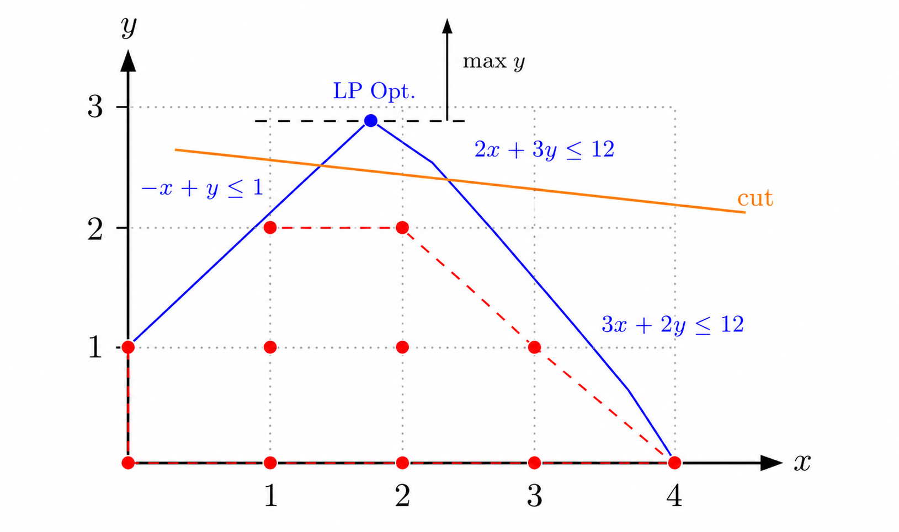
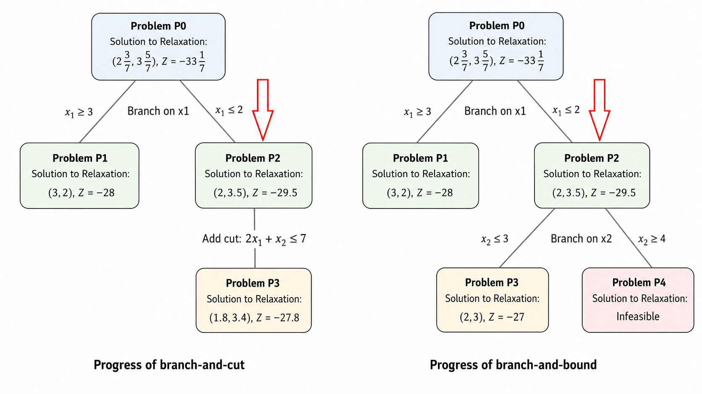
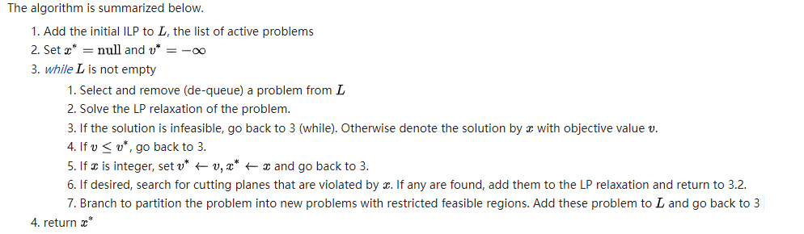

# Integer Linear Programming Notes 04: Branch and Cut

> Author: Hang Li (@flgkd)
>
> Note: Titles marked with ⭐ highlight key concepts and important summaries.

## 1. Preface

This note introduces **Branch and Cut**, a method for solving integer linear programming problems.

In essence, Branch and Cut is based on **Branch and Bound**, but it also uses **cutting planes to remove unnecessary parts of the LP relaxation feasible region. By tightening LP relaxations**, Branch and Cut can often make Branch and Bound converge faster.

Therefore, before studying Branch and Cut, it is helpful to understand the following two topics:

- [Branch and Bound](02-branch-and-bound.md)
- [Cutting Plane](03-cutting-plane.md)

A more detailed reference on this topic is Mitchell's classic survey-style chapter *Branch-and-Cut Algorithms for Combinatorial Optimization Problems*.

## 2. Overall Description⭐

As mentioned above, Branch and Cut is closely related to Branch and Bound. In fact, it can be viewed as **Branch and Bound strengthened by cutting planes**.

Before introducing Branch and Cut, let us briefly review the Branch and Bound process through the following example.

<p align="center">
  
</p>

<p align="center">
  Branch and Bound search process.
</p>

For a maximization integer programming problem, when we solve the LP relaxation at a node:

- the objective value of the LP relaxation gives an **upper bound** for that node;
- the best integer feasible solution found so far gives a **lower bound**, also called the incumbent value;
- if the upper bound of a node is no better than the current lower bound, the node can be pruned;
- otherwise, if the LP relaxation solution is fractional, we continue branching.

In short, Branch and Bound repeatedly solves LP relaxations and uses bounds to decide whether a node is still worth exploring.

Now comes **the key idea of Branch and Cut**.

> If cutting planes are used to tighten LP relaxations during Branch and Bound, then Branch and Bound becomes Branch and Cut.

That is, before we immediately branch at a fractional LP solution, we may first try to add cutting planes to shrink the relaxation feasible region.

### 2.1 What Does a Cutting Plane Do?

A cutting plane is a valid inequality added to the LP relaxation.

Geometrically, the idea can be illustrated as follows.

<p align="center">
  
</p>

<p align="center">
  Cutting planes tighten the LP relaxation without removing integer feasible solutions.
</p>

In the figure:

- the red points represent the feasible integer solutions;
- the blue region represents the feasible region of the LP relaxation;
- the orange line represents a cutting plane.

When solving the LP relaxation, **adding the orange cut reduces the LP relaxation feasible region. At the same time, it does not remove any feasible integer solution.**

**This makes the LP relaxation tighter and can make the algorithm converge faster.**

This is **the main advantage of Branch and Cut** compared with plain Branch and Bound:

> Branch and Cut tries to cut before it branches.

In this note, we will not discuss in detail how to generate cuts. That topic belongs to the previous note on cutting planes.

- [Cutting Plane](03-cutting-plane.md)

## 3. A Simple Example

To understand the essence of Branch and Cut, let us look at a small example.

Consider the following integer programming problem:

$$
\min \quad z=-6x_1-5x_2
$$

subject to

$$
3x_1+x_2\le 11
$$

$$
-x_1+2x_2\le 5
$$

$$
x_1,x_2\ge 0
$$

$$
x_1,x_2\in \mathbf{Z}.
$$

The following figure compares the solving process of Branch and Cut with that of Branch and Bound on this same problem.

<p align="center">
  
</p>

<p align="center">
  Progress of Branch and Cut and Branch and Bound on the same example.
</p>

We can see that **the main difference between the two methods lies in how they handle subproblem $P_2$**.

### 3.1 The Common First Step

The LP relaxation of the original problem $P_0$ has the optimal solution

$$
\left(2\frac{3}{7},\ 3\frac{5}{7}\right)
$$

with objective value

$$
Z=-33\frac{1}{7}.
$$

This solution is fractional, so the algorithm branches on $x_1$.

This creates two subproblems:

$$
x_1\ge 3
$$

and

$$
x_1\le 2.
$$

The left branch gives subproblem $P_1$. Its LP relaxation solution is

$$
(x_1,x_2)=(3,2),\quad Z=-28.
$$

This solution is integer feasible, so it becomes the incumbent solution.

For this minimization problem, the incumbent value is therefore

$$
Z=-28.
$$

### 3.2 Branch and Bound Treatment of Subproblem P2

Now consider subproblem $P_2$.

Solving its LP relaxation gives

$$
(x_1,x_2)=(2,3.5),\quad Z=-29.5.
$$

This solution is not integer feasible.

Since this is a minimization problem, a smaller objective value is better. Because

$$
-29.5<-28,
$$

subproblem $P_2$ may still contain an integer solution better than the incumbent. Therefore, plain Branch and Bound cannot prune it directly.

So Branch and Bound branches again, this time on $x_2$.

It creates two child subproblems:

$$
x_2\le 3
$$

and

$$
x_2\ge 4.
$$

After solving these branches, it turns out that no better integer solution is found:

- one branch gives an integer solution with value $Z=-27$, which is worse than $Z=-28$ for a minimization problem;
- the other branch is infeasible.

So Branch and Bound spends one more branching step, but this effort does not improve the incumbent.

### 3.3 Branch and Cut Treatment of Subproblem P2⭐

Branch and Cut handles subproblem $P_2$ differently.

When the LP relaxation of $P_2$ gives

$$
(x_1,x_2)=(2,3.5),\quad Z=-29.5,
$$

Branch and Cut does not immediately branch.

Instead, it tries to add a cutting plane that removes the current fractional LP solution without removing any feasible integer solution.

In this example, a valid cut is found:

$$
2x_1+x_2\le 7.
$$

After adding this cut, the new tightened subproblem is denoted by $P_3$.

Solving the LP relaxation of $P_3$ gives

$$
(x_1,x_2)=(1.8,3.4),\quad Z=-27.8.
$$

Now compare this value with the incumbent value $Z=-28$.

Since this is a minimization problem and

$$
-27.8>-28,
$$

this node cannot contain a better integer solution than the incumbent.

Therefore, Branch and Cut can prune this branch directly.

### 3.4 Main Lesson of the Example⭐

From the example above:

- Branch and Bound branches from $P_2$ and needs to explore two more child nodes;
- Branch and Cut adds a cut at $P_2$, tightens the relaxation, and prunes the node directly.

Therefore, for this example:

- Branch and Cut finishes in fewer major steps;
- Branch and Bound spends extra branching effort that does not improve the solution.

The key lesson is:

> A good cut can prevent unnecessary branching.

This is the core idea of Branch and Cut.

## 4. Algorithm Process⭐

The overall process of Branch and Cut can be summarized as follows.

<p align="center">
  
</p>

<p align="center">
  General algorithm process of Branch and Cut.
</p>

Compared with Branch and Bound, Branch and Cut adds one important step:

> use cutting planes to tighten LP relaxations before deciding whether to branch.

Therefore, the algorithm repeatedly performs the following operations:

1. solve the LP relaxation of the current problem;
2. prune the problem if the relaxation is infeasible;
3. prune the problem if its bound is not promising;
4. update the incumbent if the LP solution is integer feasible;
5. if the LP solution is fractional, try to find violated cutting planes;
6. if useful cuts are found, add them and solve the LP relaxation again;
7. if no useful cuts are found, branch and create new subproblems.

### 4.1 Algorithm Description for Maximization

The original pseudocode assumes that the objective is to be maximized.

Let $L$ be the list of active problems, and let $x^{opt}$ be the best integer feasible solution found so far. Let $v^{opt}$ be its objective value.

The algorithm can be summarized below.

1. Add the initial ILP to $L$, the list of active problems.
2. Set $x^{opt}$ to null and $v^{opt}=-\infty$.
3. While $L$ is not empty:
   1. Select and remove a problem from $L$.
   2. Solve the LP relaxation of the problem.
   3. If the relaxation is infeasible, prune this problem and continue.
   4. Let the LP relaxation solution be $x$ with objective value $v$.
   5. If $v\le v^{opt}$, prune this problem by bound and continue.
   6. If $x$ is integer feasible, set $v^{opt}=v$, set $x^{opt}=x$, and continue.
   7. If desired, search for cutting planes violated by $x$.
   8. If violated cuts are found, add them to the relaxation and go back to solving the LP relaxation.
   9. If no useful cuts are found, branch to partition the problem into new subproblems and add them to $L$.
4. Return $x^{opt}$.

This is the same idea as Branch and Bound, except that Step 7 and Step 8 are inserted before branching.

### 4.2 Pseudocode

The following pseudocode describes the main logic of Branch and Cut for a maximization problem.

```text
BranchAndCut(initial_problem):

    active_list = {initial_problem}
    incumbent_solution = None
    best_objective = -infinity

    while active_list is not empty:

        current_problem = select_and_remove_one_problem(active_list)

        while true:

            relaxation = LP_relaxation(current_problem)
            lp_solution = solve(relaxation)

            if lp_solution is infeasible:
                prune current_problem
                break

            value = objective_value(lp_solution)

            if value <= best_objective:
                prune current_problem by bound
                break

            if lp_solution is integer feasible:
                incumbent_solution = lp_solution
                best_objective = value
                prune current_problem by integrality
                break

            cuts = search_for_violated_cutting_planes(lp_solution)

            if cuts are not empty:
                add cuts to current_problem
                continue

            child_problems = branch(current_problem, lp_solution)
            add child_problems to active_list
            break

    return incumbent_solution
```

The key difference from plain Branch and Bound is this part:

```text
cuts = search_for_violated_cutting_planes(lp_solution)

if cuts are not empty:
    add cuts to current_problem
    continue
```

This means that Branch and Cut first tries to strengthen the current LP relaxation. Only when no useful cut is found does it branch.

## 5. Branch and Bound vs Branch and Cut

The relationship between Branch and Bound and Branch and Cut can be summarized as follows.

| Method | Main idea | What happens at a fractional LP solution? |
|---|---|---|
| Branch and Bound | Use branching and bounds | Branch directly if the node is promising |
| Cutting Plane | Add valid inequalities | Tighten the relaxation by cuts |
| Branch and Cut | Combine both | Try cuts first; if cuts are not enough, branch |

Branch and Cut is not a completely separate method from Branch and Bound.

Rather, it is Branch and Bound strengthened by cutting planes.

In modern MILP solvers, Branch and Cut is often the standard framework. Solvers usually do not simply branch blindly. Instead, they also use cuts, presolve, primal heuristics, node selection strategies, branching rules, and many other techniques.

## 6. Key Takeaways

1. Branch and Cut is Branch and Bound strengthened by cutting planes.
2. The main extra step in Branch and Cut is cut generation.
3. A cutting plane tightens the LP relaxation without removing feasible integer solutions.
4. Stronger LP relaxations lead to stronger bounds.
5. Stronger bounds can prune more nodes.
6. A good cut can prevent unnecessary branching.
7. If useful cuts cannot be found, the algorithm branches just like Branch and Bound.
8. In modern MILP solvers, Branch and Cut is a core solution framework.

## References

1. Deng, Faheng. “Branch and Cut.” *Cnblogs*, 2019.（邓发恒：《Branch and Cut》，博客园，2019年）  
   
2. Mitchell, John E. *Branch-and-Cut Algorithms for Combinatorial Optimization Problems*. To appear in *Handbook of Applied Optimization*, Oxford University Press, 2000. April 19, 1999; revised September 7, 1999.

## Suggested Follow-up Reading

- Branch and Bound
- Cutting Plane
- Cut Separation
- Node Selection Strategy
- Branching Rules
- Local Cuts and Global Cuts
- Branch and Price
- Modern MILP Solvers such as CPLEX and Gurobi

These topics are useful for later notes on Branch and Price and large-scale integer programming methods.
