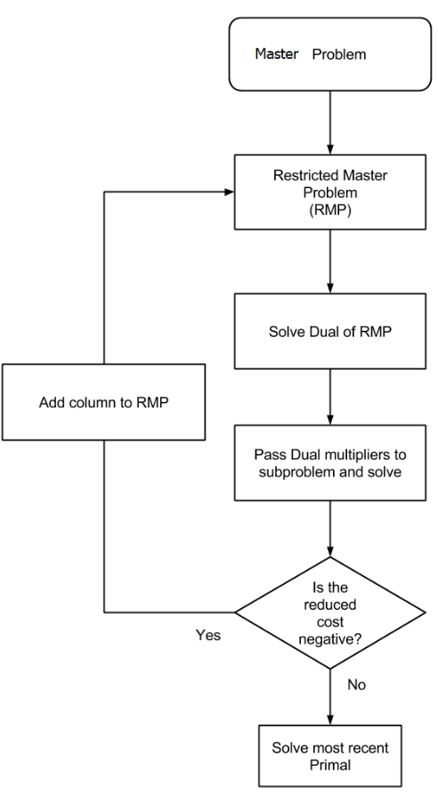

# Integer Linear Programming Notes 05: Column Generation and Its Applications in Integer Linear Programming

> Author: Hang Li (@flgkd)
>
> Note: Titles marked with ⭐ highlight key concepts and important summaries.

## 1. Preface

Finally, we arrive at **Column Generation**, one of the most important topics in this series.

Column Generation is easy to misunderstand if the connection among the simplex method, reduced costs, LP duality, and basis changes is not clear. Therefore, before reading this note, **it is strongly recommended to understand the following topics:**

1. linear programming and LP duality;
2. the principles of the simplex method, especially why a basis change is needed and how pivoting is performed;
3. reduced costs, dual variables, and the relationship between them, particularly how a simplex basis induces dual variables and how these dual variables determine reduced costs;
4. the matrix form of the simplex method and the matrix form of reduced costs.

A useful prerequisite is:

- [Simplex Method and Linear Programming Duality](01-simplex-method-and-lp-duality.md)

### 1.1 What Can Column Generation Do?

Before explaining the algorithm itself, let us first answer a basic question:

> What is Column Generation used for?

Column Generation is mainly used to solve **large-scale linear programming problems with an extremely large number of variables, or columns**.

A typical situation is:

- the number of constraints is moderate;
- the number of possible variables is extremely large;
- explicitly enumerating and storing all variables is difficult or impossible.

From the simplex viewpoint, Column Generation can be understood as a way of avoiding the explicit enumeration of all nonbasic variables.

Instead of constructing the full LP first, we start with only a small subset of columns and generate promising new columns when necessary.

Therefore:

> **Standard Column Generation is fundamentally an LP solution framework.**

This point is extremely important.

Column Generation itself does not directly solve an integer linear programming problem to integer optimality.

### 1.2 Why Does Column Generation Matter for ILP?⭐

If Column Generation solves LPs, why is it so important in integer linear programming?

Recall Branch and Bound.

For a maximization ILP:

- the LP relaxation of a node provides an **upper bound**;
- an integer feasible solution provides a **lower bound**.

Therefore, solving LP relaxations is a central operation in Branch and Bound.

Now suppose the LP relaxation itself contains an enormous number of variables. Even before we worry about integrality, explicitly solving the LP relaxation may already be difficult.

This is where Column Generation becomes useful.

> **One major role of Column Generation in large-scale ILP is to solve LP relaxations with a huge number of columns.**

When Column Generation is embedded into Branch and Bound, we obtain **Branch and Price**, which will be discussed in a later note in this series.

However, **there is another important connection between Column Generation and ILP**.

In many problems, we can reformulate a compact ILP into a pattern-based, path-based, schedule-based, or configuration-based master problem. Such reformulations may contain an enormous number of variables, but their LP relaxations can be substantially tighter than the LP relaxation of the original compact formulation.

**This second role of Column Generation will be discussed in detail near the end of this note.**

---

## 2. Basic Idea of Column Generation⭐

**Column Generation** is a highly efficient method for solving large-scale linear optimization problems. Its theoretical foundation can be traced back to the decomposition principle proposed by Dantzig and Wolfe in 1960 [1].

In essence, Column Generation is closely related to the simplex method and is fundamentally designed to solve linear programming problems.

Column Generation has been widely applied to many well-known large-scale combinatorial optimization problems, including:

- Crew Assignment Problems;
- Cutting Stock Problems;
- Vehicle Routing Problems;
- Single-Facility Location Problems.

Many of these problems are NP-hard in their integer forms. Column Generation is typically used to solve their large-scale LP relaxations or the LP master problems arising from suitable reformulations. The role of Column Generation in large-scale integer programming is surveyed in [2,3].

### 2.1 Large-Scale Linear Programs with Many Columns

Consider the following LP:

$$
\min \quad \sum_{j=1}^{n} c_j y_j
$$

subject to

$$
\sum_{j=1}^{n} a_{1j}y_j \ge b_1
$$

$$
\sum_{j=1}^{n} a_{2j}y_j \ge b_2
$$

$$
\vdots
$$

$$
\sum_{j=1}^{n} a_{mj}y_j \ge b_m
$$

$$
y_j \ge 0, \quad j=1,\ldots,n.
$$

Suppose

$$
m \ll n
$$

and $n$ is extremely large.

For example, we may have only a few hundred constraints but millions, billions, or even exponentially many possible variables.

The difficulty is not that the LP model is conceptually complicated.

The difficulty is that we may not even be able to explicitly list every column of the coefficient matrix.

### 2.2 A Simplex Viewpoint

Recall the simplex method.

At any basic feasible solution, only a limited number of variables are basic, even if the LP contains an enormous number of variables.

This suggests a natural idea:

> Why explicitly construct all columns if only a small subset is needed during the solution process?

Column Generation follows this idea.

We first select a small subset of columns and solve the resulting **Restricted Master Problem (RMP)**. Since many columns are omitted, the RMP optimum is not necessarily optimal for the full **Master Problem (MP)**.

The next task is therefore to determine whether an omitted column can improve the current solution.

For a minimization problem, this means searching for a column with negative reduced cost.

Instead of checking omitted variables one by one, Column Generation solves a **Pricing Problem (PP)**, also called a **Subproblem (SP)**, to search the feasible column space and generate an improving column directly.

If a negative reduced-cost column is found, it is added to the RMP and the RMP is solved again.

This process is repeated until no improving column exists.

### 2.3 Basic Column Generation Procedure

For a minimization problem, the basic process is:

1. construct a Restricted Master Problem using a small set of initial columns;
2. solve the Restricted Master Problem;
3. obtain the dual variables;
4. solve a pricing problem to find a column with negative reduced cost;
5. if such a column exists, add it to the Restricted Master Problem and repeat;
6. if no column with negative reduced cost exists, the current Restricted Master Problem solution is optimal for the full LP master problem.

The logic can be summarized as:

```text
Initial columns
      ↓
Solve RMP
      ↓
Obtain dual variables
      ↓
Solve pricing problem
      ↓
Negative reduced cost?
   /             \
 Yes              No
  ↓                ↓
Add column      LP optimal
  ↓
Solve RMP again
```

---

## 3. Master Problem, Restricted Master Problem, and Pricing Problem

The most important concepts in Column Generation are:

- Master Problem, MP;
- Restricted Master Problem, RMP;
- Pricing Problem, PP, also called the Subproblem, SP.

Let us introduce them carefully.

### 3.1 Master Problem (MP)

Consider the LP

$$
\min \quad \sum_{j=1}^{n} c_j y_j
$$

subject to

$$
\sum_{j=1}^{n} a_{ij}y_j \ge b_i,
\quad i=1,\ldots,m
$$

$$
y_j \ge 0,
\quad j=1,\ldots,n.
$$

The full problem containing all possible columns is called the **Master Problem (MP)**.

In matrix form:

$$
\min \quad c^T y
$$

subject to

$$
Ay \ge b
$$

$$
y \ge 0.
$$

The difficulty is that $A$ may contain an extremely large number of columns.

### 3.2 Restricted Master Problem (RMP)

Let

$$
P \subseteq \{1,\ldots,n\}
$$

be a small subset of columns.

The **Restricted Master Problem (RMP)** is

$$
\min \quad \sum_{j\in P} c_j y_j
$$

subject to

$$
\sum_{j\in P} a_{ij}y_j \ge b_i,
\quad i=1,\ldots,m
$$

$$
y_j \ge 0,
\quad j\in P.
$$

The RMP contains only a subset of the variables in the full master problem.

From the simplex viewpoint, all omitted variables are temporarily fixed at zero.

The initial column set must usually make the RMP feasible.

Possible ways to obtain initial columns include:

- direct observation;
- a simple heuristic;
- artificial columns with large penalties;
- problem-specific initialization methods.

This is similar in spirit to the need for an initial feasible basis in the simplex method.

### 3.3 Pricing Problem (PP) / Subproblem (SP)⭐

After solving the RMP, we need to answer the following question:

> Among all columns that are not currently included in the RMP, does there exist a column that can improve the current LP solution?

For a minimization problem, this means finding a column with **negative reduced cost**.

Let $\pi$ be the optimal dual solution associated with the RMP constraints.

For a candidate column $a_j$, the reduced cost is

$$
r_j = c_j-\pi^T a_j.
$$

Therefore, the **Pricing Problem (PP)** (also called **Subproblem (SP)**) searches for a column with the minimum reduced cost:

$$
\min_j \quad c_j-\pi^T a_j.
$$

If

$$
r_j < 0,
$$

then column $j$ can improve the current RMP solution and should be added.

If the minimum reduced cost satisfies

$$
r_j \ge 0,
$$

then no omitted column can improve the current solution. The current RMP solution is therefore optimal for the full LP master problem.

This is the core of Column Generation.

> **The pricing problem does not enumerate all columns. It searches the column space through an optimization model.**

### 3.4 Two Ways to Obtain Reduced Costs⭐

After solving the RMP, the Pricing Problem needs the reduced cost of a candidate column.

There are two equivalent ways to obtain this reduced cost.

#### Method 1: Compute Reduced Costs from the Simplex Basis

Recall the matrix form of the simplex method.

For a candidate column $a_j$, let $r_j$ denote its reduced cost. Then

$$
r_j=c_j-c_B^T B^{-1}a_j.
$$

More generally, for the nonbasic variables, the reduced-cost row is

$$
c_N^T-c_B^T B^{-1}N.
$$

Therefore, if the current simplex basis is known, the reduced cost of a candidate column can be computed directly from the basis matrix $B$.

This is the most direct interpretation from the simplex method.

#### Method 2: Use the Dual Variables of the RMP

The second method uses the relationship between the simplex multipliers and the dual problem.

For a current basis $B$, define

$$
\pi^T=c_B^T B^{-1}.
$$

The vector $\pi$ is the simplex multiplier vector induced by the current basis.

Therefore,

$$
r_j=c_j-\pi^T a_j.
$$

At an optimal simplex basis, $\pi$ is dual feasible and optimal.

Thus, instead of explicitly working with $B^{-1}$, we can solve the RMP and directly obtain the optimal dual variables $\pi$.

The Pricing Problem then uses these dual values to evaluate, or generate, candidate columns.

#### Why Is the Dual-Based Method Usually Preferred?

In practice, Column Generation is almost always described using dual variables.

There are several reasons:

1. explicitly computing or maintaining $B^{-1}$ is unnecessary;
2. LP solvers directly provide the dual values of the RMP constraints;
3. the Pricing Problem can be written naturally using the dual variables;
4. the notation is much simpler in papers and implementations.

Therefore, although the two methods are mathematically equivalent, the dual-based form

$$
r_j=c_j-\pi^T a_j
$$

is usually used in Column Generation.

This also explains why dual variables appear almost everywhere in Column Generation.

If the relationship among the simplex basis, reduced costs, and dual variables is not clear, it may be helpful to review the previous note:

- [Simplex Method and Linear Programming Duality](01-simplex-method-and-lp-duality.md)

That note explains the matrix form of the simplex method, reduced costs, and their relationship with LP duality in more detail.

### 3.5 Column Generation Rules

A candidate column cannot be an arbitrary vector.

It must represent a valid structure in the original problem.

For example:

- in a Cutting Stock Problem, a column represents a feasible cutting pattern;
- in a Vehicle Routing Problem, a column may represent a feasible vehicle route;
- in crew scheduling, a column may represent a feasible crew schedule;
- in network optimization, a column may represent a feasible path, embedding, or configuration.

The conditions that define a valid column will be called the **column generation rules** in this note.

These rules are problem-specific.

For a Cutting Stock Problem, a cutting pattern must satisfy the stock length limitation.

For a routing problem, a route may need to satisfy connectivity, capacity, time-window, or resource constraints.

Therefore:

> **The pricing problem may itself be an integer optimization problem even though the master problem solved by Column Generation is an LP.**

This does not mean Column Generation directly solves an ILP.

It means that the space of valid LP columns is described by a discrete combinatorial structure.

### 3.6 An Important Note on Heuristic Pricing⭐

To generate a useful column, we do not always need to find the most negative reduced cost.

Any column satisfying

$$
r_j < 0
$$

can be added to the RMP.

This is why heuristics are often useful in pricing.

However, there is one important distinction:

> A heuristic pricing method can find improving columns, but failure of the heuristic to find one does not prove that no improving column exists.

Therefore, an exact Column Generation algorithm usually needs an exact pricing step, or another valid certificate, before declaring convergence.

**A common strategy is:**

1. run fast heuristic pricing first;
2. add good columns if found;
3. when the heuristic fails, solve the exact pricing problem;
4. terminate only when exact pricing confirms that no negative reduced-cost column exists.

### 3.7 Column Generation Algorithm

The basic algorithm for a minimization LP is:

```text
ColumnGeneration:

    construct a feasible initial RMP

    repeat:

        solve the RMP

        obtain optimal dual variables pi

        solve the pricing problem

        find a column with minimum reduced cost

        if reduced_cost < 0:
            add the column to the RMP
        else:
            stop

    return the optimal RMP solution
```

<p align="center">
  
</p>

<p align="center">
  The basic Column Generation algorithm for a minimization LP.
</p>

---

## 4. Cutting Stock Problem: Two Formulations and Column Generation⭐

The **Cutting Stock Problem** is a classical integer linear programming problem and one of the most important applications of Column Generation.

Suppose a factory has stock rolls of fixed length

$$
W.
$$

Customers request smaller pieces of different lengths.

For item type $i$:

- $w_i$ is the required length;
- $d_i$ is the demand.

The objective considered in this note is to satisfy all demands while minimizing the number of stock rolls used.

Minimizing trim loss is a closely related objective, but it is not always equivalent when overproduction is allowed.

Before applying Column Generation, an important modeling question must be answered:

> **How should the Cutting Stock Problem be formulated?**

There are two natural formulations.

### 4.1 Formulation I: A Direct Roll-Based ILP

The most intuitive idea is to explicitly model individual stock rolls.

Let $K$ be a sufficiently large finite set of candidate stock rolls, where $|K|$ is chosen as a valid upper bound on the number of rolls that may be needed.

For each stock roll $k$:

- $y_k=1$ if roll $k$ is used, and $y_k=0$ otherwise;
- $x_{ik}$ is the number of pieces of item type $i$ cut from roll $k$.

A direct ILP formulation is

$$
\min \quad \sum_{k\in K} y_k
$$

subject to

$$
\sum_{k\in K} x_{ik}\ge d_i,
\quad i=1,\ldots,m
$$

$$
\sum_{i=1}^{m}w_i x_{ik}\le Wy_k,
\quad k\in K
$$

$$
x_{ik}\in\mathbf{Z}_+,
\quad i=1,\ldots,m,\ k\in K
$$

$$
y_k\in\{0,1\},
\quad k\in K.
$$

This formulation is easy to understand.

Each stock roll is modeled explicitly, and the capacity constraint ensures that the total length cut from one roll does not exceed $W$.

However, this direct formulation has an important weakness:

> **Its LP relaxation can be weak.**

After relaxing the integer restrictions, the model may use fractional values of $y_k$ and distribute items fractionally across stock rolls.

As a result, the LP relaxation may provide a poor bound for the original ILP.

This is one reason why a more structured formulation is attractive.

### 4.2 Formulation II: A Pattern-Based ILP⭐

The classical pattern-based approach to the Cutting Stock Problem goes back to Gilmore and Gomory [4].

Instead of modeling each stock roll directly, we can model complete cutting patterns.

Let

$$
P
$$

be the set of all feasible cutting patterns.

For pattern $j$:

$$
a_{ij}
$$

denotes the number of pieces of item type $i$ produced by pattern $j$.

Let

$$
x_j
$$

be the number of times pattern $j$ is used.

The pattern-based integer formulation is

$$
\min \quad \sum_{j\in P}x_j
$$

subject to

$$
\sum_{j\in P}a_{ij}x_j\ge d_i,
\quad i=1,\ldots,m
$$

$$
x_j\in\mathbf{Z}_+,
\quad j\in P.
$$

Each column

$$
a_j=
\begin{bmatrix}
a_{1j}\\
a_{2j}\\
\vdots\\
a_{mj}
\end{bmatrix}
$$

represents one complete cutting pattern.

A valid pattern must satisfy

$$
\sum_{i=1}^{m}w_i a_{ij}\le W
$$

and

$$
a_{ij}\in\mathbf{Z}_+.
$$

For example, if

$$
W=16
$$

and the item lengths are 3, 6, and 7, then

$$
\begin{bmatrix}
1\\
1\\
1
\end{bmatrix}
$$

is a feasible pattern because

$$
3+6+7=16.
$$

The main advantage of the pattern-based formulation is that one variable already represents a complete feasible cutting structure.

Its LP relaxation is often much stronger than that of the direct roll-based formulation.

The disadvantage is obvious:

> **The number of feasible cutting patterns may be enormous.**

We may not be able to enumerate all columns in $P$ explicitly.

This is exactly where Column Generation becomes useful.

### 4.3 Comparing the Two Formulations

The two formulations describe the same type of integer optimization problem, but from very different viewpoints.

| Formulation | Main modeling unit | Main advantage | Main difficulty |
|---|---|---|---|
| Direct roll-based formulation | Individual stock roll | Intuitive and compact | LP relaxation can be weak |
| Pattern-based formulation | Complete cutting pattern | Stronger structural representation and often a tighter LP relaxation | Potentially enormous number of columns |

The important point is:

> **Column Generation is not useful simply because the Cutting Stock Problem is large. It becomes useful because the pattern-based formulation has a huge number of structured columns.**

This distinction is fundamental.

### 4.4 The Cutting Stock Problem Is Still an ILP

The pattern-based formulation is

$$
\min \quad \sum_{j\in P}x_j
$$

subject to

$$
\sum_{j\in P}a_{ij}x_j\ge d_i,
\quad i=1,\ldots,m
$$

$$
x_j\in\mathbf{Z}_+.
$$

Therefore, the Cutting Stock Problem is still an **integer linear programming problem**.

This does not mean that Column Generation can directly solve the original Cutting Stock Problem to integer optimality.

Standard Column Generation solves linear programming problems.

Therefore, before applying Column Generation, we relax the integer restrictions:

$$
x_j\ge 0,
\quad j\in P.
$$

The resulting LP Master Problem is

$$
\min \quad \sum_{j\in P}x_j
$$

subject to

$$
\sum_{j\in P}a_{ij}x_j\ge d_i,
\quad i=1,\ldots,m
$$

$$
x_j\ge 0,
\quad j\in P.
$$

Column Generation is used to solve this **LP relaxation**.

Its solution may be fractional.

That is expected.

> **Column Generation participates in solving the Cutting Stock Problem by solving its large-scale LP relaxation. It does not, by itself, enforce the integrality of the pattern variables.**

To obtain an integer solution, additional techniques are needed, such as rounding or repair heuristics, solving a restricted integer master problem, or using Branch and Price.

### 4.5 Restricted Master Problem and Dual Variables

Choose a small subset

$$
P' \subset P
$$

such that the resulting Restricted Master Problem is feasible.

The RMP is

$$
\min \quad \sum_{j\in P'}x_j
$$

subject to

$$
\sum_{j\in P'}a_{ij}x_j\ge d_i,
\quad i=1,\ldots,m
$$

$$
x_j\ge 0,
\quad j\in P'.
$$

Let

$$
\pi_i
$$

be the dual variable associated with demand constraint $i$.

The dual of the RMP is

$$
\max \quad \sum_{i=1}^{m}d_i\pi_i
$$

subject to

$$
\sum_{i=1}^{m}a_{ij}\pi_i\le 1,
\quad j\in P'
$$

$$
\pi_i\ge 0,
\quad i=1,\ldots,m.
$$

The objective coefficient of every pattern variable is 1.

Therefore, the reduced cost of a candidate cutting pattern is

$$
r_j=1-\sum_{i=1}^{m}\pi_i a_{ij}.
$$

For a minimization problem, an improving column must satisfy

$$
r_j<0.
$$

Equivalently,

$$
\sum_{i=1}^{m}\pi_i a_{ij}>1.
$$

### 4.6 The Pricing Problem Is an ILP⭐

The Pricing Problem searches for a new cutting pattern.

It can be written as

$$
\max \quad \sum_{i=1}^{m}\pi_i a_i
$$

subject to

$$
\sum_{i=1}^{m}w_i a_i\le W
$$

$$
a_i\in\mathbf{Z}_+,
\quad i=1,\ldots,m.
$$

This is an **unbounded integer knapsack problem**.

Why are the pricing variables integer?

Because

$$
a_i
$$

represents the number of pieces of item type $i$ cut from one stock roll.

A cutting pattern such as

$$
a_i=1.5
$$

has no physical meaning.

Therefore, the column generation rules require

$$
a_i\in\mathbf{Z}_+.
$$

This gives an important observation:

> **The Pricing Problem can be an ILP even though Column Generation is solving an LP Master Problem.**

There is no contradiction.

The LP master variables describe how many times columns are used in the relaxed master problem.

The pricing variables describe the internal structure of one valid column.

The pricing problem is integer because a cutting pattern has a discrete combinatorial structure.

In the Cutting Stock Problem, the Pricing Problem happens to be a knapsack problem.

Although knapsack is NP-hard, when the item lengths and stock length are integral, or can be scaled to integers, it can be solved by dynamic programming in pseudo-polynomial time when the numerical capacity is not too large.

### 4.7 Column Generation Process for Cutting Stock

The Column Generation process is:

1. construct a feasible initial set of cutting patterns;
2. solve the LP RMP;
3. obtain the dual variables $\pi$;
4. solve the integer knapsack Pricing Problem;
5. if the pricing objective is greater than 1, the generated pattern has negative reduced cost and is added to the RMP;
6. solve the enlarged RMP again;
7. repeat until exact pricing confirms that no improving pattern exists.

At termination, we have solved the LP relaxation of the full pattern-based master problem.

We have **not necessarily solved the original integer Cutting Stock Problem**.

### 4.8 A Modeling Lesson: Column Generation Requires the Right Formulation⭐⭐

**The Cutting Stock Problem reveals an important fact about Column Generation.**

The direct roll-based formulation is intuitive, but its variables do not naturally represent a reusable set of complete cutting patterns.

The pattern-based formulation is different.

Each variable corresponds to one feasible structure, and the set of all such structures can be searched through a Pricing Problem.

This is exactly the type of formulation that is suitable for Column Generation.

Therefore:

> **To use Column Generation, the problem usually needs to be modeled in a form where variables represent structured feasible objects that can be generated by an optimization subproblem.**

Sometimes this structure is easy to see directly.

For Cutting Stock, it is natural to think in terms of cutting patterns.

For routing, it may be natural to think in terms of paths or routes.

For scheduling, it may be natural to think in terms of feasible schedules.

However, for many problems, the original intuitive formulation is not obviously suitable for Column Generation.

This leads to an important question:

> Can we systematically transform a structured formulation into a column-based form suitable for Column Generation?

One major answer is **Dantzig-Wolfe Decomposition**.

**For optimization models with a suitable decomposable structure (typically characterized by a block-angular constraint structure), Dantzig-Wolfe Decomposition provides a systematic way to reformulate the problem, or its LP relaxation, into a Master Problem with implicitly represented columns and one or more subproblems [1,3,5].**

This topic will be introduced in a later note in this series.

---

## 5. Two Cutting Stock Examples

The first example gives a short view of how a Pricing Problem generates a new cutting pattern.

The second example follows the complete Column Generation process in more detail.

### 5.1 Example 1: A Short Column Generation Walkthrough

Suppose a steel company has stock rods of length

$$
218\text{ cm}.
$$

Customers require:

- 44 pieces of length 81 cm;
- 3 pieces of length 70 cm;
- 48 pieces of length 68 cm.

We begin with three extremely simple patterns:

$$
a_1=
\begin{bmatrix}
1\\
0\\
0
\end{bmatrix},
\quad
a_2=
\begin{bmatrix}
0\\
1\\
0
\end{bmatrix},
\quad
a_3=
\begin{bmatrix}
0\\
0\\
1
\end{bmatrix}.
$$

Each initial pattern cuts only one requested piece from a stock rod.

The initial LP RMP is

$$
\min \quad x_1+x_2+x_3
$$

subject to

$$
x_1\ge 44
$$

$$
x_2\ge 3
$$

$$
x_3\ge 48
$$

$$
x_1,x_2,x_3\ge 0.
$$

The optimal dual variables are

$$
\pi=
\begin{bmatrix}
1\\
1\\
1
\end{bmatrix}.
$$

The initial Pricing Problem is

$$
\max \quad z_1+z_2+z_3
$$

subject to

$$
81z_1+70z_2+68z_3\le 218
$$

$$
z_1,z_2,z_3\in\mathbf{Z}_+.
$$

One optimal pricing solution is

$$
z=
\begin{bmatrix}
0\\
0\\
3
\end{bmatrix}.
$$

Therefore, the generated column is

$$
a_4=
\begin{bmatrix}
0\\
0\\
3
\end{bmatrix}.
$$

This pattern cuts three 68 cm pieces from one stock rod.

Its pricing objective is

$$
3.
$$

Therefore, its reduced cost is

$$
r_4=1-3=-2.
$$

Since

$$
r_4<0,
$$

the new pattern is added to the RMP.

The enlarged RMP becomes

$$
\min \quad x_1+x_2+x_3+x_4
$$

subject to

$$
x_1\ge 44
$$

$$
x_2\ge 3
$$

$$
x_3+3x_4\ge 48
$$

$$
x_1,x_2,x_3,x_4\ge 0.
$$

After re-solving the RMP, the dual values change and a new Pricing Problem is obtained.

For example, the new dual vector is

$$
\pi=
\begin{bmatrix}
1\\
1\\
\frac{1}{3}
\end{bmatrix}.
$$

The next Pricing Problem is

$$
\max \quad z_1+z_2+\frac{1}{3}z_3
$$

subject to

$$
81z_1+70z_2+68z_3\le 218
$$

$$
z_1,z_2,z_3\in\mathbf{Z}_+.
$$

The same process continues:

```text
Solve RMP
   ↓
Obtain new dual variables
   ↓
Solve the knapsack Pricing Problem
   ↓
Generate an improving cutting pattern
   ↓
Add the pattern to the RMP
```

This short example shows the basic mechanism of Column Generation:

> **The Pricing Problem does not choose among a pre-enumerated list of cutting patterns. It directly generates a new pattern from the dual information of the current RMP.**

After the LP master problem has been solved, we still need an additional method to recover an integer solution to the original Cutting Stock Problem.

For a covering formulation, rounding pattern-use variables upward can produce a feasible integer solution, although the solution may not be optimal.

If exact integer optimality is required, Branch and Price can be used.

### 5.2 Example 2: A Detailed Three-Iteration Process

Now consider a second example.

Each stock roll has length

$$
W=16.
$$

Customers require:

- 25 pieces of length 3;
- 20 pieces of length 6;
- 18 pieces of length 7.

We want to minimize the number of stock rolls used.

#### 5.2.1 Integer Master Problem

Let $P$ be the set of all feasible cutting patterns.

For pattern $j$:

- $a_{1j}$ is the number of 3-unit pieces;
- $a_{2j}$ is the number of 6-unit pieces;
- $a_{3j}$ is the number of 7-unit pieces.

Let

$$
y_j
$$

be the number of times pattern $j$ is used.

The integer pattern-based Master Problem is

$$
\min \quad \sum_{j\in P}y_j
$$

subject to

$$
\sum_{j\in P}a_{1j}y_j\ge 25
$$

$$
\sum_{j\in P}a_{2j}y_j\ge 20
$$

$$
\sum_{j\in P}a_{3j}y_j\ge 18
$$

$$
y_j\in\mathbf{Z}_+.
$$

Every cutting pattern must satisfy

$$
3a_{1j}+6a_{2j}+7a_{3j}\le 16
$$

$$
a_{1j},a_{2j},a_{3j}\in\mathbf{Z}_+.
$$

Again, this is an ILP.

To apply Column Generation, we relax

$$
y_j\in\mathbf{Z}_+
$$

to

$$
y_j\ge 0.
$$

#### 5.2.2 Initial RMP

Choose three simple patterns:

$$
a_1=
\begin{bmatrix}
5\\
0\\
0
\end{bmatrix},
\quad
a_2=
\begin{bmatrix}
0\\
2\\
0
\end{bmatrix},
\quad
a_3=
\begin{bmatrix}
0\\
0\\
2
\end{bmatrix}.
$$

These patterns correspond to:

- five 3-unit pieces;
- two 6-unit pieces;
- two 7-unit pieces.

The initial LP RMP is

$$
\min \quad y_1+y_2+y_3
$$

subject to

$$
5y_1\ge 25
$$

$$
2y_2\ge 20
$$

$$
2y_3\ge 18
$$

$$
y_1,y_2,y_3\ge 0.
$$

#### 5.2.3 Iteration 1

Solving the initial RMP gives

$$
\pi=
\begin{bmatrix}
0.2\\
0.5\\
0.5
\end{bmatrix}.
$$

The Pricing Problem is

$$
\max \quad 0.2z_1+0.5z_2+0.5z_3
$$

subject to

$$
3z_1+6z_2+7z_3\le 16
$$

$$
z_1,z_2,z_3\in\mathbf{Z}_+.
$$

An optimal pricing solution is

$$
z=
\begin{bmatrix}
1\\
2\\
0
\end{bmatrix}.
$$

Therefore, the generated column is

$$
a_4=
\begin{bmatrix}
1\\
2\\
0
\end{bmatrix}.
$$

The pricing objective is

$$
0.2+2(0.5)=1.2.
$$

Therefore,

$$
r_4=1-1.2=-0.2.
$$

Since

$$
r_4<0,
$$

column $a_4$ is added to the RMP.

#### 5.2.4 Iteration 2

The new RMP is

$$
\min \quad y_1+y_2+y_3+y_4
$$

subject to

$$
5y_1+y_4\ge 25
$$

$$
2y_2+2y_4\ge 20
$$

$$
2y_3\ge 18
$$

$$
y_1,y_2,y_3,y_4\ge 0.
$$

Solving the RMP gives

$$
\pi=
\begin{bmatrix}
0.2\\
0.4\\
0.5
\end{bmatrix}.
$$

The Pricing Problem becomes

$$
\max \quad 0.2z_1+0.4z_2+0.5z_3
$$

subject to

$$
3z_1+6z_2+7z_3\le 16
$$

$$
z_1,z_2,z_3\in\mathbf{Z}_+.
$$

An optimal pricing solution is

$$
z=
\begin{bmatrix}
1\\
1\\
1
\end{bmatrix}.
$$

Therefore, the generated column is

$$
a_5=
\begin{bmatrix}
1\\
1\\
1
\end{bmatrix}.
$$

The pricing objective is

$$
0.2+0.4+0.5=1.1.
$$

Therefore,

$$
r_5=1-1.1=-0.1.
$$

Column $a_5$ is added to the RMP.

#### 5.2.5 Iteration 3

The RMP now contains five columns.

Solving it gives

$$
\pi=
\begin{bmatrix}
0.2\\
0.4\\
0.4
\end{bmatrix}.
$$

The Pricing Problem is

$$
\max \quad 0.2z_1+0.4z_2+0.4z_3
$$

subject to

$$
3z_1+6z_2+7z_3\le 16
$$

$$
z_1,z_2,z_3\in\mathbf{Z}_+.
$$

The optimal pricing objective is

$$
1.
$$

Therefore, the minimum reduced cost is

$$
1-1=0.
$$

No negative reduced-cost column exists.

Column Generation terminates.

#### 5.2.6 Final LP Solution

The optimal solution of the final LP RMP is

$$
y=
\begin{bmatrix}
1.2\\
0\\
0\\
1\\
18
\end{bmatrix}.
$$

The objective value is

$$
20.2.
$$

Notice that

$$
y_1=1.2.
$$

This is not an integer.

There is no contradiction.

The original pattern-based Cutting Stock formulation is an ILP, but Column Generation has solved its LP relaxation.

Therefore:

> **The Column Generation result is the optimal LP solution of the full pattern-based Master Problem, not automatically the optimal integer solution of the Cutting Stock Problem.**

If we restore integrality and solve the integer restricted master problem using the five generated columns, one solution is

$$
y=
\begin{bmatrix}
2\\
0\\
0\\
1\\
18
\end{bmatrix}
$$

with objective value

$$
21.
$$

For this small example, 21 is also the optimal value of the full integer pattern formulation.

This can be verified directly from the total required length:

$$
25(3)+20(6)+18(7)=321.
$$

Since each stock roll has length 16, any integer solution needs at least

$$
\lceil \frac{321}{16} \rceil = 21
$$

stock rolls.

The solution above uses exactly 21 rolls and is therefore optimal.

However, this conclusion cannot be generalized.

Columns that are unnecessary for the LP optimum may still be useful for a better integer combination.

This issue will become important when we discuss the use of Column Generation in ILP.

---

## 6. How Column Generation Is Used in Integer Linear Programming⭐⭐⭐

We have repeatedly emphasized:

> Standard Column Generation solves an LP master problem.

Then how can Column Generation be used in ILP?

There are three common approaches.

### 6.1 Approach I: Solve the LP Relaxation and Round

The simplest approach is:

1. relax the ILP;
2. solve the LP relaxation by Column Generation;
3. round or repair the fractional solution.

This is only a heuristic.

As discussed in the Branch and Bound note:

- rounding may destroy feasibility;
- even if the rounded solution is feasible, its quality may be poor.

Therefore, this approach is simple, but usually unreliable.

### 6.2 Approach II: Branch and Price

The exact approach is to embed Column Generation into Branch and Bound.

At every branch-and-bound node:

1. solve the node LP relaxation by Column Generation;
2. use the LP value as the node bound;
3. branch if necessary;
4. repeat.

This framework is called **Branch and Price** [2,5].

If implemented correctly with exact pricing and valid branching, Branch and Price can prove integer optimality.

> **If the optimal integer solution must be guaranteed, Branch and Price is the standard exact framework.**

This topic will be introduced in the next note.

### 6.3 Approach III: Generate Columns and Solve the Final Restricted Integer Master⭐⭐⭐

The third approach is the main focus of this section.

The basic idea is simple:

> **Use Column Generation to construct a relatively small set of promising columns, and then solve an integer master problem using only these generated columns.**

This approach can be viewed as a **CG-based integer heuristic** or a **price-and-branch style approach**. In the literature, solving a MIP over the columns generated for the LP relaxation is also described as a **restricted master heuristic** or **price-and-branch** [6].

Unlike Branch and Price, it does not continue Column Generation throughout a branch-and-bound tree.

Instead, Column Generation is first performed on the LP relaxation. The generated columns are then passed to a final integer Restricted Master Problem.

#### 6.3.1 Complete Procedure

The complete procedure can be described as follows.

##### Step 1: Reformulate the Original ILP

Let the original integer linear programming problem be denoted by

$$
OP.
$$

Reformulate it into a column-based integer Master Problem

$$
MP.
$$

This reformulation may be obtained through:

- Dantzig-Wolfe Decomposition;
- a pattern-based formulation;
- a path-based formulation;
- a schedule-based formulation;
- a configuration-based formulation;
- direct problem-specific modeling.

The important point is that each master variable should represent a meaningful feasible structure, such as a cutting pattern, route, schedule, path, or network embedding.

At the integer level, the reformulated MP should represent the original problem correctly.

##### Step 2: Select Initial Columns

Select a small set of feasible columns such that the initial LP RMP is feasible.

These columns define a restricted integer master problem. After relaxing the integrality restrictions, they also define the initial LP RMP used by Column Generation.

The initial columns may come from:

- direct observation;
- a simple constructive rule;
- another heuristic algorithm;
- a previously known feasible solution.

This is one important place where other heuristics can be combined with Column Generation.

A good heuristic solution can be decomposed into columns and used to warm-start the RMP.

##### Step 3: Construct the Initial LP RMP

Relax the integrality restrictions on the restricted master variables.

The resulting LP is the initial Restricted Master Problem used by Column Generation.

##### Step 4: Run Column Generation on the LP RMP

Solve the LP RMP and obtain the dual variables.

Use these dual values to construct and solve the Pricing Problem.

If improving columns are found, add them to the RMP and solve the LP RMP again.

Repeat this process until exact pricing confirms that no improving column exists.

At this point, the LP relaxation of the full column-based Master Problem has been solved.

##### Step 5: Check Whether the Final LP Solution Is Already Integer⭐

Before solving another ILP, first check the final LP solution.

If the final Column Generation solution is already integer, then no additional integer RMP needs to be solved.

Assuming Column Generation has converged with exact pricing and the MP is an equivalent integer reformulation of the original problem:

> **An integer optimal solution of the LP Master Problem is already an optimal solution of the integer Master Problem.**

Therefore, the algorithm can stop directly.

This situation can occur in practice.

##### Step 6: Otherwise, Solve the Final Integer RMP

If the final LP solution is fractional, restore the integer restrictions on the generated master variables.

Then solve the final integer RMP using only the generated columns.

There are two possible outcomes:

1. the final integer RMP is feasible, in which case an integer solution can be obtained;
2. the final integer RMP is infeasible, because the generated column pool may not contain a valid integer combination.

Therefore, feasibility of the LP RMP does not guarantee feasibility of the final integer RMP.

The final decision process is therefore:

```text
Final LP solution integer?
    ├── Yes → Stop
    │         Integer optimum obtained
    │
    └── No  → Restore integrality
              ↓
              Solve final integer RMP
              ↓
              Integer feasible?
              ├── Yes → Obtain an integer solution
              │
              └── No  → Column pool is insufficient
                         for an integer feasible solution
```

#### 6.3.2 This Method Does Not Guarantee the ILP Optimum

This distinction is extremely important.

Column Generation terminates when no omitted column can improve the **LP relaxation**.

This proves that the generated columns are sufficient for the LP optimum.

However, it does not prove that they contain every column needed by the optimal integer solution.

A column may have non-improving reduced cost at the LP optimum but still be useful in a better integer combination.

Therefore:

> **Solving the final integer RMP does not generally guarantee the optimal solution of the full ILP.**

This limitation is also emphasized in the literature on restricted master heuristics and price-and-branch methods [6].

The solver may solve the final integer RMP to proven optimality, but that optimality is only with respect to the generated column set.

The missing column set may still contain a column needed by the true integer optimum.

In some problems, the generated columns may not even admit an integer feasible solution [6].

This is exactly the difference from Branch and Price.

> **Approach III may produce the ILP optimum, but Branch and Price is the method that can systematically guarantee and prove integer optimality.**

There is one important exception discussed above:

> If exact Column Generation converges and the final LP solution itself is integer, then that solution is already integer optimal.

#### 6.3.3 Why Can This Approach Work Very Well for Some Models?

Although Approach III is not exact in general, it can work extremely well for some structured optimization problems.

The key is the formulation.

Suppose the original compact ILP has a suitable decomposable structure, especially a **block-angular constraint structure**.

Through Dantzig-Wolfe Decomposition or a direct column-based formulation, each column can represent a complete feasible solution of one local substructure.

For example:

- one cutting pattern in Cutting Stock;
- one route in Vehicle Routing;
- one feasible schedule in Crew Scheduling;
- one complete feasible solution of a decomposable subproblem in a network optimization problem.

To make this idea more concrete, consider a **Service Function Chain (SFC) deployment problem**. A classical reference on the placement and chaining of virtual network functions is [7].

An SFC describes an ordered sequence of network functions that a service flow must traverse. In an NFV environment, these functions can be implemented as **Virtual Network Functions (VNFs)**. For example, a flow may need to pass through a firewall, a load balancer, and other network functions in a specified order.

In a typical SFC deployment problem, we need to decide where the required VNFs are placed and how each service flow is routed through the network. Readers unfamiliar with this problem can refer to [7] for a classical formulation of VNF placement and chaining.

Suppose the problem has a block-angular structure and can be decomposed by service flow.

Then one column may represent a **complete feasible deployment of one flow**, including its routing decisions and the placement of the required network functions.

The local feasibility requirements of that flow can therefore be enforced inside the column.

The Master Problem mainly coordinates the shared network resources used by different flows.

In this type of model, Column Generation can generate a relatively small set of promising complete deployment solutions for each flow.

As a result, the final column pool may already contain the columns required by the optimal integer solution.

Therefore:

> **For some structured models and favorable instances, the final integer RMP may recover the full ILP optimum, even though this is not theoretically guaranteed.**

Whether this happens frequently is model-dependent and should be evaluated computationally.

#### 6.3.4 Why Is the Final Integer RMP Often Easier for a Solver?⭐

There are two main reasons.

**First, the final RMP contains far fewer variables.**

The full Master Problem may contain millions or exponentially many possible columns.

Column Generation only keeps a relatively small set of generated columns that were useful during the LP solution process.

Therefore, the final integer RMP presented to a solver can be dramatically smaller than the full integer Master Problem.

**Second, a good column-based reformulation may have a much tighter LP relaxation than the original compact formulation.**

Each column already represents a complete feasible substructure.

Part of the combinatorial difficulty of the original problem is therefore captured inside the columns.

An important distinction is needed here.

A Dantzig-Wolfe reformulation of a continuous LP does not automatically improve the LP bound; it is an equivalent reformulation of the same LP.

The strengthening effect arises when the column-based formulation captures discrete feasible substructures, for example by representing integer-feasible configurations of the decomposed subproblems.

In this case, part of the local integrality structure is embedded inside the columns, and the resulting Master Problem may have a tighter LP relaxation than the original compact ILP formulation [5].

This is a central motivation in the Column Generation and Branch-and-Price literature [2,3,5].

A tighter LP relaxation usually means a smaller integrality gap and can greatly reduce the burden of the solver's branch-and-bound search.

Therefore, the solver may face

```text
fewer master variables
        +
stronger LP relaxation
        +
columns that already represent feasible substructures
```

instead of directly attacking the original large compact ILP.

This is why the final integer RMP can often be solved much faster.

However, remember the trade-off:

> Restricting the column set also creates the possibility that a column required by the true integer optimum has never been generated.

That is the price paid for the loss of exactness.

#### 6.3.5 Many Additional Techniques Can Be Combined with This Approach⭐

Another advantage of this framework is its flexibility.

**Heuristic warm starts.**  
A problem-specific heuristic can first construct a feasible solution. The structures used by this solution can then be converted into initial columns and added to the initial RMP.

**Parallel Pricing Problems.**  
If the decomposition produces multiple independent Pricing Problems, they can often be solved in parallel.

For example, in a decomposed network optimization problem, one Pricing Problem may be solved for each flow.

**Problem-specific pricing heuristics.**  
A Pricing Problem usually has a much clearer physical or combinatorial meaning than the complete ILP.

Therefore:

> **Instead of designing a heuristic for the entire ILP, it may be easier to design a heuristic specifically for the Pricing Problem.**

A pricing heuristic may exploit:

- path structure;
- network topology;
- resource ordering;
- local feasibility;
- domain-specific greedy rules.

Any improving column can be added during the Column Generation process.

The most negative reduced-cost column is not required at every iteration.

However, if LP optimality must be certified, exact pricing or another valid optimality certificate is still required before Column Generation terminates [3].

**Different Pricing Problem solvers.**  
Depending on the problem structure, a Pricing Problem may be solved by:

- a MILP solver;
- Branch and Bound;
- dynamic programming;
- a shortest-path algorithm;
- a dedicated exact algorithm;
- a heuristic algorithm.

**Multiple columns per iteration.**  
The algorithm may also add several improving columns in one iteration rather than only one column.

These techniques make the framework highly customizable.

#### 6.3.6 A Middle Ground Between an Exact Solver and a Pure Heuristic⭐

For suitable models, Approach III can be viewed as a middle ground between solving the full ILP exactly and using a pure heuristic.

A full exact solver or Branch and Price aims to prove optimality, but the computational cost can be high.

A pure heuristic can be very fast, but its solution quality may be difficult to control.

The third approach lies between them:

```text
Exact ILP / Branch and Price
High solution guarantee
Potentially high computational cost

        ↓

Column Generation
+ final integer RMP

        ↓

Pure heuristic
Very fast
Usually weaker solution guarantee
```

The third approach still uses optimization information:

- LP relaxations;
- dual variables;
- reduced costs;
- structured Pricing Problems;
- a final integer optimization model.

Therefore, it is much more optimization-guided than a pure heuristic.

For some model classes, it may be substantially faster than directly solving the full ILP, while producing solutions of much higher quality than a simple heuristic.

In favorable cases, the solution can even be optimal or extremely close to the optimum.

Therefore:

> **For certain structured large-scale ILPs, Column Generation followed by a final integer RMP can serve as a practical algorithmic framework between exact solvers and pure heuristics.**

Its success depends strongly on:

- the quality of the column-based formulation;
- the strength of its LP relaxation;
- the quality of the initial columns;
- the design of the Pricing Problem;
- the diversity and quality of the generated column pool.

This is one reason why Column Generation is not merely an LP algorithm in practical large-scale optimization.

Although standard Column Generation still solves an LP, the column-generation framework can be used to build powerful algorithms for large-scale ILPs.

---

## 7. When Is Column Generation a Good Choice?⭐

Column Generation is powerful, but it is not automatically better than solving a compact model directly.

Before using Column Generation, it is useful to ask the following questions.

### 7.1 Is the Full Column Set Extremely Large?

The first signal is that the Master Problem contains a huge number of possible variables.

The columns may be:

- millions or billions in number;
- exponentially many;
- impossible to enumerate explicitly.

If the complete model is already small and easy to solve, Column Generation may add unnecessary complexity.

### 7.2 Does One Column Represent a Meaningful Feasible Structure?

Column Generation is most natural when one variable can represent a complete structured object, such as:

- a cutting pattern;
- a vehicle route;
- a crew schedule;
- a path;
- a configuration;
- a complete feasible solution of one decomposable subproblem.

This structure gives the Pricing Problem a clear meaning.

### 7.3 Can the Pricing Problem Search the Column Space Efficiently?

The key question is not simply whether there are many columns.

The key question is:

> **Can we search the huge column space by solving a structured optimization problem instead of enumerating all columns?**

The Pricing Problem may itself be difficult, but it should expose useful problem structure.

For example, it may become:

- a knapsack problem;
- a shortest-path problem;
- a resource-constrained path problem;
- a dynamic programming problem;
- a smaller ILP with a clear physical meaning.

If pricing is almost as difficult as the original problem and no useful structure can be exploited, Column Generation may not be attractive.

### 7.4 For an ILP, What Level of Optimality Guarantee Is Required?

For an integer problem, the algorithmic goal must also be clear.

If a proof of integer optimality is required, Branch and Price is the standard exact framework [2,5].

If the goal is to obtain high-quality solutions faster, Column Generation followed by a final integer RMP may be a practical alternative [6].

Therefore, a useful rule of thumb is:

> **Column Generation is attractive when the full variable space is huge, columns have meaningful structure, and the column space can be searched through a useful Pricing Problem.**

A broader practical discussion of these design issues can be found in [3].

---

## 8. Key Takeaways

1. Standard Column Generation is fundamentally an LP solution framework. It does not directly enforce integer optimality.
2. Column Generation is closely related to the simplex method: reduced costs still determine whether a new variable can improve the current LP solution.
3. The Master Problem contains the full column space, the Restricted Master Problem contains only generated columns, and the Pricing Problem searches for improving columns.
4. Dual variables provide a convenient way to construct reduced costs and the Pricing Problem.
5. For a minimization problem, any column with negative reduced cost may be added. The most negative reduced-cost column is not required at every iteration.
6. Heuristic pricing can generate useful columns, but exact pricing or another valid certificate is required to prove LP convergence.
7. A Pricing Problem may itself be an ILP because the rules defining a valid column can be discrete.
8. The Cutting Stock Problem is an ILP. Column Generation solves the LP relaxation of its pattern-based Master Problem, not the original ILP directly.
9. Modeling matters. A pattern-, route-, schedule-, path-, or configuration-based formulation may be much more suitable for Column Generation than an intuitive compact formulation.
10. Dantzig-Wolfe Decomposition provides a systematic reformulation framework for suitable decomposable models, especially those with block-angular structure. A continuous Dantzig-Wolfe reformulation is equivalent to the original LP; tighter ILP relaxations may arise when discrete feasible substructures are embedded in the columns.
11. Branch and Price embeds Column Generation into Branch and Bound and can prove integer optimality when implemented correctly.
12. Solving a final integer RMP after root-level Column Generation is generally a heuristic. It may miss the full ILP optimum, and the generated column pool may even fail to admit an integer feasible solution.
13. If exact Column Generation converges and the final LP solution is already integer, that solution is also optimal for the integer Master Problem.
14. For suitable structured ILPs, Column Generation followed by a final integer RMP can provide a useful middle ground between a full exact solver and a pure heuristic.
15. The framework can be combined with heuristic initial columns, parallel Pricing Problems, problem-specific pricing heuristics, and multiple columns per iteration.
16. The real power of Column Generation is **replacing explicit enumeration of columns with optimization over an implicit column space**.


## References

1. Dantzig, G. B., and Wolfe, P. “Decomposition Principle for Linear Programs.” *Operations Research*, 8(1), 1960, pp. 101–111. DOI: `10.1287/opre.8.1.101`.

2. Barnhart, C., Johnson, E. L., Nemhauser, G. L., Savelsbergh, M. W. P., and Vance, P. H. “Branch-and-Price: Column Generation for Solving Huge Integer Programs.” *Operations Research*, 46(3), 1998, pp. 316–329. DOI: `10.1287/opre.46.3.316`.

3. Lübbecke, M. E., and Desrosiers, J. “Selected Topics in Column Generation.” *Operations Research*, 53(6), 2005, pp. 1007–1023. DOI: `10.1287/opre.1050.0234`.

4. Gilmore, P. C., and Gomory, R. E. “A Linear Programming Approach to the Cutting-Stock Problem.” *Operations Research*, 9(6), 1961, pp. 849–859. DOI: `10.1287/opre.9.6.849`.

5. Vanderbeck, F. “On Dantzig-Wolfe Decomposition in Integer Programming and Ways to Perform Branching in a Branch-and-Price Algorithm.” *Operations Research*, 48(1), 2000, pp. 111–128. DOI: `10.1287/opre.48.1.111.12453`.

6. Maher, S. J., and Rönnberg, E. “Integer Programming Column Generation: Accelerating Branch-and-Price Using a Novel Pricing Scheme for Finding High-Quality Solutions in Set Covering, Packing, and Partitioning Problems.” *Mathematical Programming Computation*, 15, 2023, pp. 509–548. DOI: `10.1007/s12532-023-00240-w`.

7. Mehraghdam, S., Keller, M., and Karl, H. “Specifying and Placing Chains of Virtual Network Functions.” *2014 IEEE 3rd International Conference on Cloud Networking (CloudNet)*, 2014, pp. 7–13. DOI: `10.1109/CloudNet.2014.6968961`.

## Suggested Follow-up Reading

The most relevant next topics are:

1. **Branch and Price**  
   The exact extension of Column Generation for integer programming. This is the natural next topic after understanding why a final integer RMP does not generally guarantee the full ILP optimum.

2. **Dantzig-Wolfe Decomposition**  
   A systematic way to obtain column-based Master Problems from suitable decomposable models, especially models with block-angular structure.

3. **Lagrangian Relaxation and Duality**  
   Useful for understanding the dual viewpoint of decomposition methods and the close relationship among dual multipliers, pricing, and bounds.

4. **Knapsack Problem**  
   The Pricing Problem in the classical Cutting Stock example. Understanding dynamic programming for knapsack makes the example much more concrete.

5. **Advanced Column Generation Implementation**  
   Important practical topics include dual stabilization, degeneracy, exact and heuristic pricing, multi-column generation, column management, and parallel pricing.

For this note series, **Branch and Price** and **Dantzig-Wolfe Decomposition** are the two most direct continuations of the present note.
