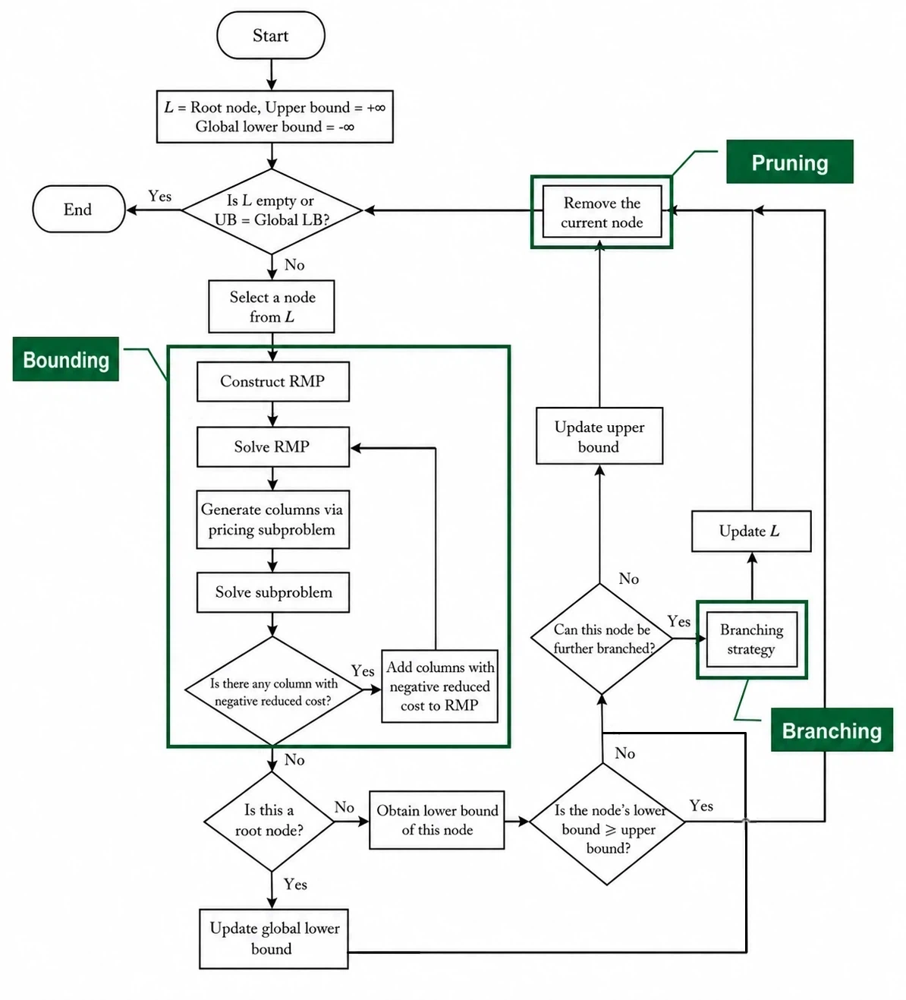

# Integer Linear Programming Notes 06: Branch and Price

> Author: Hang Li (@flgkd)
>
> Note: Titles marked with ⭐ highlight key concepts and important summaries.

## 1. Preface

This note introduces **Branch and Price**, a classical exact framework for solving large-scale integer programming problems with a huge number of variables.

Branch and Price has already appeared briefly in the previous note on Column Generation.

The basic idea is simple:

> **Branch and Price combines Branch and Bound with Column Generation.**

Branch and Bound provides the framework for enforcing integrality.

Column Generation solves the large-scale LP relaxation associated with a branch-and-bound node.

Therefore, Branch and Price can be summarized as

```text
Branch and Bound
        +
Column Generation
        =
Branch and Price
```

Before reading this note, it is strongly recommended to understand:

- [Branch and Bound](02-branch-and-bound.md)
- [Column Generation and Its Applications in Integer Linear Programming](05-column-generation-and-ilp-applications.md)

If both methods are already clear, the overall idea of Branch and Price is not difficult.

The real difficulty lies in making **branching and pricing work together correctly**.

---

## 2. Basic Idea of Branch and Price⭐

Consider a large-scale ILP whose column-based formulation contains an enormous number of variables.

Suppose its integer Master Problem is

$$
\min \quad \sum_{p\in P} c_p \lambda_p
$$

subject to

$$
\sum_{p\in P} a_{ip}\lambda_p \ge b_i,
\quad i=1,\ldots,m
$$

$$
\lambda_p\in\mathbf{Z}_+,
\quad p\in P.
$$

The column set

$$
P
$$

may be extremely large or implicitly defined.

Branch and Bound requires the LP relaxation of a node to compute a valid node bound.

However, explicitly constructing the full LP relaxation may be impossible because it contains too many columns.

Branch and Price addresses this problem by solving the node LP relaxation through Column Generation [1].

For a minimization problem:

- the optimal LP relaxation value of a node is a **lower bound** for all integer solutions in that node;
- the best known integer feasible solution provides a **global upper bound**.

The core idea is therefore:

```text
Branch-and-Bound node
        ↓
Node LP relaxation
        ↓
Solve by Column Generation
        ↓
Obtain a valid node lower bound
        ↓
Prune, update incumbent, or branch
```

### 2.1 A Small but Important Precision

It is tempting to say:

> Branch and Price replaces the simplex method in Branch and Bound with Column Generation.

This is useful as an intuition, but it is not completely precise.

A better description is:

> **Branch and Price replaces the direct solution of the full node LP relaxation with a Column Generation procedure.**

Inside Column Generation, each Restricted Master Problem may still be solved by the simplex method or another LP algorithm.

Therefore:

```text
ordinary Branch and Bound:
solve the full node LP relaxation directly

Branch and Price:
solve the node LP relaxation implicitly
through RMP + Pricing
```

The role of Column Generation is to avoid explicitly enumerating the complete column space.

---

## 3. Why Is Column Generation Needed at Branch-and-Bound Nodes?

Recall the bounding operation in Branch and Bound.

At a node, we solve the LP relaxation of the node problem.

For a large-scale column-based formulation, the LP relaxation may itself contain millions, billions, or exponentially many variables.

The integer problem is difficult because of integrality.

The node LP may also be difficult because of the number of columns.

Column Generation handles the second difficulty.

At a Branch-and-Price node, we solve a Restricted Master Problem:

$$
\min \quad \sum_{p\in P'} c_p\lambda_p
$$

subject to

$$
\sum_{p\in P'}a_{ip}\lambda_p\ge b_i,
\quad i=1,\ldots,m
$$

$$
\lambda_p\ge0,
\quad p\in P'
$$

together with the branching decisions imposed at the current node.

Here,

$$
P'\subset P
$$

contains only the columns currently available at the node.

After solving the RMP, the dual variables are passed to the Pricing Problem.

The Pricing Problem searches the feasible column space for an improving column.

For a minimization problem, this means searching for a column with negative reduced cost.

If an improving column is found, it is added to the RMP and the RMP is solved again.

This process continues until exact pricing confirms that no improving column exists.

At that point, the node LP relaxation has been solved.

### 3.1 The RMP Objective Is Not Yet the Node Bound⭐

This point is very important.

During Column Generation, the current RMP contains only a subset of the full columns.

For a minimization problem,

$$
z_{\mathrm{RMP}} \ge z_{\mathrm{LP}},
$$

where

$$
z_{\mathrm{LP}}
$$

is the optimal value of the full node LP relaxation.

Therefore, before pricing has certified convergence, the current RMP objective is **not generally the valid node lower bound used for pruning**.

Omitted columns may still reduce the LP objective.

Only after exact pricing confirms that no negative reduced-cost column exists can we conclude that

$$
z_{\mathrm{RMP}}=z_{\mathrm{LP}}.
$$

Then the value is a valid lower bound for the integer solutions in that branch-and-bound node.

> **In an exact Branch-and-Price algorithm, the node LP bound must be validly certified before it is used for exact Branch-and-Bound pruning.**

---

## 4. Complete Branch-and-Price Procedure⭐⭐

For clarity, consider a minimization ILP.

Let

$$
L
$$

be the active node list.

Let

$$
UB
$$

be the objective value of the best known integer feasible solution.

Initially,

$$
UB=+\infty
$$

if no incumbent is available.

### 4.1 Step 1: Initialize the Root Node

Construct the root node and add it to the active node list.

Prepare an initial feasible RMP for the root node.

The initial columns may come from:

- direct observation;
- artificial columns;
- a constructive heuristic;
- a previously known feasible solution.

### 4.2 Step 2: Select a Node

Select a node

$$
N\in L.
$$

The node-selection strategy may follow standard Branch-and-Bound rules, such as depth-first search or best-bound search.

### 4.3 Step 3: Solve the Node LP Relaxation by Column Generation

At node $N$:

1. construct or inherit the node RMP;
2. impose the branching decisions of node $N$;
3. if necessary, restore RMP feasibility through a Phase I procedure, artificial variables, or another valid feasibility-recovery mechanism;
4. solve the RMP;
5. obtain the dual variables;
6. solve the Pricing Problem consistently with the branching decisions of node $N$;
7. add improving columns;
8. repeat until exact pricing confirms that no improving column exists.

The resulting objective value is the optimal value of the node LP relaxation.

Denote it by

$$
LB(N).
$$

For a minimization problem, this is a valid lower bound for node $N$.

### 4.4 Step 4: Prune, Update the Incumbent, or Branch

After the node LP relaxation is solved, there are several cases.

**Case 1: The node LP is infeasible.**

Prune the node.

**Case 2: The node bound cannot improve the incumbent.**

If

$$
LB(N)\ge UB,
$$

prune the node.

**Case 3: The node LP solution is integer.**

The solution is feasible for the integer Master Problem at node $N$.

If its objective value improves the incumbent, update

$$
UB.
$$

The node can then be pruned.

**Case 4: The node LP solution is fractional.**

Choose a branching decision and create child nodes.

Add the child nodes to the active node list.

### 4.5 Step 5: Repeat

For exact termination, repeat the process until the active node list is empty.

If valid bounds are maintained for the active nodes, a global lower bound can also be defined from the active-node bounds. For a minimization problem,

$$
GLB=\min_{N\in L} LB(N).
$$

In practice, the algorithm may terminate earlier when the optimality gap is within a chosen tolerance.

The overall process is shown below.

<p align="center">
  
</p>

<p align="center">
  The Branch-and-Price algorithm for a minimization integer program.
</p>

A simplified pseudocode is:

```text
BranchAndPrice:

    L = {root node}
    incumbent = none
    UB = +infinity

    while L is not empty:

        select a node N from L
        remove N from L

        solve the LP relaxation of N by exact Column Generation

        if the node LP is infeasible:
            continue

        LB_N = node LP objective

        if LB_N >= UB:
            continue

        if the node LP solution is integer:

            if LB_N < UB:
                incumbent = current solution
                UB = LB_N

            continue

        branch on the fractional solution
        create child nodes
        pass compatible columns to the child nodes
        add child nodes to L

    return incumbent
```

For a maximization problem, the roles of lower and upper bounds are reversed.

---

## 5. Reusing the Parent Node RMP⭐

This gives the central intuition of Branch and Price:

> **At each Branch-and-Bound node, the node LP relaxation is solved by Column Generation to obtain the node bound. After branching, child nodes inherit compatible columns from the parent RMP and continue pricing under the new branching decisions.**

These two ideas together form the basic Branch-and-Price framework.

A naive implementation might rebuild Column Generation from scratch at every branch-and-bound node.

This is usually unnecessary.

Suppose node $N$ has been solved by Column Generation and its RMP contains a set of generated columns.

After branching, the child nodes are closely related to the parent node.

Therefore:

> **A child node can usually inherit compatible columns from the parent node and use them to initialize its own RMP.**

Conceptually:

```text
Parent node RMP
        ↓
Branch
     /     \
Child 1   Child 2
   ↓         ↓
inherit compatible parent columns
   ↓         ↓
add branching decisions
   ↓         ↓
continue Column Generation
```

This is the main implementation idea emphasized in the original note.

### 5.1 Why Must Column Generation Run Again?

Even if a child inherits the parent columns, the child node has new branching decisions.

These decisions may change:

- the feasible column space;
- the RMP dual variables;
- the reduced costs of candidate columns;
- the optimal LP solution.

Therefore, the parent column pool is only a **warm start**.

The child node still needs pricing.

New negative reduced-cost columns may exist under the child-node dual solution.

### 5.2 Not Every Parent Column Is Compatible with a Child Node

A branching decision may make some parent columns invalid at a child node.

Such columns must be removed, fixed, disabled, or otherwise prevented from violating the child-node branching decisions.

Therefore, the correct idea is not

> copy every parent column without modification.

It is

> **inherit the compatible parent columns and continue Column Generation under the new branching decisions.**

If the LP solver supports basis warm starts, the parent LP information may also be useful for accelerating the child RMP solve.

### 5.3 What If the Inherited Child RMP Is Infeasible?⭐

After branching, the columns inherited from the parent node may no longer be sufficient to make the child RMP feasible.

This does not necessarily mean that the full node LP relaxation is infeasible.

The complete column space may still contain columns that can restore feasibility.

Therefore, a Branch-and-Price implementation may need a Phase I procedure, artificial variables, or another feasibility-recovery mechanism before ordinary reduced-cost pricing is performed.

Only after infeasibility of the full node LP relaxation has been correctly certified can the node be pruned as infeasible.


---

## 6. The Main Difficulty: Branching and Pricing Must Be Compatible⭐⭐⭐

The high-level idea of Branch and Price is simple.

The difficult part is usually the **branching strategy**.

A branching decision changes the feasible region of a branch-and-bound node.

Therefore, the node Master Problem and the Pricing Problem must remain consistent with the branching decision.

Depending on the branching rule, this may require restricting the feasible column space or modifying the reduced-cost calculation through additional branching constraints and their dual variables.

Otherwise, pricing may generate columns that are inconsistent with the current branch.

This issue is central to Branch-and-Price algorithm design [1,2].

### 6.1 A Simple Route Example

Suppose one column represents a feasible route for a particular flow, and the Master Problem selects one route for that flow.

Let $x_{uv}^r$ indicate whether flow $r$ uses arc $(u,v)$.

Assume the branching decision creates two child nodes:

```text
Child 1:
flow r must not use arc (u,v)

Child 2:
flow r must use arc (u,v)
```

Then the Pricing Problem for flow $r$ must respect the corresponding branching decision.

For Child 1, pricing must not generate a route for flow $r$ that contains arc $(u,v)$.

For Child 2, pricing must generate columns consistently with the requirement that flow $r$ uses arc $(u,v)$.

If pricing ignores these restrictions, columns that violate the current branch may re-enter the RMP.

Then the branch decision has not actually been enforced.

### 6.2 Why Not Always Branch on a Generated Master Variable?

Suppose the current RMP contains a fractional master variable

$$
\lambda_p=0.5.
$$

A direct idea is to branch on

$$
\lambda_p.
$$

Branching directly on a generated master variable can be mathematically valid.

However, it is often inconvenient in Branch and Price because the master variable space is dynamic.

New columns continue to be generated after branching.

A branching decision on one current column may not directly control the underlying original decision that caused the fractional structure.

For this reason, many Branch-and-Price algorithms prefer branching decisions defined on:

- original problem variables;
- edges or arcs;
- pairs of items;
- assignments;
- other aggregate structural decisions.

The important requirement is:

> **The branching decision should partition the integer feasible solutions, be correctly represented in the node Master Problem, and be consistently reflected in the Pricing Problem.**

### 6.3 Exactness Conditions

Branch and Price is an exact integer programming framework when the following conditions are satisfied:

1. the column-based integer Master Problem correctly represents the original integer problem;
2. the LP relaxation at every processed node is solved by valid Column Generation;
3. exact pricing, or another valid optimality certificate, confirms node LP optimality;
4. all branching decisions are correctly represented at the node, and the Pricing Problem remains consistent with these decisions;
5. the branching rule and pruning logic preserve the validity of Branch and Bound.

Under these conditions, Branch and Price can systematically prove integer optimality [1,2].

---

## 7. Branch and Price vs. Column Generation Followed by a Final Integer RMP⭐

The previous note introduced a practical approach:

```text
run Column Generation at the root
        ↓
obtain a generated column pool
        ↓
solve a final integer RMP
```

This is **not** Branch and Price.

The distinction is:

| Method | Where is Column Generation performed? | Integer optimality guarantee |
|---|---|---|
| Column Generation + final integer RMP | Usually before the final integer solve | No general guarantee |
| Branch and Price | Throughout the Branch-and-Bound tree | Can prove optimality |

In the first approach, the column pool is generated mainly for the root LP relaxation.

Columns that are not useful for the root LP optimum may still be important for integer solutions.

Therefore, the final integer RMP may miss the full ILP optimum or may even be integer infeasible.

In Branch and Price, after branching changes the node problem, pricing is performed again.

The algorithm can therefore generate columns that become useful only in a particular branch of the search tree.

This is one of the fundamental reasons Branch and Price can be exact.

> **Root-node Column Generation followed by a fixed-column integer solve is a restricted-column integer approach. Branch and Price continues pricing inside the search tree.**

---

## 8. Practical Notes⭐

Two practical issues are worth emphasizing.

### 8.1 Exact Pricing and Warm Starts

Compatible columns and LP information can often be inherited from parent nodes and used as a warm start.

Heuristic pricing may accelerate the search, but failure of a heuristic pricing method does not prove node LP optimality.

Therefore, exact pricing or another valid certificate is still required before an exact Branch-and-Price node is declared solved [3].

### 8.2 Numerical Tolerances

In practice, reduced-cost tests, integrality tests, bound comparisons, and optimality gaps should use suitable numerical tolerances.

For example, a reduced cost that is numerically close to zero should not be treated carelessly as a strongly improving column.

Branch and Price combines LP, dual, pricing, and tree-search logic, so small numerical inconsistencies can propagate through several parts of the algorithm.

---

## 9. Key Takeaways

1. Branch and Price combines Branch and Bound with Column Generation: Branch and Bound handles integrality, while Column Generation solves the large-scale LP relaxation at each node.
2. Column Generation replaces direct solution of the full node LP with an RMP-and-Pricing procedure; the RMP itself may still be solved by the simplex method or another LP algorithm.
3. For a minimization problem, a validly certified node LP optimum provides a lower bound for the integer solutions in that node. Before pricing certifies convergence, the current RMP objective is not generally the exact node LP bound.
4. Child nodes do not need to restart Column Generation from scratch. Compatible parent columns can be inherited, although pricing must be performed again under the new branching decisions.
5. An infeasible inherited child RMP does not necessarily imply that the full node LP is infeasible; Phase I, artificial variables, or another feasibility-recovery mechanism may be needed.
6. Branching decisions must be correctly represented at the node and consistently reflected in pricing. This branching-pricing compatibility is one of the main difficulties of Branch and Price.
7. Root-node Column Generation followed by a final integer RMP is not Branch and Price. Branch and Price continues pricing throughout the Branch-and-Bound tree.
8. When the column-based formulation is valid, node LPs are correctly solved, branching is valid, and pricing remains consistent with the branch decisions, Branch and Price can prove integer optimality.
9. Warm starts and heuristic pricing can improve practical performance, but exact pricing or another valid certificate is still required to certify node LP optimality in an exact algorithm.

## References

1. Barnhart, C., Johnson, E. L., Nemhauser, G. L., Savelsbergh, M. W. P., and Vance, P. H. “Branch-and-Price: Column Generation for Solving Huge Integer Programs.” *Operations Research*, 46(3), 1998, pp. 316–329. DOI: `10.1287/opre.46.3.316`.

2. Vanderbeck, F. “On Dantzig-Wolfe Decomposition in Integer Programming and Ways to Perform Branching in a Branch-and-Price Algorithm.” *Operations Research*, 48(1), 2000, pp. 111–128. DOI: `10.1287/opre.48.1.111.12453`.

3. Lübbecke, M. E., and Desrosiers, J. “Selected Topics in Column Generation.” *Operations Research*, 53(6), 2005, pp. 1007–1023. DOI: `10.1287/opre.1050.0234`.

## Suggested Follow-up Reading

The most relevant next topics are:

1. **Lagrangian Relaxation and Duality**  
   Useful for understanding how dual multipliers, relaxed constraints, and lower bounds are used in decomposition methods.

2. **Dantzig-Wolfe Decomposition**  
   The reformulation framework behind many column-based Master Problems and Pricing Problems.

3. **Branching Strategies in Branch and Price**  
   The main algorithmic difficulty in many applications. Branching decisions must be compatible with the column-generation structure.

4. **Dual Stabilization and Degeneracy**  
   Important for improving the convergence behavior of Column Generation inside the Branch-and-Price tree.

5. **Primal Heuristics and Column Management**  
   Useful for obtaining good incumbents and reducing repeated work across branch-and-bound nodes.

For this note series, **Lagrangian Relaxation and Duality** comes next. **Dantzig-Wolfe Decomposition**, introduced later in the series, will explain the reformulation framework behind many column-based Master Problems and Pricing Problems.
