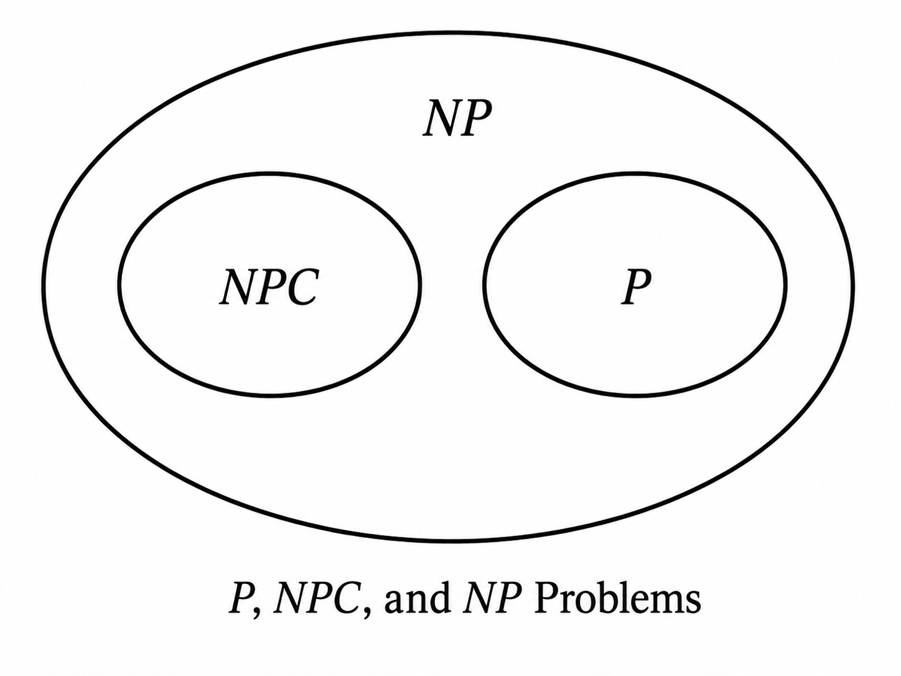
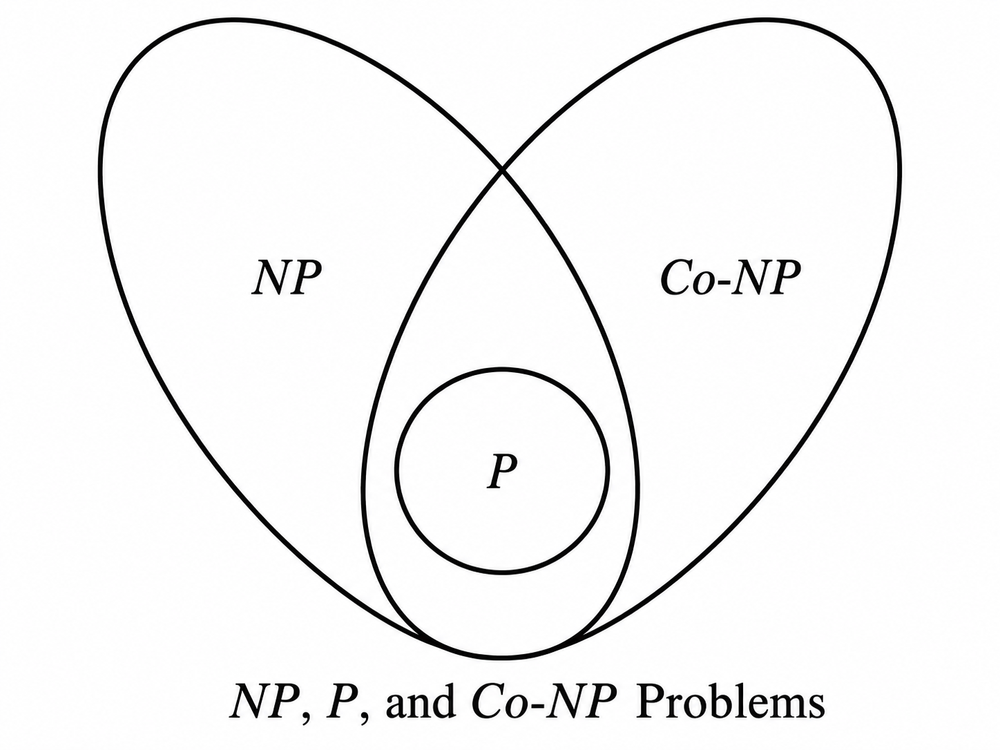

# Integer Linear Programming Notes 10: Computational Complexity Theory

> Author: Hang Li (@flgkd)
>
> Note: Titles marked with ⭐ highlight key concepts and important summaries.

## 1. Preface

When reading optimization papers, we often see statements such as:

> **The problem is NP-hard.**

We also often hear about the famous question:

> **Does $P=NP$?**

I had seen these terms many times before, but if $P$, $NP$, NP-complete, NP-hard, polynomial time, and reduction are not studied together, it is easy to know the words without really understanding what they mean.

This note organizes these ideas from the viewpoint of integer programming and optimization. The presentation follows the main line of Sun and Li's *Integer Programming* [1], while some definitions are rewritten using the standard terminology of computational complexity theory [2].

There are several questions I want this note to answer:

- What does it mean to say that one problem is harder than another?
- What exactly is a polynomial-time algorithm?
- Why does the **input length** matter more than just the number of variables?
- What are $P$, $NP$, NP-complete, co-NP, and NP-hard?
- How do polynomial-time reductions work?
- Why can an optimization problem be called NP-hard even though $P$ and $NP$ are classes of decision problems?
- What does all of this mean for integer linear programming?

---

## 2. Why Computational Complexity Theory Matters

Suppose we are given two optimization problems.

One may look much larger than the other, but this alone does not tell us which one is fundamentally harder.

A complexity theory should give us a way to:

1. quantify the difficulty of a problem;
2. compare the relative difficulty of two problems;
3. define what an **efficient algorithm** means;
4. compare algorithms without depending on a particular computer.

The important idea is that complexity theory studies a **problem class**, not one isolated numerical instance.

For example:

```text
one specific TSP instance
→ an instance

the family of all TSP instances
→ a computational problem
```

A particular large instance of an easy problem may take a long time.

A particular small instance of an NP-hard problem may be solved almost instantly.

Therefore:

> **"This instance took a long time" and "this problem is computationally hard" are not the same statement.**

Complexity theory is mainly concerned with how the required computation grows as the encoded input becomes larger.

---

## 3. Decision Problems and Optimization Problems⭐⭐

### 3.1 Why Decision Problems Appear Everywhere in Complexity Theory

The classical complexity classes $P$, $NP$, co-NP, and NP-complete are defined for **decision problems**.

A decision problem has only two possible answers:

```text
YES
or
NO
```

This does **not** mean that computational complexity theory as a whole can only study decision problems.

Search problems, function problems, counting problems, and optimization problems also have their own complexity theories.

However, when discussing $P$, $NP$, and NP-completeness, we normally associate an optimization problem with a corresponding decision problem.

### 3.2 From Optimization to Decision

Consider the maximization problem

$$
z^{\ast}=\max_{x\in S} f(x).
$$

For a given threshold $K$, define the corresponding decision problem:

$$
DEC(K):\quad \text{Does there exist }x\in S\text{ such that }f(x)\ge K?
$$

The optimization problem asks:

> What is the best objective value?

The decision problem asks:

> Is there a feasible solution whose objective value is at least $K$?

This conversion is one of the basic bridges between optimization and complexity theory.

### 3.3 Example: Bin Packing

Suppose there are $n$ items with sizes

$$
a_1,\ldots,a_n,
$$

and each bin has capacity $C$.

The optimization version asks:

> What is the minimum number of bins required to pack all items?

The corresponding decision version asks:

> Given an integer $K$, can all items be packed into at most $K$ bins?

The first asks for an optimum.

The second only asks YES or NO.

### 3.4 Solving an Optimization Problem Through Decision Problems⭐

Consider the 0-1 integer program

$$
z^{\ast}=\max \quad c^T x
$$

subject to

$$
Ax\le b
$$

$$
x\in\{0,1\}^n.
$$

Assume $c$ is integral.

For an integer threshold $K$, define

$$
DEC(K):\quad \text{Does there exist }x\in\{0,1\}^n\text{ such that }Ax\le b\text{ and }c^Tx\ge K?
$$

Suppose integer bounds $L$ and $U$ are known such that

$$
L\le z^{\ast}\le U.
$$

Then the optimal value can be found by binary search.

At each step, let

$$
K=\lfloor\frac{L+U+1}{2}\rfloor.
$$

If $DEC(K)$ returns YES, set

$$
L=K.
$$

Otherwise, set

$$
U=K-1.
$$

When $L=U$,

$$
z^{\ast}=L.
$$

The number of decision queries is at most

$$
\lceil\log_2(U-L+1)\rceil.
$$

So for many discrete optimization problems, exact optimization and the corresponding decision problem are polynomially related.

One qualification is important:

> **It is too strong to say that every optimization problem can always be converted to decision form by this simple binary-search argument.**

The argument requires suitable discrete objective values and bounds whose encoding lengths are controlled. For the integer optimization problems considered in this note, this is usually the relevant setting.

---

## 4. How Do We Measure Algorithmic Difficulty?⭐⭐⭐

### 4.1 Worst-Case Analysis

There are several possible ways to measure the difficulty of an algorithm:

- experience on some test instances;
- average running time under a probability distribution;
- worst-case running time.

Classical computational complexity theory mainly uses **worst-case analysis**.

Suppose algorithm $A$ solves problem $P$.

Let $G_A(X)$ denote the number of elementary computational steps required by $A$ on instance $X$.

If $L(X)$ is the input length of $X$, define the worst-case running time by

$$
T_A(L)=\max\{G_A(X):L(X)\le L\}.
$$

This removes dependence on one particular instance and asks:

> Among all instances whose encoded length is at most $L$, how bad can the algorithm become?

### 4.2 Input Length Is Not the Same as the Number of Variables⭐

This is one of the most important points in this chapter.

Algorithmic complexity depends on the **length of the encoded input**, not only on the number of variables or constraints.

For an integer $a$, its binary encoding length is of order

$$
O(\log(|a|+1)).
$$

For a rational number

$$
r=\frac{p}{q},
$$

with $q>0$, its encoding length is of order

$$
O(\log(|p|+1)+\log(q+1)).
$$

For a vector or matrix, the total input length is the sum of the encoding lengths of all entries, together with the information required to describe its dimensions.

This is why a numerical value such as

$$
B=2^m
$$

has value exponential in $m$, but only requires about $m+1$ bits to store.

This distinction becomes crucial for dynamic programming.

### 4.3 Example: Input Length of TSP

For a complete TSP instance with $n$ cities, suppose all integer edge costs satisfy

$$
0\le c_{ij}\le C.
$$

There are on the order of $n^2$ edge costs.

A rough encoding-length estimate is therefore

$$
L(X)=O(n^2\log(C+1)).
$$

The exact representation may differ, but the important point is that the magnitudes of the edge costs enter through their **bit lengths**, not through their numerical values directly.

### 4.4 Example: Input Length of Knapsack

For a 0-1 knapsack instance with weights $a_i$, profits $c_i$, and capacity $B$, a natural encoding length is of order

$$
L(X)=O(n+\sum_{i=1}^{n}\log(a_i+1)+\sum_{i=1}^{n}\log(|c_i|+1)+\log(B+1)).
$$

Therefore, a running time polynomial in $B$ is not necessarily polynomial in $L(X)$.

That point will become important shortly.

### 4.5 Big-O Notation

Usually we do not need an exact formula for running time.

We only care about its asymptotic growth.

We write

$$
f(L)=O(g(L))
$$

if there exist constants $C>0$ and $L_0$ such that

$$
f(L)\le Cg(L)
$$

for all

$$
L\ge L_0.
$$

For example,

$$
3L^3+20L^2+100=O(L^3).
$$

The lower-order terms and constant coefficients do not change the asymptotic order.

---

## 5. Polynomial, Strongly Polynomial, Pseudo-Polynomial, and Exponential Time⭐⭐⭐

### 5.1 Polynomial-Time Algorithm

An algorithm is polynomial-time if there exists a constant $p>0$ such that

$$
T_A(L)=O(L^p).
$$

Here $L$ is the **input length**.

This is the standard theoretical meaning of an efficient algorithm.

Of course, polynomial time does not automatically mean fast in practice.

For example,

$$
O(L^{100})
$$

is polynomial but obviously not attractive.

The classification is asymptotic.

### 5.2 Strongly Polynomial-Time Algorithm

For numerical optimization problems, a stronger notion is often useful.

Roughly speaking, an algorithm is **strongly polynomial** if:

1. the number of arithmetic operations is bounded by a polynomial in the combinatorial dimensions of the problem, independently of the magnitudes of the numerical data;
2. the numbers generated during the computation have encoding lengths polynomially bounded by the input length.

The important intuition is:

```text
polynomial time
→ may depend polynomially on the bit length of numerical data

strongly polynomial time
→ number of arithmetic operations does not depend on numerical magnitudes
```

Shortest-path, assignment, and several network-flow problems have strongly polynomial algorithms.

General linear programming is polynomial-time solvable, although the simplex method itself is not a polynomial-time algorithm in the worst case. Polynomial-time LP algorithms include the ellipsoid method and interior-point methods.

For a review of LP and simplex, see:

- [Simplex Method and Linear Programming Duality](01-simplex-method-and-lp-duality.md)

### 5.3 Pseudo-Polynomial Time⭐

This concept is especially important for integer programming.

Suppose an algorithm runs in

$$
O(nB),
$$

where $B$ is an integer appearing in the input.

Since the binary encoding length of $B$ is only

$$
O(\log(B+1)),
$$

the value $B$ may be exponential in its own encoding length.

Therefore,

$$
O(nB)
$$

is not necessarily polynomial in the true input length.

Such an algorithm is called **pseudo-polynomial**.

The standard example is dynamic programming for 0-1 knapsack.

A typical implementation runs in

$$
O(nB).
$$

This is polynomial in the numerical value $B$, but not polynomial in the number of bits used to encode $B$.

So:

> **The usual dynamic programming algorithm for 0-1 knapsack is pseudo-polynomial, not polynomial-time in the standard bit-complexity sense.**

We will return to this point in the later notes on Dynamic Programming and Knapsack.

### 5.4 Exponential and Superpolynomial Time

An algorithm such as

$$
O(2^L)
$$

or

$$
O(c^L),\quad c>1,
$$

is exponential in the input length.

Brute-force algorithms for combinatorial problems often have running times such as

$$
O(2^n)
$$

or

$$
O(n!).
$$

One correction is important:

> **"Not polynomial" does not automatically mean "exponential."**

There are also superpolynomial but subexponential functions, for example

$$
2^{\sqrt{L}}.
$$

So the correct broad contrast is often:

```text
polynomial
vs.
superpolynomial
```

rather than simply polynomial vs. exponential.

---

## 6. The Complexity Classes P and NP⭐⭐⭐

### 6.1 NP Does Not Mean "Non-Polynomial"

This is probably the most common misunderstanding.

$NP$ does **not** mean "non-polynomial."

It means **nondeterministic polynomial time**.

A modern and very useful equivalent definition is based on certificates.

A decision problem belongs to $NP$ if, for every YES instance, there exists a certificate of polynomial length whose correctness can be verified in polynomial time.

Informally:

> **An $NP$ problem is a decision problem for which a proposed YES solution can be checked efficiently.**

### 6.2 Example: 0-1 Knapsack Is in NP

Consider the decision version of 0-1 knapsack:

$$
\text{Does there exist }x\in\{0,1\}^n\text{ such that }a^Tx\le B\text{ and }c^Tx\ge K?
$$

If somebody gives us a candidate vector

$$
x\in\{0,1\}^n,
$$

we only need to verify:

$$
a^Tx\le B
$$

and

$$
c^Tx\ge K.
$$

These checks can be performed in polynomial time in the encoded input length.

Therefore, the decision version of 0-1 knapsack belongs to $NP$.

The same certificate idea applies to many familiar combinatorial problems, including TSP decision, set cover decision, integer programming feasibility, and many others [2].

### 6.3 The Class P

$P$ is the class of decision problems that can be **solved** by a deterministic polynomial-time algorithm.

Therefore,

$$
P\subseteq NP.
$$

The reason is straightforward:

> If we can solve a problem in polynomial time, then of course we can verify a proposed answer in polynomial time.

Notice the symbol:

$$
P\subseteq NP
$$

is known.

Whether the inclusion is strict,

$$
P\subsetneq NP,
$$

is unknown.

### 6.4 Examples of Polynomial-Time Solvable Problems

Examples include:

- shortest-path problems;
- one-to-one assignment problems;
- transportation and many network-flow problems;
- linear programming.

This is important for integer programming.

The assignment problem, for example, is naturally written with binary variables, but it still has polynomial-time algorithms such as the Hungarian algorithm.

Therefore:

> **The fact that a model contains integer variables does not by itself imply NP-hardness.**

---

## 7. Polynomial-Time Reduction⭐⭐⭐

Reduction is the central tool for comparing problem difficulty.

### 7.1 Definition

Let $A$ and $B$ be two decision problems.

We say that $A$ is polynomial-time reducible to $B$, written

$$
A\le_p B,
$$

if there exists a polynomial-time transformation that maps every instance $x$ of $A$ to an instance $r(x)$ of $B$ such that

$$
x\text{ is a YES instance of }A
$$

if and only if

$$
r(x)\text{ is a YES instance of }B.
$$

The intuitive meaning is:

> **If I know how to solve $B$, then I can use that solver to solve $A$ with only polynomial additional work.**

Therefore,

$$
A\le_p B
$$

means:

> **$A$ is no harder than $B$.**

Or equivalently:

> **$B$ is at least as hard as $A$.**

### 7.2 The Direction of Reduction Is Easy to Reverse by Mistake⭐

This is worth remembering explicitly.

If we want to prove that a new problem $B$ is hard, we start from a problem $A$ that is already known to be hard and construct

$$
A\le_p B.
$$

Not the other way around.

A useful memory aid is:

```text
known hard problem
        ↓ reduce to
new problem

therefore:
new problem is at least as hard
```

### 7.3 Reduction Lemma

Two consequences are used repeatedly.

First, if

$$
A\le_p B
$$

and

$$
B\in P,
$$

then

$$
A\in P.
$$

Why?

Because we can transform $A$ into $B$ in polynomial time and then solve $B$ in polynomial time.

Second, if $A$ is NP-hard and

$$
A\le_p B,
$$

then $B$ is also NP-hard.

If, in addition,

$$
B\in NP,
$$

then $B$ is NP-complete.

This simple logic is the backbone of most NP-hardness and NP-completeness proofs.

---

## 8. NP-Complete Problems⭐⭐⭐

### 8.1 Definition

A decision problem $B$ is **NP-complete** if:

1. $B\in NP$;
2. every problem $A\in NP$ can be polynomial-time reduced to $B$.

That is,

$$
A\le_p B,\quad \forall A\in NP.
$$

NP-complete problems can therefore be regarded as the "hardest" problems inside $NP$ under polynomial-time reductions.

This is more precise than saying that they are simply "very difficult."

### 8.2 The First NP-Complete Problem: SAT

Cook's 1971 result established the foundation of NP-completeness by showing that Boolean satisfiability is complete for nondeterministic polynomial time; this is now usually stated as the Cook-Levin theorem [3].

The SAT decision problem asks:

> Given a Boolean formula, does there exist a truth assignment that makes the formula true?

SAT is in $NP$ because a truth assignment can be checked in polynomial time.

The deep part is that every problem in $NP$ can be reduced to SAT in polynomial time.

Karp later used polynomial reductions to establish NP-completeness for many important combinatorial problems [4].

### 8.3 The Most Important Consequence

Suppose $B$ is NP-complete and somebody finds a polynomial-time algorithm for $B$.

Because every problem $A\in NP$ satisfies

$$
A\le_p B,
$$

every problem in $NP$ would then be solvable in polynomial time.

Therefore,

$$
B\in P\text{ for some NP-complete }B
$$

implies

$$
P=NP.
$$

Conversely, if

$$
P=NP,
$$

then every NP-complete problem is in $P$.

At present, no polynomial-time algorithm is known for an NP-complete problem, and no proof is known that such an algorithm cannot exist. The $P$ versus $NP$ problem remains an unsolved Millennium Prize Problem [5].

Most complexity theorists believe

$$
P\ne NP,
$$

but this has not been proved.

### 8.4 Relationship Among P, NP, and NP-Complete Problems

Under the commonly believed assumption

$$
P\ne NP,
$$

we have the schematic relationship shown below.

<p align="center">
  
</p>

<p align="center">
  Relationship among P, NP-complete, and NP problems under the assumption P ≠ NP.
</p>

A point that is easy to overlook is that not every problem in

$$
NP\setminus P
$$

has to be NP-complete.

NP-complete problems are the hardest problems in $NP$, but the region between $P$ and NP-complete problems should not simply be ignored.

### 8.5 co-NP

The class co-NP is defined through complements.

A decision problem $A$ belongs to co-NP if its complement belongs to $NP$.

Informally, co-NP contains problems for which NO answers have polynomially verifiable certificates.

We know that

$$
P\subseteq NP\cap co\text{-}NP.
$$

However, the exact relationship between $NP$ and co-NP is unknown.

In particular, it is not known whether

$$
NP=co\text{-}NP.
$$

If an NP-complete problem were proved to belong to co-NP, then it would imply

$$
NP=co\text{-}NP.
$$

So one should **not** casually claim that NP-complete problems are known to lie in co-NP.

The following figure should therefore be read as a schematic picture, not as a complete characterization of the unknown boundary.

<p align="center">
  
</p>

<p align="center">
  Schematic relationship among P, NP, and co-NP.
</p>

---

## 9. NP-Hard Problems⭐⭐⭐

### 9.1 Definition

NP-hard is more general than NP-complete.

A problem $H$ is NP-hard if every problem in $NP$ can be reduced to $H$ in polynomial time.

Unlike NP-complete problems:

- an NP-hard problem does not have to belong to $NP$;
- an NP-hard problem does not even have to be a decision problem.

This is why optimization problems are commonly described as NP-hard.

For an optimization problem, a standard sufficient route is:

```text
its associated decision problem is NP-complete
        ↓
the exact optimization problem is NP-hard
```

So the statement from optimization papers,

> "This optimization problem is NP-hard,"

is perfectly meaningful even though $NP$ itself is a class of decision problems.

### 9.2 NP-Hard vs. NP-Complete

| Concept | Must be a decision problem? | Must belong to NP? | Hard for all problems in NP? |
|---|---:|---:|---:|
| $P$ | Yes | Yes | No |
| $NP$ | Yes | By definition | No |
| NP-complete | Yes | Yes | Yes |
| NP-hard | No | No | Yes |

### 9.3 How to Prove a Problem Is NP-Hard⭐

This is another place where the direction matters.

Suppose we want to prove that problem $B$ is NP-hard.

We choose a known NP-hard or NP-complete problem $A$ and prove

$$
A\le_p B.
$$

Then $B$ is at least as hard as $A$.

So the correct pattern is:

```text
known NP-hard problem A
        ↓ polynomial reduction
new problem B

therefore B is NP-hard
```

Do **not** prove

$$
B\le_p A
$$

and then conclude that $B$ is NP-hard.

That only shows that $B$ is no harder than $A$.

### 9.4 What NP-Hard Does and Does Not Mean

If

$$
P\ne NP,
$$

then an NP-hard problem cannot have a polynomial-time exact algorithm under the standard reduction model.

Otherwise such an algorithm would imply a polynomial-time algorithm for every problem in $NP$.

But several qualifications are important.

NP-hard does **not** mean:

- every instance is difficult;
- practical solvers must always be slow;
- approximation is impossible;
- heuristics are useless;
- a special case cannot be polynomial-time solvable.

NP-hardness is a statement about the **general problem class** and worst-case polynomial-time exact solvability.

This is why commercial MILP solvers can solve many large practical instances even though general MILP is NP-hard.

---

## 10. Complexity of Integer Linear Programming⭐⭐⭐

### 10.1 0-1 Linear Integer Programming

Consider the 0-1 optimization problem

$$
\max \quad c^T x
$$

subject to

$$
Ax\le b
$$

$$
x\in\{0,1\}^n.
$$

Its threshold decision version is

$$
\text{Does there exist }x\in\{0,1\}^n\text{ such that }Ax\le b\text{ and }c^Tx\ge K?
$$

This problem belongs to $NP$ because a candidate binary vector $x$ can be checked in polynomial time.

It is also NP-hard through standard reductions from NP-complete Boolean problems.

Therefore, the decision version is NP-complete, and the corresponding 0-1 optimization problem is NP-hard [2].

### 10.2 General Integer Linear Programming

Now consider the more general decision problem:

$$
\text{Does there exist }x\in\mathbb{Z}^n\text{ such that }Ax\le b\text{ and }c^Tx\ge K?
$$

General integer linear programming is NP-hard, and the standard decision formulations are NP-complete under binary encoding [6].

This is one of the theoretical reasons why integer programming is fundamentally more difficult than linear programming.

However, one must be very careful with the interpretation.

> **"General ILP is NP-hard" does not mean that every optimization problem written with integer variables is NP-hard.**

For example, the one-to-one assignment problem can be written as a binary linear program, but it is polynomial-time solvable.

The structure of the constraint matrix matters.

### 10.3 A Very Important Special Case: Fixed Dimension

There is an even stronger warning against saying "integer variables imply NP-hard."

Lenstra proved that integer linear programming with a **fixed number of variables** is polynomial-time solvable [7].

So:

```text
general ILP with variable dimension
→ NP-hard

ILP with fixed dimension
→ polynomial-time solvable
```

This is a good example of why complexity statements must always specify exactly which family of problems is being discussed.

### 10.4 Binary Linear Equations and Subset Sum

Even very restricted-looking integer problems can still be hard.

Consider

$$
a^Tx=b
$$

with

$$
x\in\{0,1\}^n.
$$

The decision question

$$
\text{Does there exist }x\in\{0,1\}^n\text{ such that }a^Tx=b?
$$

is the classic **Subset Sum** form.

It is NP-complete.

This gives a useful lesson:

> A model can have only one linear equation and still define an NP-complete decision problem.

The number of constraints alone is therefore not a reliable measure of computational difficulty.

---

## 11. Complexity of the Knapsack Problem⭐⭐

### 11.1 0-1 Knapsack

The 0-1 knapsack optimization problem is

$$
\max \quad c^T x
$$

subject to

$$
a^Tx\le B
$$

$$
x\in\{0,1\}^n.
$$

Its decision version is

$$
\text{Does there exist }x\in\{0,1\}^n\text{ such that }a^Tx\le B\text{ and }c^Tx\ge K?
$$

It belongs to $NP$ because a proposed $x$ can be checked efficiently.

To see why it is NP-hard, start from Subset Sum:

$$
a^Tx=b,\quad x\in\{0,1\}^n.
$$

Construct a knapsack instance with

$$
c=a,
$$

$$
B=b,
$$

and

$$
K=b.
$$

Then the two knapsack inequalities become

$$
a^Tx\le b
$$

and

$$
a^Tx\ge b.
$$

Together they imply

$$
a^Tx=b.
$$

Thus Subset Sum reduces to 0-1 Knapsack.

Therefore, the knapsack decision problem is NP-complete and the optimization problem is NP-hard [2].

### 11.2 Why Dynamic Programming Does Not Contradict NP-Hardness

The classical dynamic programming algorithm for 0-1 knapsack runs in approximately

$$
O(nB).
$$

At first sight this may look polynomial.

But $B$ is a numerical value.

Its binary input length is only

$$
O(\log(B+1)).
$$

Therefore,

$$
O(nB)
$$

can be exponential in the number of bits required to encode $B$.

This is why the dynamic programming algorithm is **pseudo-polynomial** rather than polynomial-time.

There is no contradiction with NP-hardness.

### 11.3 Weak NP-Hardness

This also leads to another useful term.

0-1 knapsack is a classic example of a **weakly NP-hard** optimization problem.

Very roughly:

- weakly NP-hard problems may admit pseudo-polynomial algorithms;
- strongly NP-hard problems remain hard even when the numerical values are suitably bounded.

Do not confuse:

```text
strongly polynomial algorithm
```

with

```text
strongly NP-hard problem
```

They are different concepts.

---

## 12. How to Read "NP-Hard" in an Optimization Paper⭐

After all the definitions, this is the practical interpretation I find most useful.

When a paper says:

> **Problem P is NP-hard.**

the statement should normally mean that the authors have established a polynomial-time reduction showing that the general exact optimization problem is at least as hard as a known NP-hard problem.

It does **not** automatically justify:

> "Therefore, our heuristic is necessary."

NP-hardness only rules out a polynomial-time exact algorithm **if $P\ne NP$**.

A paper still needs to explain why its proposed method is appropriate.

Depending on the application, possible approaches include:

- exact MILP methods;
- Branch and Bound / Branch and Cut;
- Branch and Price;
- decomposition;
- dynamic programming;
- approximation algorithms;
- heuristics and metaheuristics;
- learning-assisted optimization.

Also, when reading an NP-hardness proof, check the reduction direction carefully:

$$
\text{known hard problem}\le_p\text{new problem}.
$$

This one line catches many incorrect complexity arguments.

---

## 13. Key Takeaways⭐⭐⭐

After all of the definitions above, these are the points I think are worth remembering.

1. $P$, $NP$, co-NP, and NP-complete are classical complexity classes of **decision problems**.
2. Optimization problems can often be connected to decision problems through an objective threshold.
3. For many discrete optimization problems with integer objective values, a polynomial number of decision queries can recover the optimal objective value.
4. Complexity is measured as a function of **encoded input length**, not only the number of variables and constraints.
5. An integer of magnitude $B$ requires only $O(\log(B+1))$ bits to encode.
6. Polynomial time means polynomial in the input length.
7. A pseudo-polynomial algorithm may be polynomial in a numerical value such as $B$ but exponential in the bit length of $B$.
8. $NP$ does **not** mean non-polynomial. It means nondeterministic polynomial time and can be understood through polynomial-time verification of YES certificates.
9. $P\subseteq NP$ is known; whether $P=NP$ is still open.
10. A polynomial reduction $A\le_p B$ means that $A$ is no harder than $B$.
11. To prove a new problem $B$ is NP-hard, reduce a known hard problem **to** it: $A\le_p B$.
12. An NP-complete problem is both in $NP$ and NP-hard.
13. If any NP-complete problem has a polynomial-time algorithm, then $P=NP$.
14. NP-hard is broader than NP-complete: an NP-hard problem does not have to be a decision problem or belong to $NP$.
15. General integer linear programming is NP-hard, but this does not mean every special ILP structure is NP-hard.
16. Binary assignment is polynomial-time solvable, and fixed-dimensional ILP is also polynomial-time solvable.
17. 0-1 knapsack is NP-hard even though it has an $O(nB)$ dynamic programming algorithm, because that algorithm is pseudo-polynomial.
18. NP-hardness is a worst-case statement about a problem family. It does not mean every practical instance is difficult.

## References

1. Sun, Xiaoling, and Duan Li. *Integer Programming*. Beijing: Science Press, 2010. ISBN: 978-7-03-029380-0.（孙小玲、李端：《整数规划》，北京：科学出版社，2010年，ISBN：978-7-03-029380-0）

2. Garey, M. R., and Johnson, D. S. *Computers and Intractability: A Guide to the Theory of NP-Completeness*. W. H. Freeman, 1979. ISBN: `0-7167-1045-5`.

3. Cook, S. A. “The Complexity of Theorem-Proving Procedures.” *Proceedings of the Third Annual ACM Symposium on Theory of Computing (STOC)*, 1971, pp. 151–158. DOI: `10.1145/800157.805047`.

4. Karp, R. M. “Reducibility Among Combinatorial Problems.” In *Complexity of Computer Computations*, 1972, pp. 85–103. DOI: `10.1007/978-1-4684-2001-2_9`.

5. Clay Mathematics Institute. “P vs NP.” *Millennium Prize Problems*. Current status: unsolved.

6. Papadimitriou, C. H. “On the Complexity of Integer Programming.” *Journal of the ACM*, 28(4), 1981, pp. 765–768. DOI: `10.1145/322276.322287`.

7. Lenstra, H. W., Jr. “Integer Programming with a Fixed Number of Variables.” *Mathematics of Operations Research*, 8(4), 1983, pp. 538–548. DOI: `10.1287/moor.8.4.538`.

## Suggested Follow-up Reading

The most relevant next topics are:

1. **Dynamic Programming**  
   Especially useful for understanding pseudo-polynomial algorithms and why dynamic programming can solve some NP-hard problems efficiently when numerical parameters are small.

2. **Knapsack Problem**  
   A central example connecting NP-completeness, pseudo-polynomial dynamic programming, weak NP-hardness, and approximation algorithms.

3. **Assignment Problem**  
   A useful counterexample to the idea that every binary integer formulation is NP-hard.

4. **Approximation Algorithms**  
   NP-hardness rules out polynomial-time exact algorithms under $P\ne NP$, but many NP-hard problems still admit useful approximation guarantees.

For this note series, **Dynamic Programming** is the next topic.
