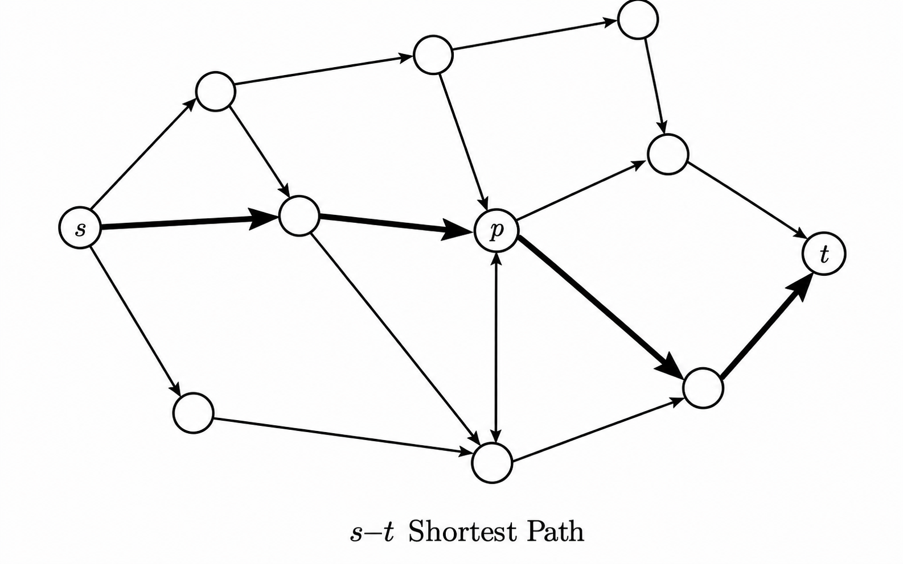
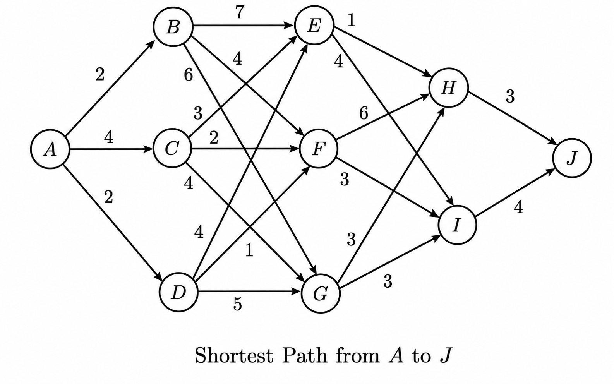
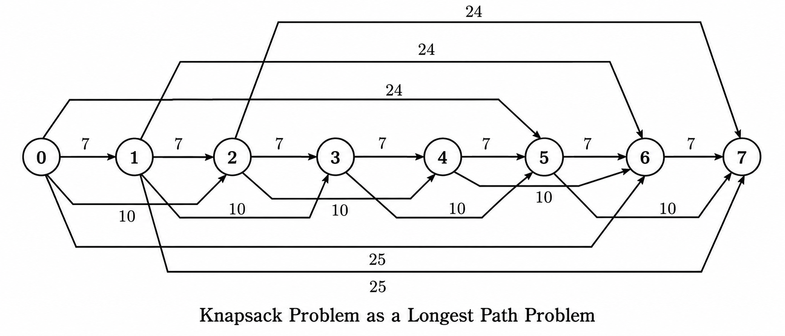
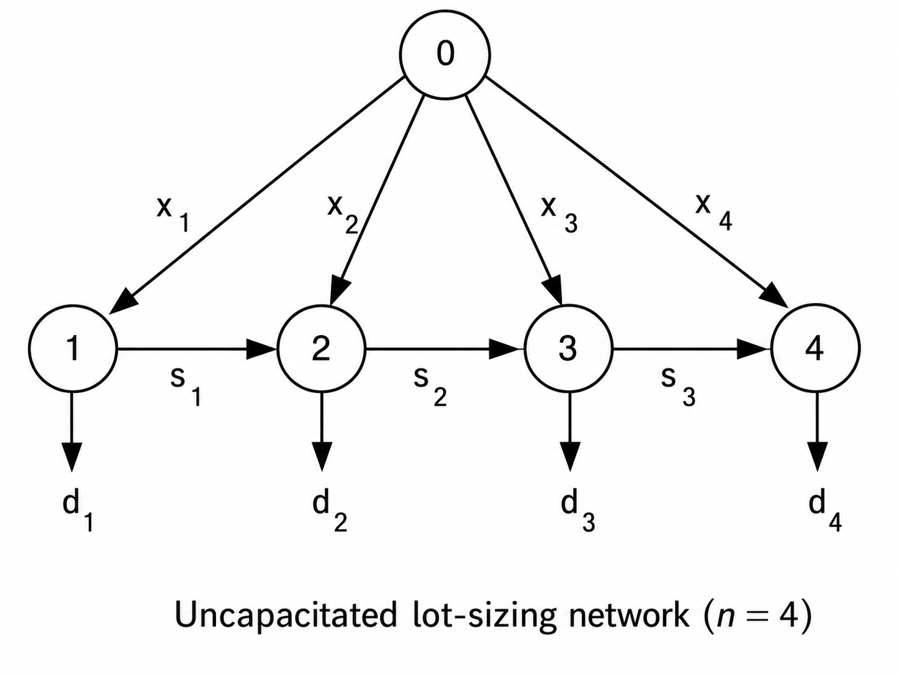

# Integer Linear Programming Notes 11: Dynamic Programming

> Author: Hang Li (@flgkd)
>
> Note: Titles marked with ⭐ highlight key concepts and important summaries.

## 1. Preface

This note studies **dynamic programming (DP)**, one of the most important methods for solving multi-stage decision problems.

This note is primarily based on Sun and Li's *Integer Programming* [1].

Dynamic programming is particularly useful when a problem can be divided into stages and the optimal decision at one stage can be expressed through optimal solutions of smaller subproblems. In integer programming, it can be used to solve several important special structures, including the 0-1 knapsack problem and the integer knapsack problem [1].

The main examples in this note are:

- shortest-path problems;
- 0-1 knapsack;
- integer / unbounded knapsack;
- uncapacitated lot-sizing.

One point is especially important after the previous note on computational complexity:

> **A dynamic-programming algorithm does not automatically imply a polynomial-time algorithm.**

For knapsack, the familiar $O(nB)$ dynamic program is only **pseudo-polynomial**, because $B$ is a numerical value rather than its binary encoding length.

For a review of this distinction, see:

- [Computational Complexity Theory](10-computational-complexity-theory.md)

---

## 2. Basic Idea of Dynamic Programming⭐⭐⭐

### 2.1 Dynamic Programming vs. Divide and Conquer

The basic idea of dynamic programming is also to decompose a problem into smaller subproblems.

The important difference from ordinary divide-and-conquer is that the subproblems in a dynamic-programming formulation are often **not independent**.

A naive recursive method may repeatedly solve the same subproblem many times.

Dynamic programming avoids this repeated computation by storing the value of each state after it has been solved.

There are two standard implementations:

```text
top-down recursion + memoization

bottom-up recursion + tabulation
```

In this note, the main presentation follows the second style: define a state-value function, derive a recurrence, and fill a table stage by stage.

### 2.2 Three Important Structural Ideas

A useful practical summary of the usual conditions for applying dynamic programming is:

1. the principle of optimality / optimal substructure;
2. no aftereffect;
3. overlapping subproblems.

This is a very useful practical checklist, but one qualification is needed.

> **Optimal substructure and a sufficient state description are the fundamental structural requirements. Overlapping subproblems are what often make memoization or tabulation computationally useful, but they are not a formal requirement for every dynamic-programming formulation.**

#### Optimal Substructure

A problem has optimal substructure if an optimal solution contains optimal solutions to the relevant subproblems.

For example, if a shortest path from $s$ to $t$ passes through $p$, then the subpath from $s$ to $p$ and the subpath from $p$ to $t$ must themselves be shortest paths between their respective endpoints.

#### No Aftereffect / State Sufficiency

Once the current state is known, future decisions should not need the full history of how that state was reached.

In other words:

> **The state should contain all information from the past that is relevant to the future.**

This is closely related to the Markov idea in sequential decision problems.

#### Overlapping Subproblems

Different decision sequences may lead to the same state.

If the value of that state is computed once and stored, many repeated calculations can be avoided.

This is why dynamic programming often trades memory for speed.

However, it is too strong to say that DP always converts an exponential algorithm into a polynomial one. The number of distinct states may itself be exponential or pseudo-polynomial.

### 2.3 A General Bellman Recursion⭐

For a multi-stage minimization problem, let

- $k$ be the stage;
- $s$ be the current state;
- $a$ be a feasible decision;
- $g_k(s,a)$ be the immediate cost;
- $T_k(s,a)$ be the next state.

A generic Bellman recursion is

$$
V_k(s)=\min_{a\in A_k(s)}\{g_k(s,a)+V_{k+1}(T_k(s,a))\}.
$$

For a maximization problem, replace $\min$ by $\max$.

The terminal condition may be written as

$$
V_{K+1}(s)=g_{K+1}(s).
$$

This simple structure is the core idea behind all of the examples below.

Richard Bellman's work in the 1950s developed this principle into the systematic framework now known as dynamic programming [2].

---

## 3. Shortest Path and the Principle of Optimality⭐⭐⭐

### 3.1 The Shortest-Path Problem

Let

$$
G=(V,A)
$$

be a directed graph, where $V$ is the node set and $A$ is the arc set.

For each arc

$$
(i,j)\in A,
$$

let $c_{ij}$ be its length.

For the DAG recursion discussed below, the arc lengths do not need to be positive; the absence of directed cycles is enough.

Given a source node $s$, the shortest-path problem asks for the minimum-length path from $s$ to another node $t$.

The most direct idea is enumeration:

```text
enumerate all s-t paths
→ calculate every path length
→ choose the shortest
```

But the number of paths can grow exponentially with the size of the graph.

<p align="center">
  
</p>

<p align="center">
  An s-t shortest path and one intermediate node p.
</p>

### 3.2 Property 1: Optimal Subpaths⭐

Suppose a shortest path from $s$ to $t$ passes through node $p$.

Then:

> **The subpath from $s$ to $p$ is a shortest path from $s$ to $p$, and the subpath from $p$ to $t$ is a shortest path from $p$ to $t$.**

The proof is by contradiction.

If the subpath from $s$ to $p$ were not shortest, replace it by a shorter path from $s$ to $p$. The resulting path from $s$ to $t$ would then be shorter than the assumed shortest path, which is impossible.

This is the shortest-path version of the **principle of optimality**.

### 3.3 Property 2: Bellman Recursion for Shortest Paths

Let $d(v)$ denote the shortest-path distance from $s$ to node $v$.

Let

$$
Pred(v)=\{u:(u,v)\in A\}
$$

be the set of predecessors of $v$.

Then

$$
d(s)=0
$$

and, whenever the predecessor distances are already known,

$$
d(v)=\min_{u\in Pred(v)}\{d(u)+c_{uv}\}.
$$

This equation says:

> If I already know the shortest distances to every node that can directly enter $v$, then I can compute the shortest distance to $v$.

This is exactly a dynamic-programming recurrence.

### 3.4 Why the Order of States Matters⭐

For a general directed graph, the equation above is not by itself an algorithm, because dependencies may form cycles.

For a **directed acyclic graph (DAG)**, however, the nodes can be arranged in topological order.

Then every predecessor of a node appears earlier in the order, so the recurrence can be evaluated once from left to right.

A DAG shortest-path algorithm therefore runs in

$$
O(|V|+|A|)
$$

time when the graph is stored using adjacency lists [3].

This bound follows directly from processing the nodes once in topological order.

The $O(|V||A|)$ recurrence belongs to a different but related dynamic program: the Bellman-Ford edge-count formulation.

### 3.5 Edge-Count Dynamic Programming and Bellman-Ford

Let

$$
D_k(v)
$$

be the shortest distance from $s$ to $v$ among paths that use at most $k$ arcs.

Initialize

$$
D_0(s)=0
$$

and

$$
D_0(v)=+\infty,\quad v\ne s.
$$

Then

$$
D_k(v)=\min\{D_{k-1}(v),\min_{u\in Pred(v)}[D_{k-1}(u)+c_{uv}]\}.
$$

If there is no reachable negative cycle, a shortest simple path uses at most

$$
|V|-1
$$

arcs, so computing the recurrence for

$$
k=1,\ldots,|V|-1
$$

gives the Bellman-Ford dynamic program with complexity

$$
O(|V||A|).
$$

So there are two different facts to remember:

```text
DAG + topological order
→ O(|V| + |A|)

general directed graph + Bellman-Ford recurrence
→ O(|V||A|)
```

For nonnegative arc lengths, Dijkstra's algorithm is another standard alternative.

### 3.6 Example: Shortest Path from A to J

The task is to determine the shortest distance from node $A$ to node $J$ and identify the corresponding shortest path or paths.

Consider the graph below.

<p align="center">
  
</p>

<p align="center">
  Shortest Path from A to J.
</p>

The stages are

```text
Stage 0: A
Stage 1: B, C, D
Stage 2: E, F, G
Stage 3: H, I
Stage 4: J
```

From $A$:

$$
d(B)=2,\quad d(C)=4,\quad d(D)=2.
$$

For Stage 2:

$$
d(E)=\min\{2+7,\ 4+3,\ 2+4\}=6.
$$

$$
d(F)=\min\{2+4,\ 4+2,\ 2+1\}=3.
$$

$$
d(G)=\min\{2+6,\ 4+4,\ 2+5\}=7.
$$

For Stage 3:

$$
d(H)=\min\{6+1,\ 3+6,\ 7+3\}=7.
$$

$$
d(I)=\min\{6+4,\ 3+3,\ 7+3\}=6.
$$

Finally,

$$
d(J)=\min\{7+3,\ 6+4\}=10.
$$

Therefore the shortest-path length is

$$
d(J)=10.
$$

There are two shortest paths:

$$
A\to D\to E\to H\to J
$$

and

$$
A\to D\to F\to I\to J.
$$

Both have length $10$.

### 3.7 Dynamic Programming vs. Enumeration

This example contains 18 complete paths from $A$ to $J$.

An enumeration algorithm evaluates all $18$ paths separately.

Every complete path contains four arcs, so evaluating one path length requires three additions. Under the simple convention of counting only additions and comparisons, exhaustive enumeration requires

$$
18	imes3+17=71
$$

elementary operations.

Dynamic programming instead computes the best value of each intermediate state only once.

Using the same counting convention, the stage-by-stage calculations require:

- Stage 2: $9$ additions and $6$ comparisons;
- Stage 3: $6$ additions and $4$ comparisons;
- Stage 4: $2$ additions and $1$ comparison.

Thus the recurrence requires

$$
9+6+6+4+2+1=28
$$

additions and comparisons for this example, excluding simple initialization and assignment operations.

The exact count depends on the implementation and the operation-counting convention, so the main point is not the particular number $28$.

The important difference is structural:

```text
enumeration
→ work grows with the number of complete paths

dynamic programming on this DAG
→ work grows with the number of states and arcs
```

For large layered networks, the difference can be enormous.

### 3.8 Python Implementation

```python
from math import inf


def dag_shortest_path(topological_order, edges, source):
    adjacency = {u: [] for u in topological_order}

    for u, v, weight in edges:
        adjacency[u].append((v, weight))

    distance = {u: inf for u in topological_order}
    parent = {u: None for u in topological_order}
    distance[source] = 0

    for u in topological_order:
        if distance[u] == inf:
            continue

        for v, weight in adjacency[u]:
            candidate = distance[u] + weight

            if candidate < distance[v]:
                distance[v] = candidate
                parent[v] = u

    return distance, parent
```

For the graph above, one topological order is

```python
order = ["A", "B", "C", "D", "E", "F", "G", "H", "I", "J"]
```

The algorithm scans each arc once after the topological ordering is known.

### 3.9 Stages and States

A **stage** is one part of a sequential decision process. The stage index is commonly denoted by $k$.

A **state** describes the information needed at the beginning of that stage. A state variable may be denoted by $s_k$.

In a layered shortest-path problem, nodes can be grouped into stages according to their position in the path. In the graph above, every node in the same stage is reached after the same number of arcs from the source.

The stages are therefore:

- Stage 1 states: $B,C,D$;
- Stage 2 states: $E,F,G$;
- Stage 3 states: $H,I$;
- Stage 4 state: $J$.

The state is what summarizes the past.

Once we know the shortest distance to the current node, we do not need to remember every path used to reach it.

This distinction between **stage** and **state** is important:

```text
stage
→ where we are in the decision process

state
→ the information needed to continue optimally from that stage
```

---

## 4. Dynamic Programming for the 0-1 Knapsack Problem⭐⭐⭐

The knapsack problem is one of the standard examples for understanding both dynamic programming and pseudo-polynomial complexity [4].

### 4.1 Model

Consider the 0-1 knapsack problem

$$
\max \quad \sum_{j=1}^{n}c_jx_j
$$

subject to

$$
\sum_{j=1}^{n}a_jx_j\le B
$$

$$
x_j\in\{0,1\},\quad j=1,\ldots,n.
$$

Here:

- $c_j$ is the value of item $j$;
- $a_j$ is the weight of item $j$;
- $B$ is the knapsack capacity;
- $x_j=1$ means that item $j$ is selected.

For the capacity-based dynamic program, assume

$$
a_j\in\mathbb{Z}_{>0}
$$

and

$$
B\in\mathbb{Z}_{>0}.
$$

The profits $c_j$ are usually taken as nonnegative integers in this discussion, although the state indexing itself depends on the weights and capacity.

### 4.2 Stages and States

Let the stage $k$ mean:

> We are allowed to use only items $1,\ldots,k$.

Let the state $\lambda$ be the available capacity.

Define

$$
F_k(\lambda)=\max\{\sum_{j=1}^{k}c_jx_j:\sum_{j=1}^{k}a_jx_j\le\lambda,\ x_j\in\{0,1\}\}.
$$

The original problem value is

$$
F^{\ast}=F_n(B).
$$

### 4.3 Initial Condition

A convenient initialization is

$$
F_0(\lambda)=0,\quad \lambda=0,\ldots,B.
$$

For $k=1$, this gives

$$
F_1(\lambda)=0,\quad \lambda<a_1
$$

and

$$
F_1(\lambda)=c_1,\quad \lambda\ge a_1.
$$

### 4.4 Deriving the Recurrence⭐

For item $k$, there are only two possibilities.

#### Case 1: Do Not Select Item k

Then

$$
x_k=0
$$

and the best value is

$$
F_{k-1}(\lambda).
$$

#### Case 2: Select Item k

If

$$
a_k\le\lambda,
$$

then selecting item $k$ leaves capacity

$$
\lambda-a_k.
$$

The remaining best value is

$$
F_{k-1}(\lambda-a_k),
$$

so the total value is

$$
c_k+F_{k-1}(\lambda-a_k).
$$

Therefore,

$$
F_k(\lambda)=F_{k-1}(\lambda),\quad a_k>\lambda.
$$

Otherwise,

$$
F_k(\lambda)=\max\{F_{k-1}(\lambda),c_k+F_{k-1}(\lambda-a_k)\}.
$$

This is the standard 0-1 knapsack recurrence.

The reason the second term uses

$$
F_{k-1}
$$

rather than

$$
F_k
$$

is crucial:

> Item $k$ can be used at most once.

### 4.5 Recovering an Optimal Solution

After the table is filled, start from

$$
(k,\lambda)=(n,B).
$$

If

$$
F_k(\lambda)=F_{k-1}(\lambda),
$$

we may choose

$$
x_k=0.
$$

Otherwise,

$$
x_k=1
$$

and update

$$
\lambda\gets\lambda-a_k.
$$

Then continue with

$$
k\gets k-1.
$$

When there is a tie, more than one optimal solution may exist. The chosen solution depends on the tie-breaking rule.

### 4.6 Complexity

There are

$$
n(B+1)
$$

states.

Each state requires constant work.

Therefore the time complexity is

$$
O(nB).
$$

The full two-dimensional table uses

$$
O(nB)
$$

memory.

If only the optimal value is needed, memory can be reduced to

$$
O(B)
$$

by updating capacities in descending order.

### 4.7 Why O(nB) Is Only Pseudo-Polynomial⭐⭐⭐

This is one of the most important points in the note.

At first sight,

$$
O(nB)
$$

looks polynomial.

But standard complexity is measured in terms of the **number of bits required to encode the input**.

The binary encoding length of $B$ is

$$
O(\log(B+1)).
$$

Let

$$
s=\lceil\log_2(B+1)\rceil.
$$

Then $B$ can be on the order of

$$
2^s.
$$

Therefore the running time may behave like

$$
O(n2^s),
$$

which is exponential in the number of bits used to represent the capacity.

A more complete estimate of the binary input length for integer data is

$$
L=O(n+\sum_{j=1}^{n}\log(a_j+1)+\sum_{j=1}^{n}\log(c_j+1)+\log(B+1)).
$$

So the $O(nB)$ algorithm is **pseudo-polynomial**, not polynomial in $L$.

This does not contradict the NP-hardness of 0-1 knapsack.

#### A Useful Comparison

Suppose we sort $n$ fixed-width integers.

If each integer uses $32$ bits, the encoded input length is proportional to

$$
32n.
$$

An $O(n^2)$ sorting algorithm is still polynomial in the input length.

Now consider trial division for testing whether one integer $N$ is prime:

```python
def is_prime_trial(N):
    if N < 2:
        return False

    divisor = 2

    while divisor * divisor <= N:
        if N % divisor == 0:
            return False

        divisor += 1

    return True
```

The loop performs on the order of

$$
\sqrt{N}
$$

iterations.

But $N$ itself requires only

$$
O(\log N)
$$

bits to encode.

If

$$
L=\Theta(\log N),
$$

then

$$
\sqrt{N}=2^{\Theta(L)}.
$$

So this particular trial-division algorithm is not polynomial in the bit length.

This does **not** mean primality testing itself is hard: Agrawal, Kayal, and Saxena proved that primality testing has a deterministic polynomial-time algorithm [5].

The lesson is simply:

> **Never confuse the numerical magnitude of an integer with the length of its binary encoding.**

#### Structural Size vs. Numerical Magnitude

This distinction is easy to miss because, for many ordinary data structures, the natural size parameter and the encoded input length grow together.

For example, if a graph is stored as an adjacency list, merely listing its vertices and arcs already requires a representation whose structural size grows with $|V|+|A|$. Therefore an $O(|V|+|A|)$ graph algorithm is polynomial in the encoded input size, apart from the additional bits needed to store labels or numerical edge data.

A numerical parameter such as $B$ behaves differently.

If $B$ is represented in binary using $s$ bits, increasing the representation by only one bit can almost double the range of possible values of $B$. An algorithm whose running time is proportional to $B$ may therefore require roughly twice as much work after the numerical input grows by only one bit.

This is the intuition behind pseudo-polynomial time.

It is also worth remembering that pseudo-polynomial does **not** mean useless in practice. If $B$ is moderate, the $O(nB)$ knapsack dynamic program can still be very effective even though it is not polynomial in the formal bit-length model.

### 4.8 Python Implementation

```python
def knapsack_01(weights, profits, capacity):
    n = len(weights)

    dp = [[0] * (capacity + 1) for _ in range(n + 1)]
    take = [[False] * (capacity + 1) for _ in range(n + 1)]

    for k in range(1, n + 1):
        weight = weights[k - 1]
        profit = profits[k - 1]

        for cap in range(capacity + 1):
            dp[k][cap] = dp[k - 1][cap]

            if weight <= cap:
                candidate = profit + dp[k - 1][cap - weight]

                if candidate > dp[k][cap]:
                    dp[k][cap] = candidate
                    take[k][cap] = True

    x = [0] * n
    cap = capacity

    for k in range(n, 0, -1):
        if take[k][cap]:
            x[k - 1] = 1
            cap -= weights[k - 1]

    return dp[n][capacity], x, dp
```

### 4.9 Numerical Example

The task is to determine the maximum total value and recover an optimal 0-1 item-selection vector for the following knapsack problem.

Consider

$$
\max \quad 3x_1+2x_2+2x_3+2x_4+6x_5+4x_6
$$

subject to

$$
2x_1+6x_2+2x_3+4x_4+3x_5+9x_6\le17
$$

$$
x_j\in\{0,1\},\quad j=1,\ldots,6.
$$

The DP table is:

| Capacity $\lambda$ | $F_1$ | $F_2$ | $F_3$ | $F_4$ | $F_5$ | $F_6$ |
|:---:|---:|---:|---:|---:|---:|---:|
| 0 | 0 | 0 | 0 | 0 | 0 | 0 |
| 1 | 0 | 0 | 0 | 0 | 0 | 0 |
| 2 | 3 | 3 | 3 | 3 | 3 | 3 |
| 3 | 3 | 3 | 3 | 3 | 6 | 6 |
| 4 | 3 | 3 | 5 | 5 | 6 | 6 |
| 5 | 3 | 3 | 5 | 5 | 9 | 9 |
| 6 | 3 | 3 | 5 | 5 | 9 | 9 |
| 7 | 3 | 3 | 5 | 5 | 11 | 11 |
| 8 | 3 | 5 | 5 | 7 | 11 | 11 |
| 9 | 3 | 5 | 5 | 7 | 11 | 11 |
| 10 | 3 | 5 | 7 | 7 | 11 | 11 |
| 11 | 3 | 5 | 7 | 7 | 13 | 13 |
| 12 | 3 | 5 | 7 | 7 | 13 | 13 |
| 13 | 3 | 5 | 7 | 7 | 13 | 13 |
| 14 | 3 | 5 | 7 | 9 | 13 | 13 |
| 15 | 3 | 5 | 7 | 9 | 13 | 13 |
| 16 | 3 | 5 | 7 | 9 | 13 | 15 |
| 17 | 3 | 5 | 7 | 9 | 15 | 15 |

Therefore,

$$
F_6(17)=15.
$$

The problem has more than one optimal solution.

For example,

$$
x=(1,0,1,0,1,1)^T
$$

has weight

$$
2+2+3+9=16
$$

and value

$$
3+2+6+4=15.
$$

Another optimal solution is

$$
x=(1,1,1,1,1,0)^T,
$$

which exactly uses capacity $17$ and also has value $15$.

This is a useful reminder that a DP value table determines the optimal objective value, but tie-breaking during backtracking determines which optimal solution is returned.

---

## 5. Dynamic Programming for the Integer Knapsack Problem⭐⭐⭐

### 5.1 Model

Now consider the integer, or unbounded, knapsack problem

$$
\max \quad \sum_{j=1}^{n}c_jx_j
$$

subject to

$$
\sum_{j=1}^{n}a_jx_j\le B
$$

$$
x_j\in\mathbb{Z}_{\ge0},\quad j=1,\ldots,n.
$$

The difference from 0-1 knapsack is that each item type may now be selected multiple times.

### 5.2 State Definition

Define

$$
G_k(\lambda)=\max\{\sum_{j=1}^{k}c_jx_j:\sum_{j=1}^{k}a_jx_j\le\lambda,\ x_j\in\mathbb{Z}_{\ge0}\}.
$$

Then the original problem value is

$$
G_n(B).
$$

### 5.3 Direct Recurrence

Suppose item type $k$ is used exactly $t$ times.

Then

$$
t=0,1,\ldots,\lfloor\lambda/a_k\rfloor.
$$

After using $t$ copies, the remaining capacity is

$$
\lambda-ta_k.
$$

Therefore,

$$
G_k(\lambda)=\max_{0\le t\le\lfloor\lambda/a_k\rfloor}\{tc_k+G_{k-1}(\lambda-ta_k)\}.
$$

For one state, this can require up to $O(B)$ candidate values.

Across all stages and capacities, the worst-case complexity is therefore

$$
O(nB^2).
$$

### 5.4 Improved Recurrence⭐

The direct recurrence can be improved.

For an optimal solution of $G_k(\lambda)$, there are again two cases.

#### Case 1: No Item k Is Used

Then the value is

$$
G_{k-1}(\lambda).
$$

#### Case 2: At Least One Item k Is Used

Remove one copy of item $k$.

The remaining problem still allows item $k$, so the residual value is

$$
G_k(\lambda-a_k).
$$

Therefore,

$$
G_k(\lambda)=G_{k-1}(\lambda),\quad a_k>\lambda.
$$

Otherwise,

$$
G_k(\lambda)=\max\{G_{k-1}(\lambda),c_k+G_k(\lambda-a_k)\}.
$$

Notice the difference from 0-1 knapsack:

```text
0-1 knapsack:
c_k + F_{k-1}(lambda - a_k)

unbounded knapsack:
c_k + G_k(lambda - a_k)
```

The use of $G_k$ allows item type $k$ to be selected again.

The complexity is now

$$
O(nB).
$$

This is still pseudo-polynomial.

### 5.5 Recovering an Optimal Solution

Starting from

$$
(k,\lambda)=(n,B),
$$

if

$$
G_k(\lambda)=G_{k-1}(\lambda),
$$

choose no additional item of type $k$ and move to

$$
k-1.
$$

Otherwise, choose one more copy:

$$
x_k\gets x_k+1
$$

and update

$$
\lambda\gets\lambda-a_k.
$$

The stage remains $k$ because item $k$ may be selected again.

### 5.6 Python Implementation

```python
def unbounded_knapsack(weights, profits, capacity):
    n = len(weights)

    dp = [[0] * (capacity + 1) for _ in range(n + 1)]
    take = [[False] * (capacity + 1) for _ in range(n + 1)]

    for k in range(1, n + 1):
        weight = weights[k - 1]
        profit = profits[k - 1]

        for cap in range(capacity + 1):
            dp[k][cap] = dp[k - 1][cap]

            if weight <= cap:
                candidate = profit + dp[k][cap - weight]

                if candidate > dp[k][cap]:
                    dp[k][cap] = candidate
                    take[k][cap] = True

    x = [0] * n
    k = n
    cap = capacity

    while k > 0:
        if take[k][cap]:
            x[k - 1] += 1
            cap -= weights[k - 1]
        else:
            k -= 1

    return dp[n][capacity], x, dp
```

### 5.7 Numerical Example

The task is to determine the maximum total value and recover an optimal integer item-selection vector for the following unbounded knapsack problem.

Consider

$$
\max \quad 7x_1+9x_2+2x_3+15x_4
$$

subject to

$$
3x_1+4x_2+2x_3+7x_4\le10
$$

$$
x\in\mathbb{Z}_{\ge0}^4.
$$

The DP table is:

| Capacity $\lambda$ | $G_1$ | $G_2$ | $G_3$ | $G_4$ |
|:---:|---:|---:|---:|---:|
| 0 | 0 | 0 | 0 | 0 |
| 1 | 0 | 0 | 0 | 0 |
| 2 | 0 | 0 | 2 | 2 |
| 3 | 7 | 7 | 7 | 7 |
| 4 | 7 | 9 | 9 | 9 |
| 5 | 7 | 9 | 9 | 9 |
| 6 | 14 | 14 | 14 | 14 |
| 7 | 14 | 16 | 16 | 16 |
| 8 | 14 | 18 | 18 | 18 |
| 9 | 21 | 21 | 21 | 21 |
| 10 | 21 | 23 | 23 | 23 |

Hence,

$$
G_4(10)=23.
$$

One optimal solution is

$$
x=(2,1,0,0)^T.
$$

Indeed,

$$
3(2)+4(1)=10
$$

and

$$
7(2)+9(1)=23.
$$

### 5.8 A One-Dimensional Recurrence

The same integer knapsack problem can also be written without the stage index.

Define

$$
Z(\lambda)=\max\{\sum_{j=1}^{n}c_jx_j:\sum_{j=1}^{n}a_jx_j\le\lambda,\ x\in\mathbb{Z}_{\ge0}^n\}.
$$

Set

$$
Z(0)=0.
$$

For $\lambda>0$,

$$
Z(\lambda)=\max\{0,\max_{j:a_j\le\lambda}[c_j+Z(\lambda-a_j)]\}.
$$

The recurrence can be justified in both directions.

For any item type $j$ satisfying

$$
a_j\le\lambda,
$$

take an optimal solution for capacity $\lambda-a_j$ and add one copy of item $j$. This produces a feasible solution for capacity $\lambda$, so

$$
Z(\lambda)\ge c_j+Z(\lambda-a_j).
$$

Conversely, suppose an optimal solution for capacity $\lambda$ is nonzero. Then at least one item type $k$ is used. Remove one copy of item $k$. The remaining solution is feasible for capacity $\lambda-a_k$, so its value cannot exceed $Z(\lambda-a_k)$. Hence

$$
Z(\lambda)\le c_k+Z(\lambda-a_k).
$$

Together, these two inequalities establish the recurrence.

For every fixed capacity $\lambda$, at most $n$ item types are checked.

Therefore the total complexity remains

$$
O(nB).
$$

Since $Z(\lambda)$ optimizes over all item types, it is equivalent to the last-stage value

$$
Z(\lambda)=G_n(\lambda).
$$

For the numerical example above,

$$
Z(10)=G_4(10)=23.
$$

### 5.9 Integer Knapsack as a Longest-Path Problem⭐

The one-dimensional recurrence has a direct graph interpretation.

Create a DAG with nodes

$$
0,1,\ldots,B.
$$

For every item type $j$ and state $\lambda$ satisfying

$$
\lambda+a_j\le B,
$$

add an arc

$$
(\lambda,\lambda+a_j)
$$

with length

$$
c_j.
$$

Taking one copy of item $j$ corresponds to traversing this arc.

Because all arcs move from a smaller capacity to a larger capacity, the graph is acyclic.

If unused capacity must be represented explicitly, one may also add zero-weight arcs

$$
(\lambda,\lambda+1).
$$

For every capacity state $\lambda$, the value $Z(\lambda)$ is exactly the longest-path value from node $0$ to node $\lambda$ in this state-space graph.

In particular, the integer knapsack optimum is the longest-path value from node $0$ to node $B$.

The figure below corresponds to

$$
\max \quad 10x_1+7x_2+25x_3+24x_4
$$

subject to

$$
2x_1+x_2+6x_3+5x_4\le7
$$

$$
x\in\mathbb{Z}_{\ge0}^4.
$$

The zero-weight arcs are omitted from the picture.

<p align="center">
  
</p>

<p align="center">
  Knapsack Problem as a Longest Path Problem.
</p>

This graph interpretation makes the relation between dynamic programming and shortest / longest paths very concrete:

> **A DP state can often be viewed as a node, and a decision can often be viewed as an arc between states.**

---

## 6. Dynamic Programming for the Uncapacitated Lot-Sizing Problem⭐⭐⭐

### 6.1 Problem Description

The **Uncapacitated Lot-Sizing Problem (ULS)** determines a minimum-cost production and inventory schedule for one product over a finite discrete planning horizon while satisfying known demand in every period.

For period

$$
t=1,\ldots,n,
$$

let

- $f_t$: fixed setup cost if production occurs in period $t$;
- $p_t$: unit production cost;
- $h_t$: unit inventory holding cost at the end of period $t$;
- $d_t$: demand;
- $x_t$: production quantity;
- $s_t$: ending inventory;
- $y_t\in\{0,1\}$: whether production is set up.

The standard formulation is

$$
\min \quad \sum_{t=1}^{n}(f_ty_t+p_tx_t+h_ts_t)
$$

subject to

$$
s_{t-1}+x_t=d_t+s_t,\quad t=1,\ldots,n,
$$

$$
x_t\le M_ty_t,\quad t=1,\ldots,n,
$$

$$
x_t\ge0,\quad s_t\ge0,\quad y_t\in\{0,1\},
$$

with

$$
s_0=s_n=0.
$$

Because the problem is uncapacitated, a valid and much tighter choice than an arbitrary large $M$ is

$$
M_t=\sum_{j=t}^{n}d_j.
$$

### 6.2 Network Interpretation

ULS can be interpreted as a fixed-charge network-flow problem.

The production decisions correspond to fixed-charge arcs, while inventory carries material from one period to the next.

In the network below:

- an arc from node $0$ to period $t$ represents production $x_t$ in period $t$;
- opening that production arc incurs the fixed setup cost $f_t$;
- flow on the production arc incurs unit production cost $p_t$;
- an arc from period $t$ to period $t+1$ represents inventory carried forward and incurs holding cost $h_t$;
- the outgoing demand arc at period $t$ represents demand $d_t$.

Therefore the problem can be viewed in two steps conceptually:

```text
choose which production arcs are opened
→ determine the production periods

then
→ send a minimum-cost feasible flow through the resulting network
```

<p align="center">
  
</p>

<p align="center">
  Uncapacitated lot-sizing network for n = 4.
</p>

### 6.3 Zero-Inventory Ordering Property⭐

A fundamental property of the uncapacitated deterministic lot-sizing problem is that there exists an optimal solution satisfying

$$
s_{t-1}x_t=0,\quad t=1,\ldots,n.
$$

In words:

> If production starts in period $t$, there is an optimal solution in which the inventory entering period $t$ is zero.

This is often called the **zero-inventory ordering property**.

Consequently, when

$$
x_t>0,
$$

the quantity produced in period $t$ can be taken to cover an integer block of future demands:

$$
x_t=D_{t,k}
$$

for some $k\ge t$, where

$$
D_{t,k}=\sum_{j=t}^{k}d_j.
$$

This is the structural property that makes the Wagner-Whitin dynamic program possible [6].

### 6.4 Direct Wagner-Whitin Recursion

Suppose production in period $t$ satisfies all demand from periods $t$ through $k$.

The lot size is

$$
D_{t,k}.
$$

Its direct original cost is

$$
L_{t,k}=f_t+p_tD_{t,k}+\sum_{r=t}^{k-1}h_rD_{r+1,k}.
$$

The first term is the setup cost.

The second term is the production cost.

The final term is the inventory cost: demand for later periods must be held from period $t$ until it is consumed.

Let

$$
H(k)
$$

be the minimum original cost for satisfying demands in periods $1,\ldots,k$.

Set

$$
H(0)=0.
$$

If the last production lot begins in period $t$, then periods $1,\ldots,t-1$ contribute $H(t-1)$ and the last lot contributes $L_{t,k}$.

Therefore,

$$
H(k)=\min_{1\le t\le k}\{H(t-1)+L_{t,k}\}.
$$

There are $O(n^2)$ pairs $(t,k)$.

With the lot costs precomputed in $O(n^2)$ time, the full dynamic program runs in

$$
O(n^2).
$$

This is the classical Wagner-Whitin dynamic program [6].

### 6.5 Equivalent Objective Transformation

An equivalent transformed objective is also useful.

From the inventory-balance equations,

$$
s_t=\sum_{i=1}^{t}x_i-\sum_{i=1}^{t}d_i.
$$

Define

$$
\bar h_t=\sum_{r=t}^{n}h_r
$$

and

$$
c_t=p_t+\bar h_t.
$$

Then

$$
\sum_{t=1}^{n}h_ts_t=\sum_{t=1}^{n}\bar h_tx_t-\sum_{t=1}^{n}\bar h_td_t.
$$

The second term is constant.

So minimizing the original objective is equivalent to minimizing

$$
\sum_{t=1}^{n}(f_ty_t+c_tx_t).
$$

up to the constant

$$
C_0=\sum_{t=1}^{n}\bar h_td_t.
$$

Under the zero-inventory ordering property, if production starts at $t$ and covers demand through $k$, the transformed lot cost is

$$
f_t+c_tD_{t,k}.
$$

Define $\widehat H(k)$ as the optimal value of this transformed objective for the first $k$ periods.

Then

$$
\widehat H(0)=0
$$

and

$$
\widehat H(k)=\min_{1\le t\le k}\{\widehat H(t-1)+f_t+c_tD_{t,k}\}.
$$

The original objective value is recovered by subtracting the corresponding constant.

For the full horizon,

$$
H(n)=\widehat H(n)-C_0.
$$

This distinction is important: $\widehat H(n)$ is the value of the **transformed** objective, not the original production-plus-inventory cost.

### 6.6 Numerical Example

The task is to determine the minimum total cost and recover an optimal production and setup schedule over the four-period planning horizon.

Consider

$$
n=4
$$

with demands

$$
d=(2,4,5,1),
$$

unit production costs

$$
p=(3,3,3,3),
$$

holding costs

$$
h=(1,2,1,1),
$$

and setup costs

$$
f=(12,20,16,8).
$$

The cumulative holding-cost terms are

$$
\bar h=(5,4,2,1),
$$

so

$$
c=(8,7,5,4).
$$

For the transformed recurrence:

$$
\widehat H(1)=12+8(2)=28.
$$

For $k=2$,

$$
\widehat H(2)=\min\{12+8(6),\ 28+20+7(4)\}=60.
$$

For $k=3$,

$$
\widehat H(3)=\min\{12+8(11),\ 28+20+7(9),\ 60+16+5(5)\}=100.
$$

For $k=4$,

$$
\widehat H(4)=\min\{12+8(12),\ 28+20+7(10),\ 60+16+5(6),\ 100+8+4(1)\}=106.
$$

The minimizing predecessor for period $4$ is $t=3$, and the predecessor for period $2$ is $t=1$.

Therefore the production plan is

$$
x=(6,0,6,0)
$$

and

$$
y=(1,0,1,0).
$$

The ending inventories are

$$
s=(4,0,1,0).
$$

The constant is

$$
C_0=5(2)+4(4)+2(5)+1(1)=37.
$$

Therefore the original objective value is

$$
H(4)=106-37=69.
$$

We can verify it directly:

$$
\sum_{t=1}^{4}f_ty_t=12+16=28,
$$

$$
\sum_{t=1}^{4}p_tx_t=3(6)+3(6)=36,
$$

and

$$
\sum_{t=1}^{4}h_ts_t=1(4)+2(0)+1(1)+1(0)=5.
$$

Thus

$$
28+36+5=69.
$$

### 6.7 Python Implementation

```python
def wagner_whitin(demand, setup, production_cost, holding_cost):
    n = len(demand)

    lot_cost = [[0] * n for _ in range(n)]

    for t in range(n):
        quantity = 0
        holding = 0
        cumulative_holding = 0

        for k in range(t, n):
            quantity += demand[k]

            if k > t:
                cumulative_holding += holding_cost[k - 1]
                holding += demand[k] * cumulative_holding

            lot_cost[t][k] = (
                setup[t]
                + production_cost[t] * quantity
                + holding
            )

    dp = [float("inf")] * (n + 1)
    predecessor = [None] * (n + 1)
    dp[0] = 0

    for k in range(1, n + 1):
        for t in range(1, k + 1):
            candidate = dp[t - 1] + lot_cost[t - 1][k - 1]

            if candidate < dp[k]:
                dp[k] = candidate
                predecessor[k] = t

    production = [0] * n
    setup_decision = [0] * n

    k = n

    while k > 0:
        t = predecessor[k]
        setup_decision[t - 1] = 1
        production[t - 1] = sum(demand[t - 1:k])
        k = t - 1

    return dp[n], production, setup_decision
```

For the numerical example,

```python
demand = [2, 4, 5, 1]
setup = [12, 20, 16, 8]
production_cost = [3, 3, 3, 3]
holding_cost = [1, 2, 1, 1]
```

the function returns the original optimal cost

```text
69
```

with production plan

```text
[6, 0, 6, 0]
```

and setup decisions

```text
[1, 0, 1, 0]
```

---

## 7. What Dynamic Programming Is Really Doing⭐

After the examples above, I think the most useful way to understand dynamic programming is:

```text
state
→ summarizes all relevant information from the past

decision
→ moves from one state to another

Bellman recurrence
→ keeps only the best value reaching each state

table / memoization
→ prevents repeated solution of the same state
```

In many discrete optimization problems, this can also be interpreted as a path problem on an implicit state-space graph.

This is why shortest path, knapsack, and lot-sizing can all be discussed using almost the same logic.

A useful complexity rule is

$$
\text{DP work}\approx\text{number of states}\times\text{number of transitions per state}.
$$

The difficult part is often not writing the recurrence.

The difficult part is choosing a state that is:

1. rich enough to preserve the no-aftereffect property;
2. small enough that the state space remains computationally manageable.

---

## 8. Key Takeaways⭐⭐⭐

1. Dynamic programming solves a multi-stage problem by storing and reusing optimal values of subproblems.
2. The principle of optimality means that the relevant continuation of an optimal solution must itself be optimal.
3. A good state is a sufficient summary of the past: once the state is known, the future should not require the entire decision history.
4. Overlapping subproblems explain why memoization and tabulation can save large amounts of repeated computation, but DP is not automatically polynomial-time.
5. Shortest paths on a DAG can be solved by dynamic programming in $O(|V|+|A|)$ time.
6. The 0-1 knapsack recurrence uses $F_{k-1}(\lambda-a_k)$ because each item can be used at most once.
7. The unbounded knapsack recurrence uses $G_k(\lambda-a_k)$ because the same item type may be used again.
8. Both standard knapsack dynamic programs run in $O(nB)$ time, which is pseudo-polynomial rather than polynomial in the binary input length.
9. Integer knapsack can be interpreted as a longest-path problem on a DAG whose nodes represent capacity states.
10. The Wagner-Whitin algorithm uses the zero-inventory ordering property to solve uncapacitated lot-sizing in $O(n^2)$ time.
11. In many optimization problems, dynamic programming can be understood as shortest or longest path on an implicit state-space network.

## References

1. Sun, Xiaoling, and Duan Li. *Integer Programming*. Beijing: Science Press, 2010. ISBN: 978-7-03-029380-0.（孙小玲、李端：《整数规划》，北京：科学出版社，2010年，ISBN：978-7-03-029380-0）

2. Bellman, R. *Dynamic Programming*. Princeton University Press, 1957. ISBN: `978-0-691-07951-6`.

3. Ahuja, R. K., Magnanti, T. L., and Orlin, J. B. *Network Flows: Theory, Algorithms, and Applications*. Prentice Hall, 1993. ISBN: `978-0-13-617549-0`.

4. Kellerer, H., Pferschy, U., and Pisinger, D. *Knapsack Problems*. Springer, 2004. DOI: `10.1007/978-3-540-24777-7`.

5. Agrawal, M., Kayal, N., and Saxena, N. “PRIMES is in P.” *Annals of Mathematics*, 160(2), 2004, pp. 781–793. DOI: `10.4007/annals.2004.160.781`.

6. Wagner, H. M., and Whitin, T. M. “Dynamic Version of the Economic Lot Size Model.” *Management Science*, 5(1), 1958, pp. 89–96. DOI: `10.1287/mnsc.5.1.89`.
