# Integer Linear Programming Notes 13: Assignment Problem and Hungarian Algorithm

> Author: Hang Li (@flgkd)
>
> Note: Titles marked with ⭐ highlight key concepts and important summaries.

## 1. Preface

This note studies the **assignment problem** and the **Hungarian algorithm**, together with their connections to bipartite matching, combinatorial optimization, and integer programming.

This note is primarily based on Sun and Li's *Integer Programming* [1]. The sections on bipartite matching, augmenting paths, minimum vertex cover, and several programming examples are also based on the online materials listed in References [8]-[12].

Two assignment models should be distinguished from the beginning:

1. the **classical assignment problem**, also called the **one-to-one assignment problem**;
2. the **generalized assignment problem (GAP)**.

The classical assignment problem imposes a one-to-one correspondence between agents and tasks. In the balanced case, every agent receives exactly one task and every task is assigned to exactly one agent.

The generalized assignment problem removes this one-to-one structure and introduces capacity constraints. A machine or agent may process several jobs as long as its resource capacity is respected.

This distinction has an important computational consequence:

> **The classical assignment problem is polynomially solvable, while the generalized assignment problem is NP-hard.**

A second distinction is equally important:

> **The classical weighted assignment problem is a minimum-cost or maximum-weight perfect matching problem. An unweighted maximum-cardinality bipartite matching problem is related, but it is not the same optimization problem.**

This matters because the phrase **Hungarian algorithm** is used in two different ways in practice. In operations research, it usually refers to the Kuhn-Munkres method for the weighted assignment problem [2,3]. In some competitive-programming materials, a DFS-based augmenting-path algorithm for unweighted bipartite maximum matching is also informally called the Hungarian algorithm. This note treats both ideas, while keeping them conceptually separate.

---

## 2. Classical Assignment Problem⭐⭐⭐

### 2.1 Problem Description

Suppose there are $n$ machines and $n$ production tasks.

If machine $i$ performs task $j$, the resulting profit is $c_{ij}$. Define

$$
x_{ij}=1
$$

if machine $i$ is assigned to task $j$, and

$$
x_{ij}=0
$$

otherwise.

The maximum-profit assignment problem can be written as

$$
\max \quad \sum_{i=1}^{n}\sum_{j=1}^{n}c_{ij}x_{ij}.
$$

Each task must be assigned to exactly one machine:

$$
\sum_{i=1}^{n}x_{ij}=1,\quad j=1,\ldots,n.
$$

Each machine must receive exactly one task:

$$
\sum_{j=1}^{n}x_{ij}=1,\quad i=1,\ldots,n.
$$

The decision variables are binary:

$$
x_{ij}\in\{0,1\},\quad i,j=1,\ldots,n.
$$

This is the standard balanced **one-to-one assignment model** [1-3].

The source material also presents the equivalent minimum-cost form. If $c_{ij}$ denotes the cost of assigning person or machine $i$ to job $j$, then the objective becomes

$$
\min \quad \sum_{i=1}^{n}\sum_{j=1}^{n}c_{ij}x_{ij}
$$

with the same assignment constraints.

### 2.2 Interpretation as a Weighted Bipartite Perfect Matching

Construct a bipartite graph with two vertex sets:

$$
X=\{X_1,\ldots,X_n\}
$$

and

$$
Y=\{Y_1,\ldots,Y_n\}.
$$

The left vertices represent machines or workers, while the right vertices represent jobs.

An edge $(X_i,Y_j)$ represents the possibility of assigning machine $i$ to task $j$. The edge can carry cost or profit $c_{ij}$.

A feasible classical assignment selects exactly one incident edge for every vertex on both sides. Therefore, it is a **perfect matching**.

With costs, the problem is a **minimum-cost perfect matching in a bipartite graph**.

With profits, it is a **maximum-weight perfect matching in a bipartite graph**.

This is more precise than simply calling the classical assignment problem a “maximum matching problem.” Maximum cardinality matching only maximizes the **number** of matched pairs and ignores edge costs or profits.

### 2.3 Why the Classical Assignment Problem Is Easier than General ILP⭐⭐⭐

Although the classical assignment problem has binary variables, its linear-programming relaxation has a special integral structure.

If we replace

$$
x_{ij}\in\{0,1\}
$$

by

$$
x_{ij}\ge0,
$$

the extreme points of the balanced assignment polytope are permutation matrices. Therefore, solving the LP relaxation already yields an integral optimal solution.

This is one reason the classical assignment problem is polynomially solvable despite having a natural binary integer-programming formulation.

This example is also important for understanding what is meant when we say that **integer linear programming is NP-hard**.

The statement does **not** mean that every optimization problem written in ILP form is individually NP-hard. Many special classes of ILP have additional structure and can be solved in polynomial time. The classical assignment problem is a particularly clear counterexample: it has a binary ILP formulation, yet it admits polynomial-time exact algorithms.

The correct complexity statement is about the **general ILP problem**. General ILP is NP-hard, meaning that a polynomial-time algorithm capable of solving arbitrary ILP instances to global optimality would also solve NP-hard problems in polynomial time. Therefore, unless $P=NP$, there is no polynomial-time algorithm that solves every ILP instance.

So the logical relationship is:

```text
general ILP
→ NP-hard

a particular problem with an ILP formulation
→ may be NP-hard
→ may also belong to a polynomially solvable special class
```

The classical assignment problem belongs to the second category.

For a more detailed discussion of NP-hardness, special cases, and the difference between a general problem class and individual structured subclasses, see:

- [Computational Complexity Theory](10-computational-complexity-theory.md)

### 2.4 The Hungarian Method for Weighted Assignment⭐⭐⭐

Kuhn introduced the Hungarian method for the assignment problem in 1955 [2], and Munkres later gave a refined algorithmic treatment [3].

For a square minimum-cost matrix $C=(c_{ij})$, the classical matrix interpretation proceeds conceptually as follows:

1. subtract the minimum value in each row from every entry of that row;
2. subtract the minimum value in each column from every entry of that column;
3. search for a set of independent zeros corresponding to a complete assignment;
4. if a complete assignment cannot yet be formed, cover all zeros with a minimum number of horizontal and vertical lines;
5. adjust uncovered and doubly covered entries to create additional zeros;
6. repeat until $n$ independent zeros can be selected.

The row and column reductions preserve the relative cost of complete assignments, while the zero-creation steps progressively expose an optimal perfect matching [2,3,8].

A standard implementation of the minimum-cost Hungarian algorithm runs in

$$
O(n^3)
$$

time for an $n\times n$ cost matrix.

Therefore, the Hungarian algorithm finds a **globally optimal solution in polynomial time** for the classical assignment problem.

This point is worth emphasizing from an integer-programming perspective. The classical assignment model is naturally written with binary variables, so it is an ILP formulation. Nevertheless, the existence of the polynomial-time Hungarian algorithm shows directly that

> **having an ILP formulation does not imply that the resulting optimization problem is NP-hard.**

What is NP-hard is the **general ILP problem**, not every structured optimization problem that happens to be expressible as an ILP.

Equivalently, the NP-hardness of general ILP means that there is no single polynomial-time exact algorithm for arbitrary ILP instances unless $P=NP$. It does not prevent particular ILP subclasses, such as the classical assignment problem, from having polynomial-time exact algorithms.

This makes the assignment problem and the Hungarian algorithm a useful counterexample to the incorrect statement:

> “Every problem written as an ILP is NP-hard.”

For the general complexity distinction, see again:

- [Computational Complexity Theory](10-computational-complexity-theory.md)

The following Python implementation returns the minimum cost and one optimal assignment:

```python
def hungarian_min_cost(cost):
    n = len(cost)
    m = len(cost[0])

    if n > m:
        raise ValueError("This implementation assumes n <= m.")

    u = [0] * (n + 1)
    v = [0] * (m + 1)
    p = [0] * (m + 1)
    way = [0] * (m + 1)

    for i in range(1, n + 1):
        p[0] = i
        j0 = 0
        minv = [float("inf")] * (m + 1)
        used = [False] * (m + 1)

        while True:
            used[j0] = True
            i0 = p[j0]
            delta = float("inf")
            j1 = 0

            for j in range(1, m + 1):
                if used[j]:
                    continue

                cur = cost[i0 - 1][j - 1] - u[i0] - v[j]

                if cur < minv[j]:
                    minv[j] = cur
                    way[j] = j0

                if minv[j] < delta:
                    delta = minv[j]
                    j1 = j

            for j in range(m + 1):
                if used[j]:
                    u[p[j]] += delta
                    v[j] -= delta
                else:
                    minv[j] -= delta

            j0 = j1

            if p[j0] == 0:
                break

        while True:
            j1 = way[j0]
            p[j0] = p[j1]
            j0 = j1

            if j0 == 0:
                break

    assignment = [-1] * n
    for j in range(1, m + 1):
        if p[j] != 0:
            assignment[p[j] - 1] = j - 1

    min_cost = -v[0]
    return min_cost, assignment
```

For a maximum-profit problem, one can transform profits into costs, for example by replacing $c_{ij}$ with $M-c_{ij}$ for a sufficiently large constant $M$.

---

## 3. Bipartite Matching and the Augmenting-Path Algorithm⭐⭐⭐

The source material develops the assignment problem through bipartite matching. This is especially useful for understanding feasibility, perfect matching, minimum vertex cover, and several graph-modeling applications.

### 3.1 Bipartite Graph

A graph $G=(V,E)$ is **bipartite** if its vertex set can be partitioned into two disjoint sets

$$
V=X\cup Y,\quad X\cap Y=\varnothing,
$$

such that every edge has one endpoint in $X$ and the other endpoint in $Y$.

<p align="center">
  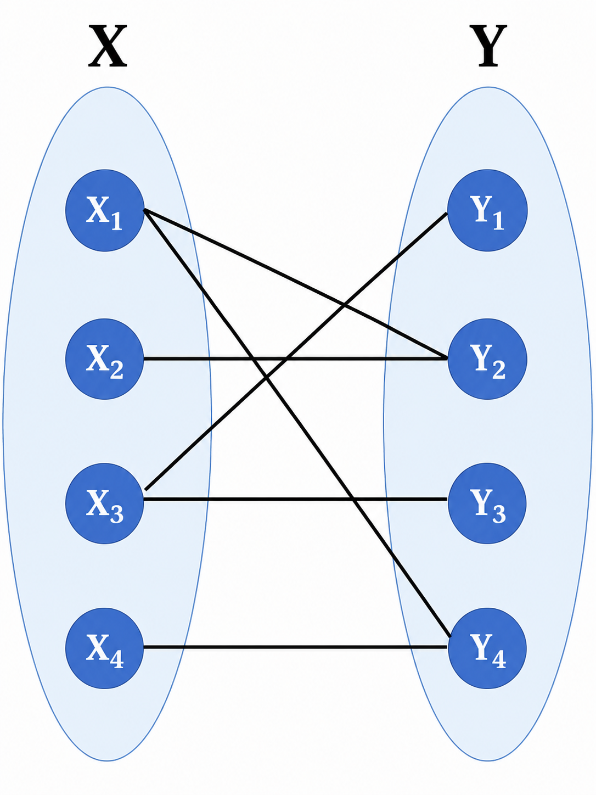
</p>

<p align="center">
  A bipartite graph with vertex sets X and Y. Adapted and redrawn from [11].
</p>

### 3.2 Matching, Maximum Matching, and Perfect Matching

A **matching** is a set of edges no two of which share an endpoint.

A **maximum matching** is a matching with the largest possible number of edges.

A **perfect matching** is a matching that covers every vertex.

For a balanced bipartite graph with

$$
|X|=|Y|=n,
$$

a perfect matching has exactly $n$ edges.

The following illustration uses a pairing interpretation. Boys and girls form the two vertex sets, and an edge represents an admissible pair.

<p align="center">
  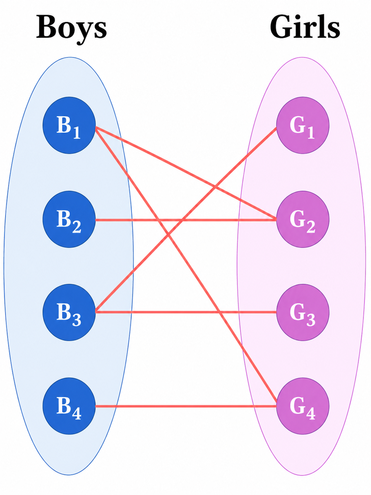
</p>

<p align="center">
  A bipartite pairing graph. Adapted and redrawn from [11].
</p>

The maximum-matching problem asks:

> What is the largest number of pairwise compatible pairs that can be selected so that no person belongs to more than one pair?

Mathematically, this is exactly the maximum-cardinality matching problem in a bipartite graph.

### 3.3 Augmenting Paths

The key idea behind the DFS-based bipartite matching algorithm is the **augmenting path**.

Suppose we currently have a matching $M$.

An augmenting path is a path that:

- starts at an unmatched vertex;
- ends at an unmatched vertex;
- alternates between edges not in $M$ and edges in $M$.

If the matched and unmatched status of every edge on such a path is reversed, the size of the matching increases by exactly one.

This is the logic behind the familiar “try another partner for the currently matched vertex” interpretation.

<p align="center">
  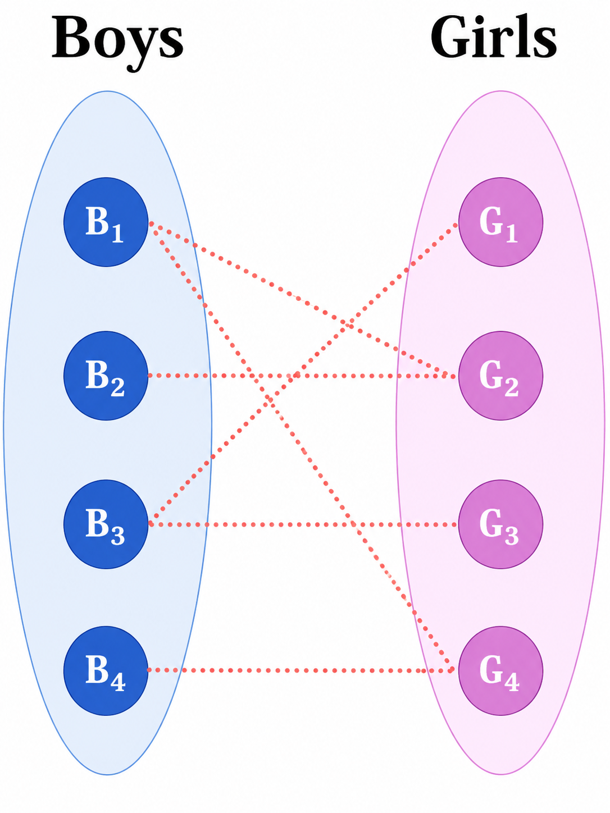
</p>

<p align="center">
  Candidate edges in the bipartite matching example. Adapted and redrawn from [11].
</p>

Consider the following sequence conceptually:

1. try to match $B_1$ to an available neighbor;
2. when $B_2$ wants a vertex already used by $B_1$, search recursively for an alternative neighbor for $B_1$;
3. if that rerouting succeeds, assign the freed vertex to $B_2$;
4. continue with the remaining left-side vertices.

The next figures illustrate this rerouting idea.

<p align="center">
  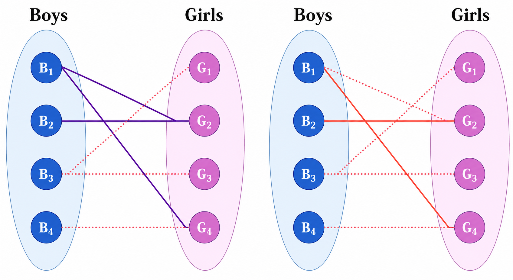
</p>

<p align="center">
  An augmenting-path rematching step. Adapted and redrawn from [11].
</p>

<p align="center">
  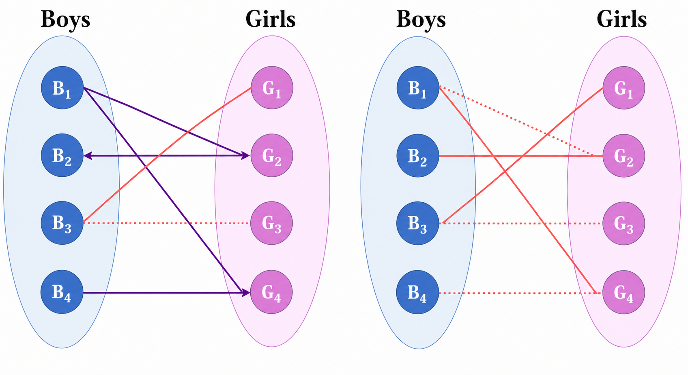
</p>

<p align="center">
  Further matching updates in the same example. Adapted and redrawn from [11].
</p>

The concrete sequence in Figures 3-5 is useful for seeing the recursion more clearly:

- first match $B_1$ with $G_2$;
- when $B_2$ also needs $G_2$, recursively try to move $B_1$ to another available neighbor;
- since $B_1$ can also use $G_4$, rematch $B_1$ with $G_4$ and then match $B_2$ with $G_2$;
- $B_3$ can then be matched with $G_1$;
- finally, $B_4$ can only use $G_4$. To free $G_4$, $B_1$ would have to move back to $G_2$, but $G_2$ is occupied by $B_2$, which has no alternative neighbor.

Therefore no augmenting path starting from $B_4$ reaches an unmatched right-side vertex, and the matching cannot be enlarged further. The maximum matching size in this example is **3**.

A different search order may produce a different maximum matching, but the maximum cardinality remains the same.

The precise drawing order is not important. The invariant is that after a successful augmenting-path search, the matching cardinality increases by one.

### 3.4 DFS-Based Maximum Bipartite Matching

The following Python version corresponds to the recursive C++ implementation in the source material.

```python
def maximum_bipartite_matching(adj, n_right):
    match_right = [-1] * n_right

    def augment(u, visited):
        for v in adj[u]:
            if visited[v]:
                continue

            visited[v] = True

            if match_right[v] == -1 or augment(match_right[v], visited):
                match_right[v] = u
                return True

        return False

    matching_size = 0

    for u in range(len(adj)):
        visited = [False] * n_right

        if augment(u, visited):
            matching_size += 1

    return matching_size, match_right
```

Here:

- `adj[u]` stores the right-side neighbors of left vertex $u$;
- `match_right[v]` stores the left vertex currently matched to right vertex $v$;
- `visited[v]` prevents repeatedly exploring the same right-side vertex in one augmenting search.

If $|X|$ left vertices are processed and each augmenting search scans at most all edges, the running time is

$$
O(|X||E|).
$$

This is often written as $O(VE)$ in a more general graph notation.

This algorithm solves **unweighted maximum-cardinality bipartite matching**. It should not be confused with the $O(n^3)$ weighted Hungarian method in Section 2.4.

---

## 4. Minimum Vertex Cover in Bipartite Graphs⭐⭐⭐

### 4.1 Definition

A **vertex cover** is a set of vertices such that every edge has at least one endpoint in the set.

A **minimum vertex cover** is a vertex cover containing as few vertices as possible.

<p align="center">
  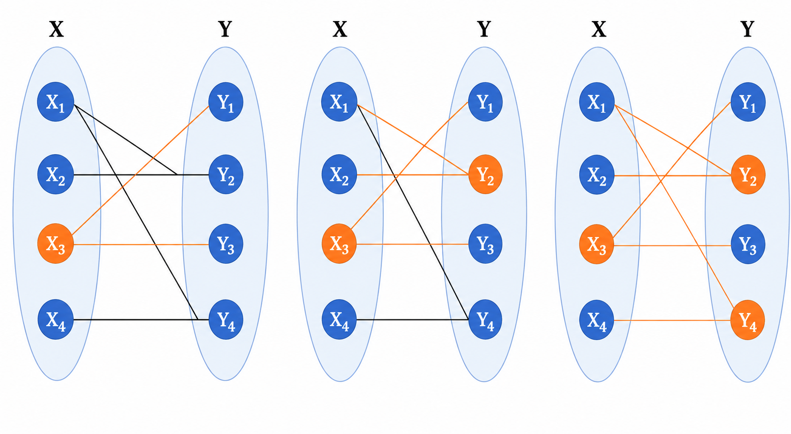
</p>

<p align="center">
  Alternating reachability used to construct a minimum vertex cover. Adapted and redrawn from [11].
</p>

### 4.2 König's Theorem⭐⭐⭐

For every bipartite graph,

> **the size of a maximum matching equals the size of a minimum vertex cover.**

This is **König's theorem** [12].

If a maximum matching has size

$$
\nu(G),
$$

and a minimum vertex cover has size

$$
\tau(G),
$$

then for bipartite graphs,

$$
\nu(G)=\tau(G).
$$

### 4.3 Constructing a Minimum Vertex Cover from a Maximum Matching

After finding a maximum matching, a minimum vertex cover can be constructed by alternating reachability.

Let $U$ be the left vertex set.

1. Start from all **unmatched left vertices**.
2. From a left vertex, traverse **unmatched edges** to the right.
3. From a right vertex, traverse its **matched edge** back to the left.
4. Continue until no new vertices can be reached.

Let:

- $Z_X$ be the reached left vertices;
- $Z_Y$ be the reached right vertices.

Then a minimum vertex cover is

$$
(X\setminus Z_X)\cup Z_Y.
$$

For the running example, consider the maximum matching $\{(B_1,G_4),(B_2,G_2),(B_3,G_1)\}$. The unmatched left vertex is $B_4$. Following alternating paths from $B_4$ reaches $G_4$, then $B_1$, then $G_2$, and then $B_2$. Thus the reached left vertices are $\{B_4,B_1,B_2\}$ and the reached right vertices are $\{G_4,G_2\}$.

The resulting minimum vertex cover is therefore

$$
\{B_3,G_2,G_4\}.
$$

Its size is $3$, exactly equal to the maximum matching size, as guaranteed by König's theorem.

This result is extremely useful because the augmenting-path computation for maximum matching can be reused to recover a minimum vertex cover.

---

## 5. Applications of Bipartite Matching⭐⭐⭐

The source material gives several problems that do not initially look like assignment or matching problems but become simple after an appropriate bipartite-graph transformation.

### 5.1 Matrix Game: Row and Column Permutations

A representative problem is **Luogu P1129 [ZJOI2007] Matrix Game**.

Consider an $n\times n$ binary matrix.

The allowed operations are:

- exchange any two rows;
- exchange any two columns.

The goal is to determine whether row and column permutations can make every main-diagonal entry equal to $1$.

Construct a bipartite graph:

- left vertex $X_i$ represents row $i$;
- right vertex $Y_j$ represents column $j$;
- add edge $(X_i,Y_j)$ if matrix entry $(i,j)$ equals $1$.

The question becomes:

> Can we choose one $1$ in every row and one $1$ in every column?

That is exactly the existence of a **perfect matching**.

Row and column exchanges only relabel the row and column vertices. They do not change the underlying bipartite adjacency structure.

<p align="center">
  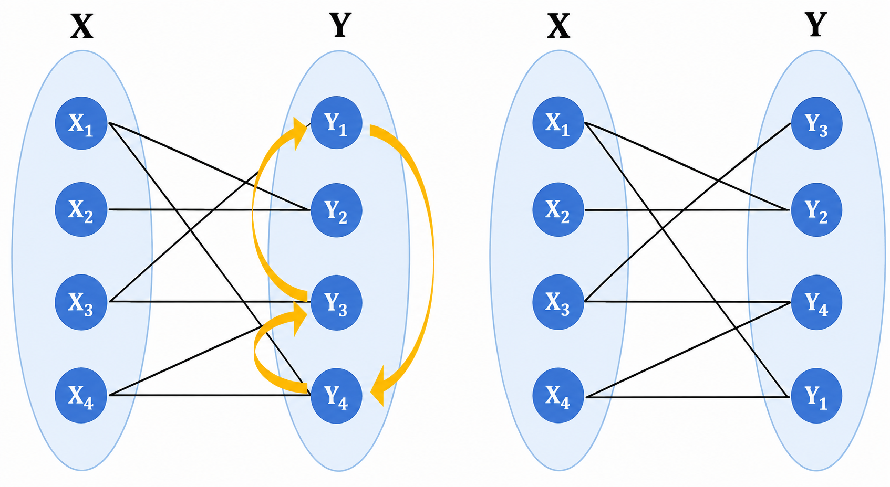
</p>

<p align="center">
  Row or column permutations can be interpreted as relabeling one side of the bipartite graph. Adapted and redrawn from [11].
</p>

Therefore the matrix game is feasible if and only if the bipartite graph has matching size $n$.

There is also a direct connection to the combinatorial concept of a **system of distinct representatives (SDR)**. For each row $i$, let $S_i$ be the set of columns containing a $1$ in that row. Choosing one $1$ from every row with all chosen columns distinct is exactly the same as choosing one distinct representative from each set $S_i$. In graph language, this is a perfect matching.

The following Python implementation corresponds to the source C++ code:

```python
import sys


def maximum_matching_from_matrix(matrix):
    n = len(matrix)
    match_right = [-1] * n

    def augment(row, visited):
        for col in range(n):
            if matrix[row][col] == 0 or visited[col]:
                continue

            visited[col] = True

            if match_right[col] == -1 or augment(match_right[col], visited):
                match_right[col] = row
                return True

        return False

    matching_size = 0

    for row in range(n):
        visited = [False] * n

        if augment(row, visited):
            matching_size += 1

    return matching_size


def solve():
    data = sys.stdin.read().strip().split()

    if not data:
        return

    it = iter(map(int, data))
    t = next(it)
    answers = []

    for _ in range(t):
        n = next(it)
        matrix = [[next(it) for _ in range(n)] for _ in range(n)]

        if maximum_matching_from_matrix(matrix) == n:
            answers.append("Yes")
        else:
            answers.append("No")

    print("\n".join(answers))


if __name__ == "__main__":
    solve()
```

### 5.2 Row/Column Pressing and Minimum Vertex Cover

A representative problem is **vijos1204, CoVH: Conan Unlocking**.

Another example uses a rectangular grid in which some cells are initially raised.

One operation presses an entire row or an entire column.

<p align="center">
  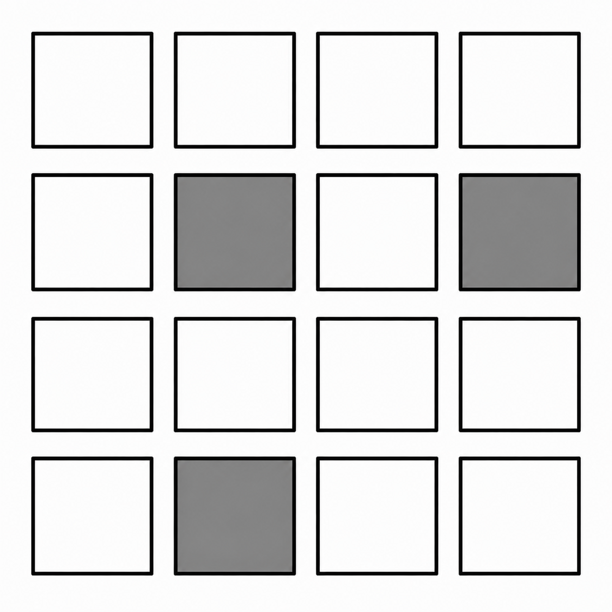
</p>

<p align="center">
  A grid with selected cells. Adapted and redrawn from [11].
</p>

Construct a bipartite graph:

- one left vertex for each row;
- one right vertex for each column;
- an edge $(X_i,Y_j)$ for every raised cell $(i,j)$.

<p align="center">
  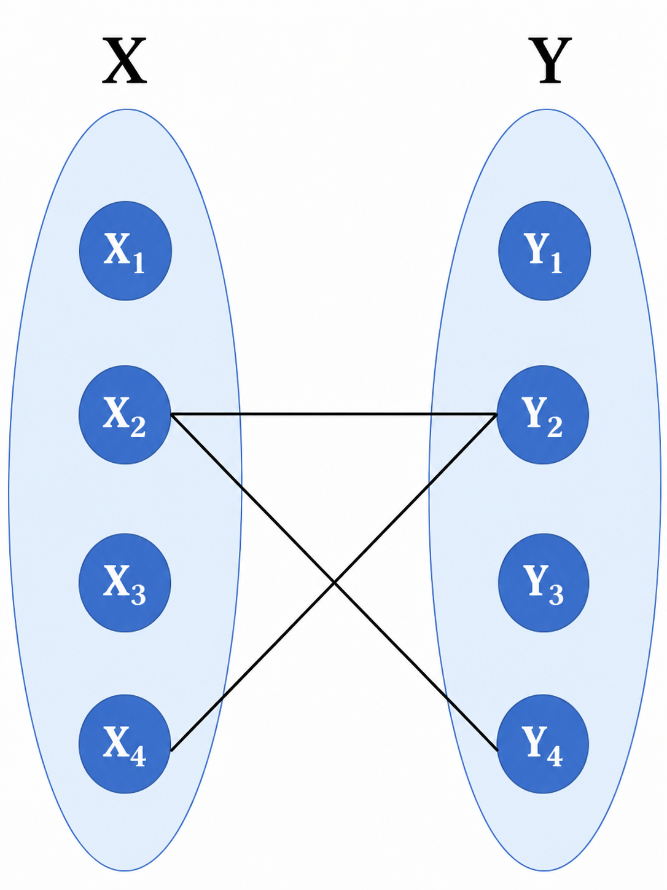
</p>

<p align="center">
  Bipartite representation of the row-column grid. Adapted and redrawn from [11].
</p>

Pressing row $i$ removes all edges incident to row vertex $X_i$.

Pressing column $j$ removes all edges incident to column vertex $Y_j$.

Therefore, pressing the minimum number of rows and columns so that every raised cell is handled is exactly a **minimum vertex cover** problem.

By König's theorem,

$$
\text{minimum number of presses}=\text{maximum matching size}.
$$

### 5.3 Domino Tiling as Maximum Matching

A representative problem is **TYVJ P1035, Chessboard Covering**.

Consider an $n\times n$ chessboard with some cells deleted.

A $1\times2$ domino covers two orthogonally adjacent cells.

Color the board in a checkerboard pattern.

<p align="center">
  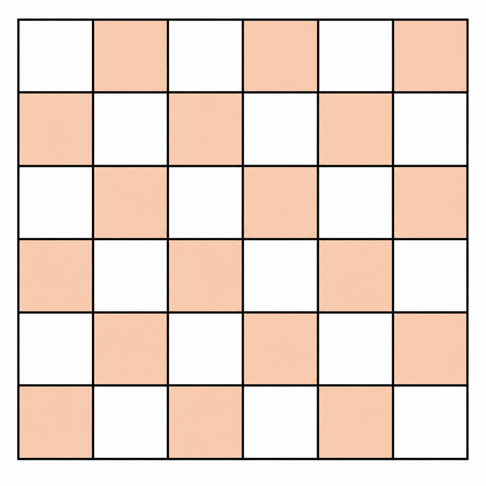
</p>

<p align="center">
  Checkerboard coloring of the board. Adapted and redrawn from [11].
</p>

Every pair of orthogonally adjacent cells has opposite colors. Therefore every domino always covers:

- one cell from the first color class;
- one cell from the second color class.

After deleting unavailable cells:

<p align="center">
  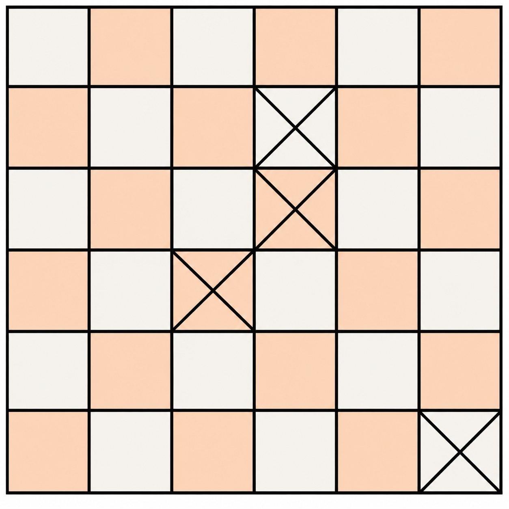
</p>

<p align="center">
  A checkerboard with deleted cells. Adapted and redrawn from [11].
</p>

Construct a bipartite graph:

- one partition contains all remaining cells of one color;
- the other partition contains all remaining cells of the other color;
- connect two vertices if the corresponding cells are orthogonally adjacent.

Each selected matching edge corresponds to one domino, and no two matching edges share a cell.

Because every grid cell has at most four orthogonal neighbors, the resulting bipartite graph is sparse. For larger boards, an adjacency-list representation is therefore preferable to storing a dense adjacency matrix.

Therefore,

$$
\text{maximum number of nonoverlapping dominoes}=\text{maximum matching size}.
$$

If a problem asks for the number of **covered cells** instead of the number of dominoes, the answer is twice the matching size.

A Python implementation is:

```python
import sys


def max_dominoes(n, removed):
    blocked = [[False] * n for _ in range(n)]

    for r, c in removed:
        blocked[r][c] = True

    left_id = {}
    right_id = {}

    for r in range(n):
        for c in range(n):
            if blocked[r][c]:
                continue

            if (r + c) % 2 == 0:
                left_id[(r, c)] = len(left_id)
            else:
                right_id[(r, c)] = len(right_id)

    adj = [[] for _ in range(len(left_id))]
    directions = [(1, 0), (-1, 0), (0, 1), (0, -1)]

    for (r, c), u in left_id.items():
        for dr, dc in directions:
            nr = r + dr
            nc = c + dc

            if (nr, nc) in right_id:
                adj[u].append(right_id[(nr, nc)])

    match_right = [-1] * len(right_id)

    def augment(u, visited):
        for v in adj[u]:
            if visited[v]:
                continue

            visited[v] = True

            if match_right[v] == -1 or augment(match_right[v], visited):
                match_right[v] = u
                return True

        return False

    matching_size = 0

    for u in range(len(adj)):
        visited = [False] * len(right_id)

        if augment(u, visited):
            matching_size += 1

    return matching_size


def solve():
    data = sys.stdin.read().strip().split()

    if not data:
        return

    it = iter(map(int, data))
    n = next(it)
    m = next(it)

    removed = []

    for _ in range(m):
        x = next(it) - 1
        y = next(it) - 1
        removed.append((x, y))

    print(max_dominoes(n, removed))


if __name__ == "__main__":
    solve()
```

### 5.4 Optional Video Explanation

An additional intuitive explanation of the augmenting-path interpretation is available in the Zhihu video listed in Reference [14].

---

## 6. Generalized Assignment Problem (GAP)⭐⭐⭐

### 6.1 Minimum-Cost Capacity-Constrained Formulation

The generalized assignment problem replaces the one-to-one structure of the classical assignment problem with capacity constraints.

Suppose there are:

- $m$ machines;
- $n$ jobs;
- available resource capacity $b_i$ on machine $i$;
- resource consumption $a_{ij}$ if machine $i$ performs job $j$;
- cost $c_{ij}$ if machine $i$ performs job $j$.

Define

$$
x_{ij}=1
$$

if job $j$ is assigned to machine $i$, and

$$
x_{ij}=0
$$

otherwise.

The minimum-cost GAP formulation in [1] is

$$
\min \quad \sum_{i=1}^{m}\sum_{j=1}^{n}c_{ij}x_{ij}.
$$

Each machine must respect its capacity:

$$
\sum_{j=1}^{n}a_{ij}x_{ij}\le b_i,\quad i=1,\ldots,m.
$$

Each job must be assigned to exactly one machine:

$$
\sum_{i=1}^{m}x_{ij}=1,\quad j=1,\ldots,n.
$$

The variables are binary:

$$
x_{ij}\in\{0,1\},\quad i=1,\ldots,m,\quad j=1,\ldots,n.
$$

This differs fundamentally from the classical assignment model because one machine may receive multiple jobs, provided its capacity is not exceeded.

### 6.2 Maximum-Profit Variant

Another common formulation treats machines as bins and jobs as items [5,7].

Let:

- $t_i$ be the capacity of bin $i$;
- $w_{ij}$ be the weight consumed if item $j$ is assigned to bin $i$;
- $p_{ij}$ be the profit obtained from that assignment.

Then the optional-assignment max-profit GAP can be written as

$$
\max \quad \sum_{i=1}^{m}\sum_{j=1}^{n}p_{ij}x_{ij}.
$$

Capacity constraints:

$$
\sum_{j=1}^{n}w_{ij}x_{ij}\le t_i,\quad i=1,\ldots,m.
$$

Each item is assigned to at most one bin:

$$
\sum_{i=1}^{m}x_{ij}\le1,\quad j=1,\ldots,n.
$$

Binary restrictions:

$$
x_{ij}\in\{0,1\},\quad i=1,\ldots,m,\quad j=1,\ldots,n.
$$

If every item must be assigned, replace the inequality with

$$
\sum_{i=1}^{m}x_{ij}=1.
$$

So the term **GAP** is used for closely related minimization and maximization formulations. The exact assignment requirement should always be stated explicitly.

### 6.3 Why GAP Is Hard

The generalized assignment problem is NP-hard [4].

The classical assignment problem has only one-to-one matching constraints. GAP additionally introduces machine-dependent resource consumption and capacity limits.

Those capacity constraints couple many assignment decisions together, destroying the simple perfect-matching structure that makes the classical assignment problem polynomially solvable.

This is an important example of a broader principle:

> **A small-looking modeling change can completely change computational complexity.**

### 6.4 Approximation Algorithms

Because GAP is NP-hard, approximation and heuristic algorithms are important for large instances.

For maximum GAP, LP-based approximation methods can achieve strong constant-factor guarantees. In particular, Fleischer, Goemans, Mirrokni, and Sviridenko give a $1-1/e$ approximation for the standard maximum GAP setting [5].

The source material also presents the residual-profit framework of Cohen, Katzir, and Raz [6] for the version in which not every item must be assigned.

Suppose an $\alpha$-approximation algorithm `ALG` is available for a single knapsack problem, where the approximation factor is written in the convention

$$
\text{OPT}\le\alpha\cdot\text{ALG}.
$$

Their framework obtains a

$$
1+\alpha
$$

approximation for GAP [6].

### 6.5 Residual-Profit Greedy Framework

Let $T[i]$ denote the current tentative bin assigned to item $i$.

Use

$$
T[i]=-1
$$

if item $i$ is currently unassigned.

During the iteration for bin $j$, define the residual profit $P_j[i]$.

If item $i$ is currently unassigned,

$$
P_j[i]=p_{ij}.
$$

If item $i$ is currently assigned to bin $k$,

$$
P_j[i]=p_{ij}-p_{ik}.
$$

Thus the residual profit measures the net improvement obtained by moving item $i$ to the current bin.

The framework is:

```text
Initialize T[i] = -1 for every item i.

For each bin j:
    1. Construct the residual-profit function P_j.
    2. Call a knapsack approximation algorithm ALG for bin j.
    3. Let S_j be the selected item set.
    4. Set T[i] = j for every item i in S_j.
```

The tentative assignment may change during later iterations because an item can be reassigned to a different bin if doing so provides sufficient residual profit.

This approach reveals a direct algorithmic connection between GAP and the knapsack problem studied in Note 12.

---

## 7. Classical Assignment vs. Generalized Assignment⭐⭐⭐

| Property | Classical Assignment Problem | Generalized Assignment Problem |
| :---: | :--- | :--- |
| Basic structure | one-to-one assignment | capacity-constrained assignment |
| Number of jobs per agent | exactly one in the balanced model | potentially multiple |
| Job assignment | exactly one agent per job | exactly one or at most one, depending on variant |
| Main graph interpretation | weighted bipartite perfect matching | multiple knapsack-like assignment |
| Standard exact method | Hungarian / Kuhn-Munkres method | MILP, branch-and-bound, branch-and-cut, decomposition, etc. |
| Typical complexity | polynomial | NP-hard |

The difference is not merely terminology. The underlying combinatorial structure changes from a perfect matching polytope to a capacity-constrained packing-and-assignment model.

---

## 8. Key Takeaways⭐⭐⭐

1. The classical assignment problem is a one-to-one resource-allocation problem.
2. Its natural binary formulation is equivalent to a weighted perfect matching problem in a bipartite graph.
3. The weighted Hungarian / Kuhn-Munkres method finds a globally optimal classical assignment in polynomial time, commonly $O(n^3)$.
4. The classical assignment problem is an important counterexample to the claim that every optimization problem with an ILP formulation is NP-hard.
5. General ILP is NP-hard, but special structured ILP subclasses may still admit polynomial-time exact algorithms.
6. Unweighted maximum-cardinality bipartite matching is related but should not be confused with weighted assignment.
7. The DFS augmenting-path algorithm repeatedly searches for alternating paths that increase the matching size by one.
8. König's theorem states that, in bipartite graphs, the maximum matching size equals the minimum vertex-cover size.
9. Matrix permutation, row-column covering, and domino-placement problems can all be transformed into bipartite matching or vertex-cover problems.
10. GAP introduces capacity constraints and allows one machine or bin to receive multiple jobs or items.
11. GAP is NP-hard, so exact MILP methods, approximation algorithms, and heuristics become important.
12. Knapsack algorithms are directly connected to approximation methods for GAP.

---

## References

1. Sun, Xiaoling, and Duan Li. *Integer Programming*. Beijing: Science Press, 2010. ISBN: 978-7-03-029380-0.（孙小玲、李端：《整数规划》，北京：科学出版社，2010年，ISBN：978-7-03-029380-0）
2. Kuhn, H. W. “The Hungarian Method for the Assignment Problem.” *Naval Research Logistics Quarterly* 2(1-2), 1955, 83-97. DOI: 10.1002/nav.3800020109.
3. Munkres, James. “Algorithms for the Assignment and Transportation Problems.” *Journal of the Society for Industrial and Applied Mathematics* 5(1), 1957, 32-38. DOI: 10.1137/0105003.
4. Shmoys, David B., and Éva Tardos. “An Approximation Algorithm for the Generalized Assignment Problem.” *Mathematical Programming* 62, 1993, 461-474. DOI: 10.1007/BF01585178.
5. Fleischer, Lisa, Michel X. Goemans, Vahab S. Mirrokni, and Maxim Sviridenko. “Tight Approximation Algorithms for Maximum General Assignment Problems.” *Proceedings of the Seventeenth Annual ACM-SIAM Symposium on Discrete Algorithms (SODA)*, 2006, 611-620. DOI: 10.1145/1109557.1109624.
6. Cohen, Reuven, Liran Katzir, and Danny Raz. “An Efficient Approximation for the Generalized Assignment Problem.” *Information Processing Letters* 100(4), 2006, 162-166. DOI: 10.1016/j.ipl.2006.06.003.
7. “Generalized Assignment Problem.” *Wikipedia*. https://en.wikipedia.org/wiki/Generalized_assignment_problem.
8. “Assignment Problem: Meaning, Methods and Variations | Operations Research.” *Engineering Notes*. https://www.engineeringenotes.com/project-management-2/operations-research/assignment-problem-meaning-methods-and-variations-operations-research/15652.
9. SimyHsu. “Hungarian Algorithm.” *CSDN Blog*. https://blog.csdn.net/u014754127/article/details/78086014.（SimyHsu：《Hungarian Algorithm匈牙利算法》，CSDN博客）
10. Yinshi Mowen Qiancheng. “Bipartite Matching — Hungarian Algorithm (Time Complexity O(nm)).” *CSDN Blog*. https://blog.csdn.net/weixin_40477002/article/details/122799390.（银时莫问前程：《二分图匹配——匈牙利算法（时间复杂度O(nm)）》，CSDN博客）
11. “Algorithm Study Notes (5): Hungarian Algorithm.” *Zhihu Column*. https://zhuanlan.zhihu.com/p/96229700.（《算法学习笔记(5)：匈牙利算法》，知乎专栏）
12. Matrix67. “König's Theorem for Maximum Matching in Bipartite Graphs and Its Proof.” *Matrix67 Blog*. http://www.matrix67.com/blog/archives/116.（Matrix67：《二分图最大匹配的König定理及其证明》，Matrix67博客）
13. “Assignment Problem.” *Wikipedia*. https://en.wikipedia.org/wiki/Assignment_problem.
14. “Hungarian Algorithm.” *Zhihu Video*. https://www.zhihu.com/zvideo/1492806232239349760.（《匈牙利算法 Hungarian Algorithm》，知乎视频）

---

## Suggested Follow-up Reading

The most relevant next topics are:

1. **Network Flow and Minimum-Cost Flow**  
   Bipartite matching and assignment can both be formulated through network-flow models, providing a broader framework for understanding augmenting paths, capacities, and assignment costs.

2. **Total Unimodularity and Integral Polyhedra**  
   Useful for understanding why the LP relaxation of the classical assignment problem already has integral extreme points.

3. **Generalized Assignment Algorithms**  
   A deeper study of exact branch-and-bound methods, Lagrangian relaxation, local search, and approximation algorithms for GAP.

4. **Matching Theory**  
   Extends the ideas in this note to Hall's theorem, weighted matching, non-bipartite matching, blossom algorithms, and deeper structural results.
